# 新加坡 24 小时的喜与欢 · 城市清单

*Geng Yue · Travel Guides*

当我每次在异国他乡旅行时，对自己越来越了解，其中一点是：

**我着迷于在城市里，寻找那些鲜为人知的秘境。**

用朋友接地气的话来形容，"你的旅行，有一个很吸引人的地方是，好吃好玩游客少，还能逼格满满。"

所以我开设了"城市清单"这个原创栏目。每一期推荐一份走心的私藏地图。

今天写的是新加坡。这一期的初心，**是想在熟悉或陌生的旅行地，用最简单的方式，找回不可缺失的好奇心。**

❤️

Singapore

如何只用1天

在城市里找回你的好奇心

这份走心的**文艺城市清单**

带你重新探索

新加坡这座花园之城

**1 Tong Ah Eating House / 9:00**

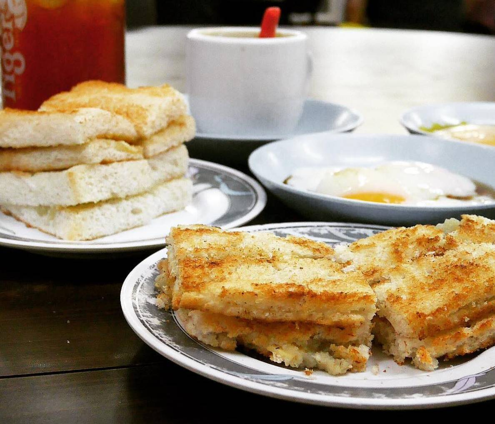

一天的开始，我爱上了吃一顿典型的南洋早餐：咖椰烤吐司、咖啡、和半生蛋。

这家非常有当地特色的小店，初看不起眼，但它从1939年开业到今天，还在坚持做很地道正宗的咖椰吐司，相当难得。白吐司浸饱了蛋液，煎得微焦，配着他家自制的咖椰酱——酱是老板亲自花费八小时熬制的，手工感十足。厨师会在十秒钟之内完成涂酱，热呼呼一出炉，即刻开吃。浓郁的南洋传统咖啡kopi，配着这样的黄油点心一起吃，才是真爱。开始有点羡慕新加坡人啦。

地址：35 Keong Saik Rd, Singapore 089142

电话：+65 6223 5083

开业时间 ：周一至周日 7AM–10PM

**2 Tiong Bahru Market / 10:00**

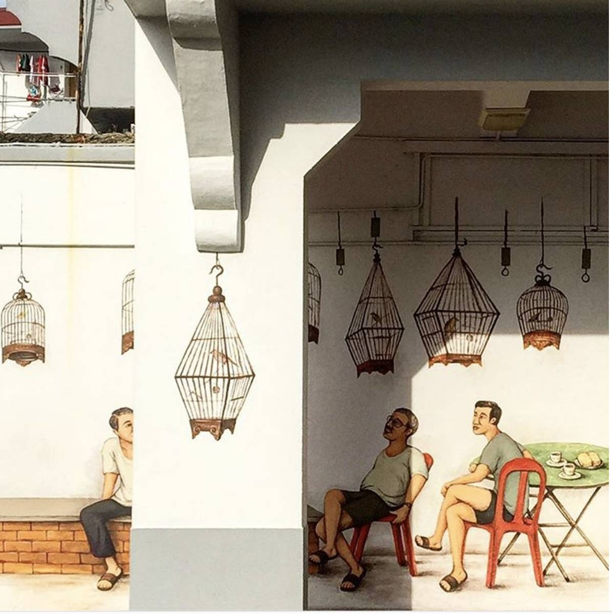

*ins@bibikgourmand*

我喜欢中峇鲁，它不是大风大景，却是城市角落中迷人的一环。

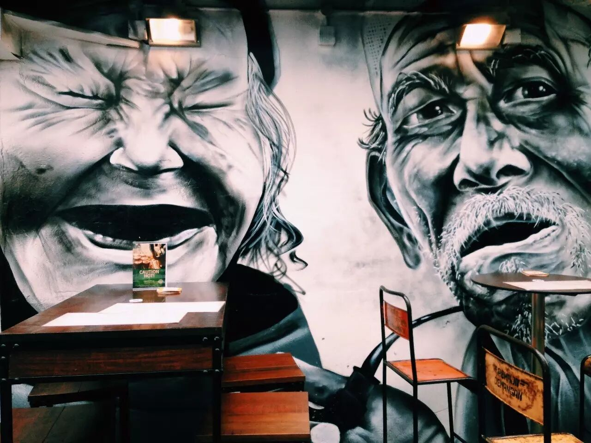

在这个文艺街区骑自行车，是一种小旅行的好用交通工具，在蜿蜒街道间，细细感受它的独特风情——你会看到新加坡最古老组屋与历史悠久的社区，同时寻找近年来开的一些现代感的咖啡馆，有个性的独立书店，和新潮风格的文青新店。

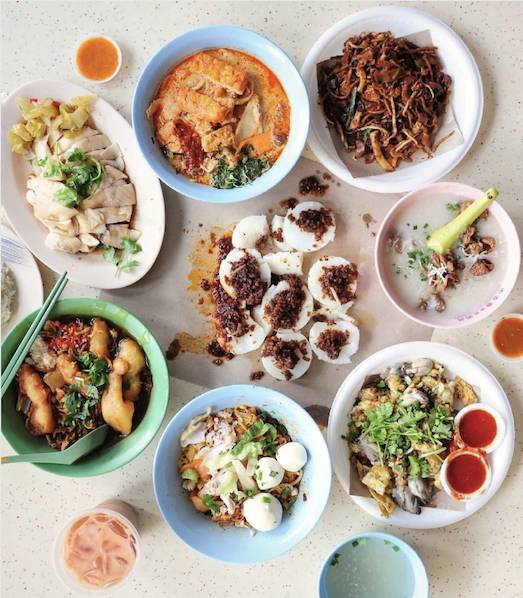

*ins@lefooding*

骑出来之后，大概有些饿了，可以去附近的中峇鲁市场，"这儿大多只有新加坡当地人来吃美食，买蔬果，本地的国民美食非常多：水粿、罗惹、虾头排骨汤面，还有夏天一定要来一杯的自制甘蔗水，不会太甜，却又能解渴的口感。吃美食时，配一杯刚刚好。"

地址：30 Seng Poh Road, Singapore 168898

**3 Plain Vanilla / 11:00**

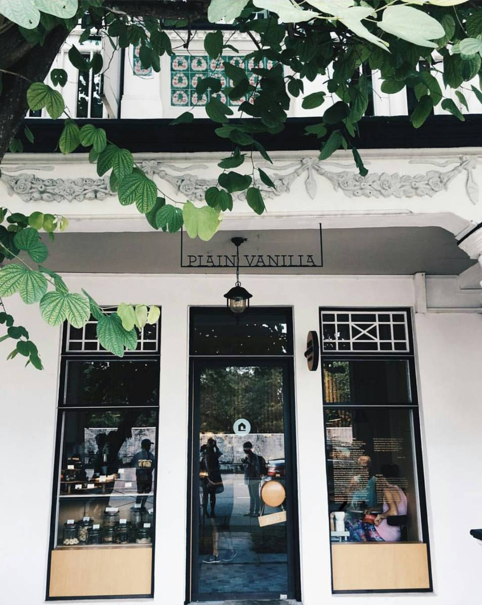

离开这个街区之前，会经过一家给人幸福感的面包店，可以顺便进去看一眼。这里有各种欧洲风味的杯子蛋糕，漂亮的让人看了舍不得吃：红色天鹅绒、焦糖海盐、巧克力、伯爵茶、奶油花生…每一款都精美像艺术品。

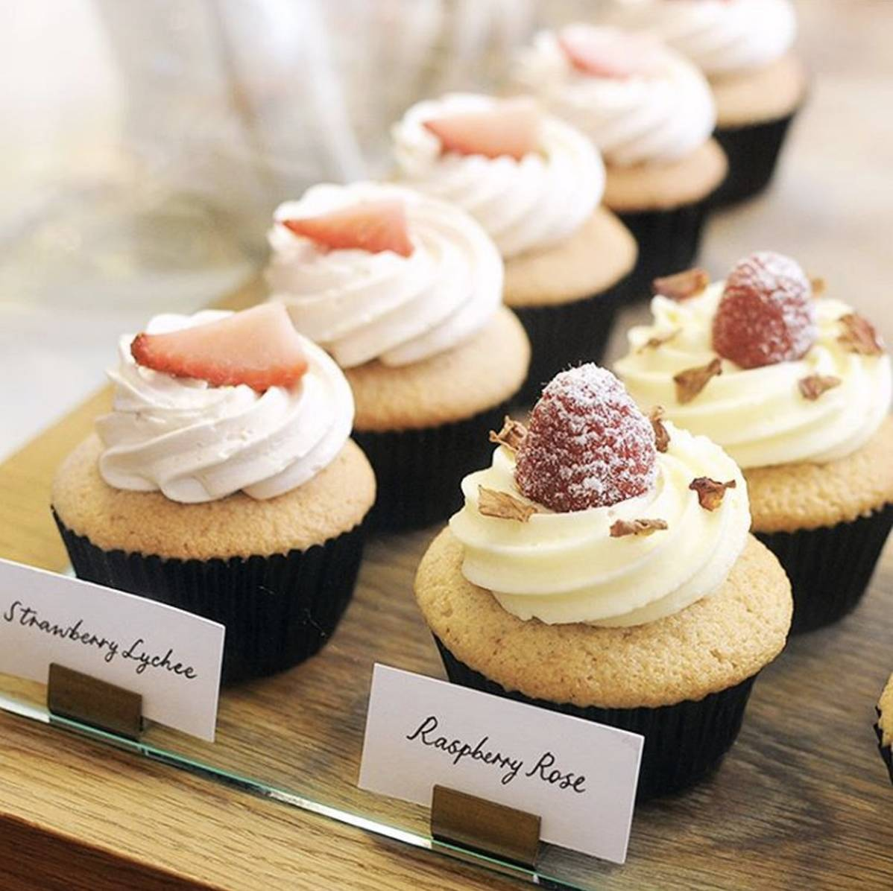

*ins@pvbakery*

小店迷你可爱，却是"当地杯子蛋糕第一把交椅"。从成立的那一天起，它就怀着纯粹的提供古早味的糕点的愿望。当地朋友推荐要尝尝薰衣草伯爵茶杯子蛋糕。

地址：Tiong Bahru Estate 1D Yong Siak Street, Singapore 168641

电话：+65 8363 7614

时间：周一至周六：8AM - 19PM

**4 Gardens By The Bay / 12:00**

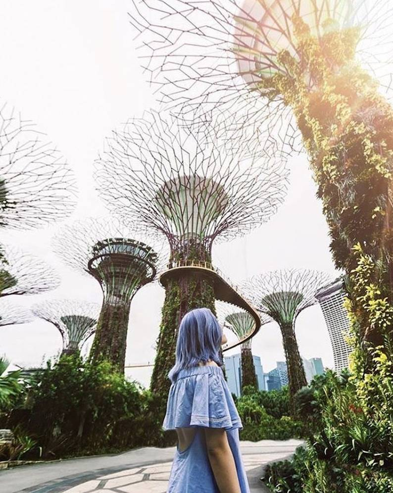

*ins@*msyan_**

正午过后，新加坡开始洋溢着它的热情，火辣辣的太阳，你会感受到这座城的热度。我总是会找室内的地方，躲一躲。

走进这里的一瞬间，迎着雨林、水汽和迷雾，新加坡这座「花园城市」在眼前真正铺开，正是我想跟你分享的清凉片刻。

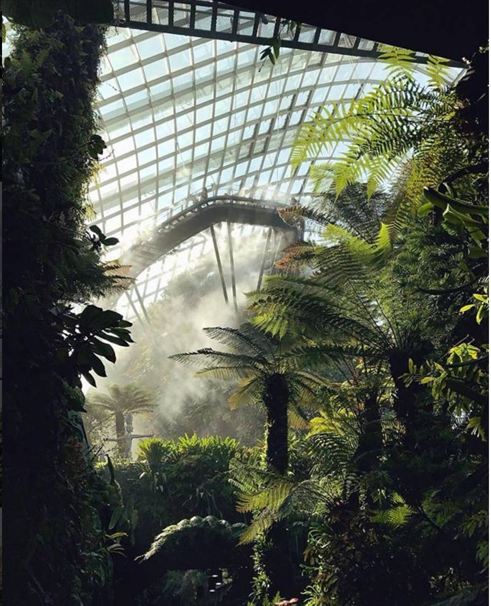
*ins@*gardensbythebay**

和我一样喜欢植物的人，会彻彻底底爱上这里，当看到加州、南非、澳洲、地中海花园里的植物，我会想念那些曾经的旅途。

我被这里的巨树群、世界上最高的室内瀑布所震撼，仿佛来到另一个星球，好喜欢Flower Dome（花穹）和Supertree Grove（擎天树林），特别是Cloud Forest（云雾林），像仙境一样，美哭了！

地址：18 Marina Gardens Drive

电话： 65 6420 6848

**5 National Gallery / 15:00**

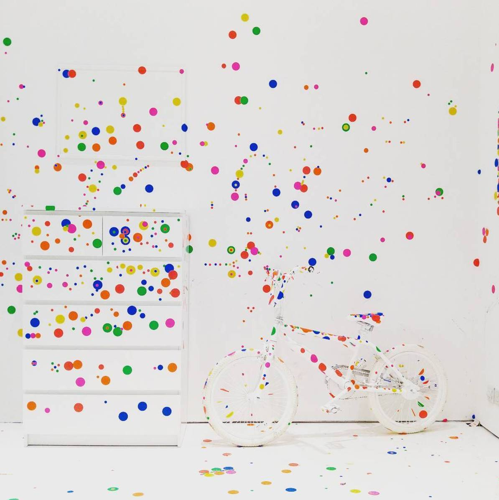

下午三点，狮城的阳光不那么刺眼了，我想带你去逛一逛国家美术馆，"去一个城市或国家，应该先去当地美术馆看看，在那里可以看出这个城市或国家的底蕴神圣与公正感。"

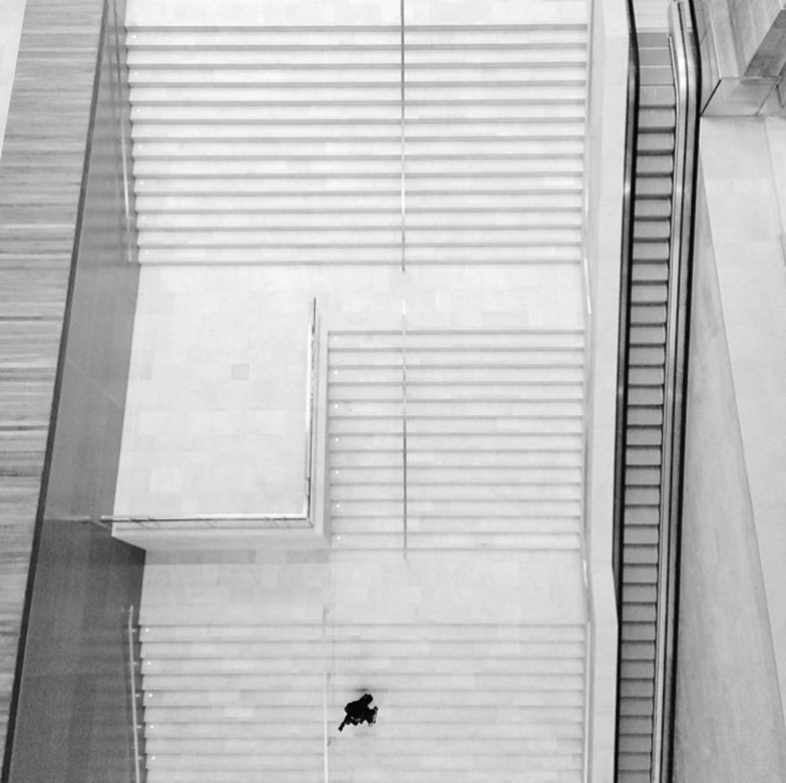

*ins@Idaph*

做为一个摄影师，我也喜欢在旅途中发现建筑的美感。这里有白色的玻璃穹顶，美貌的角落天光庭院。东南亚炙热的光和影，洒落在优雅的殖民时期的建筑上，柔和明媚。

*ins@dreachong*

地址: 1 St. Andrew's Road National Gallery Singapore, Singapore 178957

电话：+65 6271 7000

开放时间：10AM - 7PM

**6 Cats Socrates / 17:00**

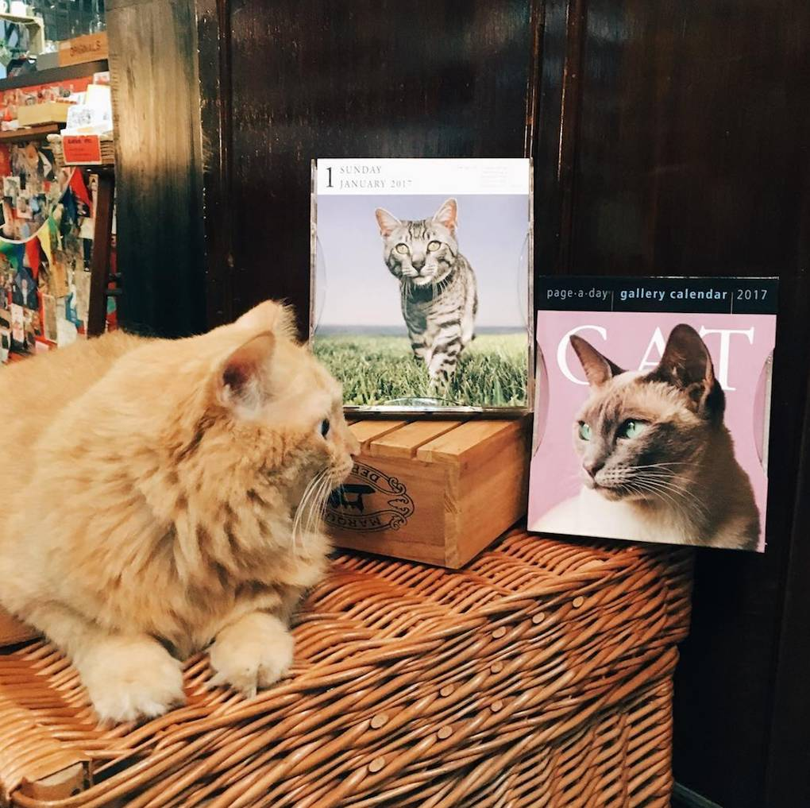

*ins@cat_socrates*

经常看我旅行故事的人知道，我喜欢逛各种各样有趣的小店。这家苏格拉底猫杂货铺，是我私人清单里想与你分享的，也是你会喜欢的调调。

杂货铺里有很多猫咪的物件，有摄影、电影、艺术及生活美学有关的书籍杂志，独立(Indie)音乐唱片，创意杂货，平常还会举办好玩又有趣的照片展览，小型音乐会，电影放映等小众文化活动。

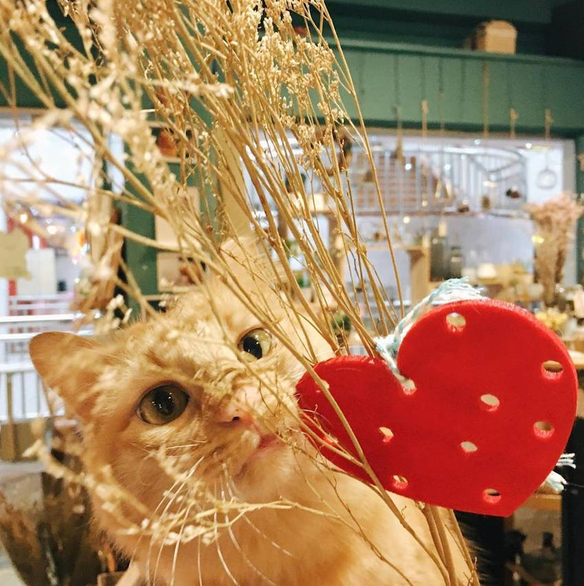

有态度的店铺背后，一定是有趣的灵魂。书店主人张震与妻子蒋航蕾，是上海人，也是梦想实践者，原先做服装设计的，一直想开店，在新加坡定居后，终于开了家自己的专营中文文艺类书籍的店，人气越来越高。

这家店的名字也真的是因为一只猫，名字就叫苏格拉底，好有文化气质的一只猫哇。

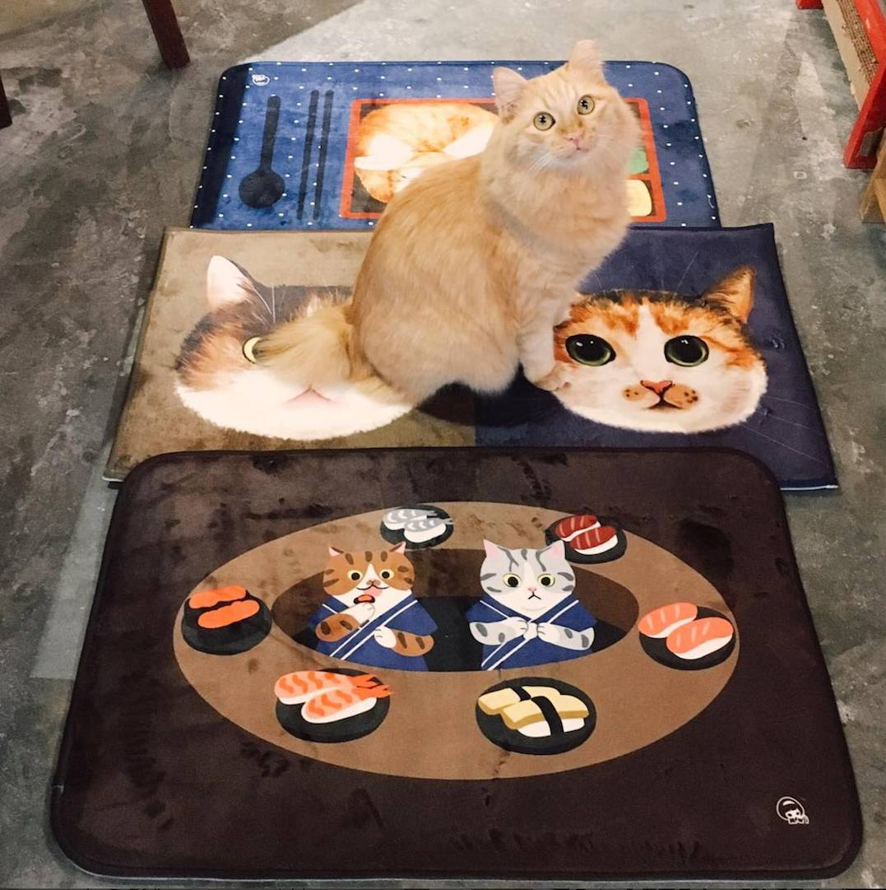

地址：#03-39B Bras Basah Complex,231 Bain Street, Singapore 180231

网站：http://www.catsocrates.com.sg/

联系方式：65-6333-0870；contact@catsocrates.com.sg

**7 Timbre / 19:00**

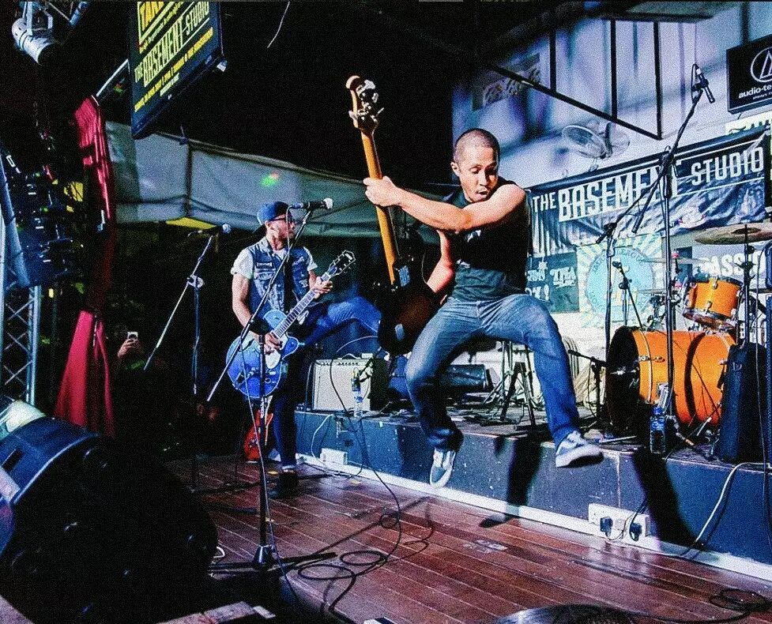

傍晚我喜欢去一些live house，看看当地的乐队演出，在Timbre里，歌手值得去听，喜欢听重金属和摇滚乐的人更要去，还可以点你喜欢听的歌。

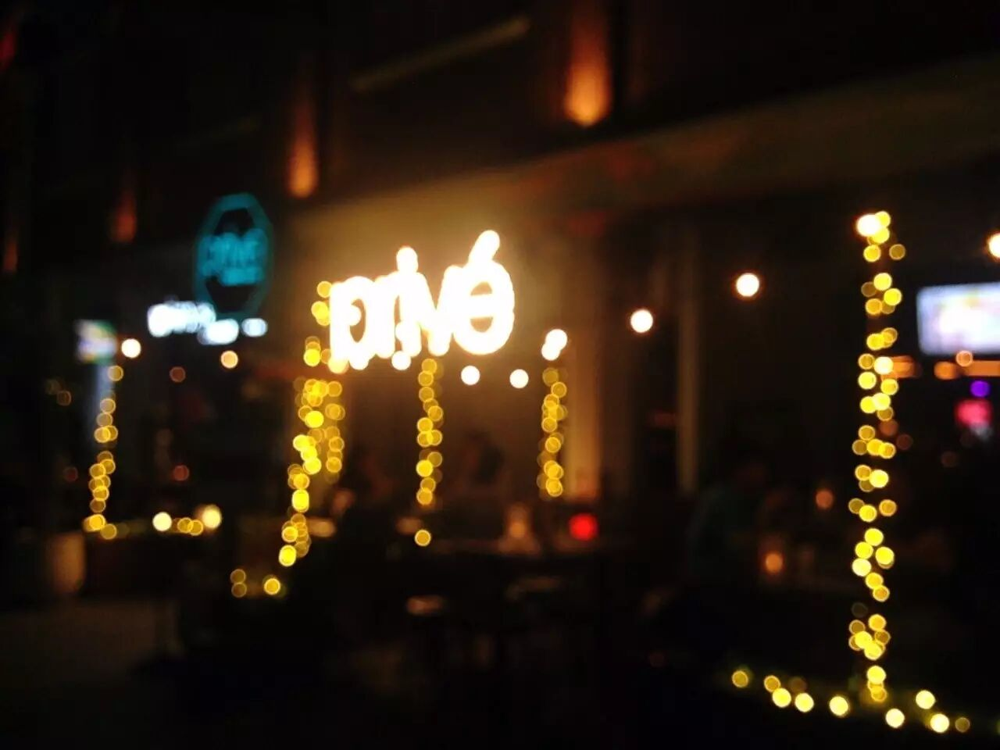

自己一个人，或和朋友一块儿去都不错，食物的价格很合理，我喜欢有一种味道很棒好吃的披萨（a local twist of roasted duck topped with crispy popiah skin）。

地址：Old Parliament Lane #01-04, Singapore 179429, Singapore

电话：+65 6336 3386

时间：18：00-2：00

初夏美妙的一天，就是这样。对了，在晚上的任何时候，如果你想买东西，可以骑车去新加坡的一个秘密之地Mustafa Center，一家24小时的超大型超市，性价比极高，去了你就会发现，那就是你要找的地方，可以买到任何一种需要的日常用品。

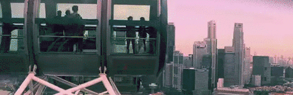

每次我想做一个可爱的小采访，我那个缤纷丰富如万花筒般的朋友圈，都惊到了我。

这一次，我采访了**几位**酷酷的爱骑自行车的朋友，听了听他们独特的城市打开方式。

他们跟我说了在新加坡，和世界不同地方，骑自行车探索城市，**究竟是一种怎么样的有趣感受**。聊完我很羡慕呢。

**@Linda**

关键词：海边城堡 | 隐秘街心公园 | 夕阳 | 啤酒 | 海风 | 干净

我是在2011年，圣诞节前夕和我的男友（现在是前男友），一起在新加坡的east coast海边，沿着海岸线骑行，感受着海风和大自然的美景。一路上，遇到很多别致的小餐厅、酒吧，便利店。值得一提的是，遇到了隐秘的街心公园和小型植物园。

我们一直呆到快夕阳西下，买了几罐啤酒，就坐在海边堆沙堡，看远处的邮轮和船只，不远处的人声以及孩子的嬉笑声。 感受着这个世界上最clean 的城市之一所带给我们的干净整洁印象！

**@大白白白**

关键词：海边城堡 | 隐秘街心公园 | 夕阳 | 啤酒 | 海风 | 干净

我在荷兰，通勤都靠自行车。但在慕尼黑、哥本哈根和马斯特里赫特的旅行中，骑过单车。

我必经停的地点是：好看的自行车店、咖啡馆、酸奶店、书店、家具店和设计工作室。女友基本会在每一个饰品店门口停下来。

有30%的店铺，之前就听说/朋友推荐/做功课查到的。70%都会是在以上30%的周边发现的。我一般玩儿的会很慢，第一天发现的好地方，喜欢在第二天再骑一遍。

比较特殊的是，我一定会先找自行车咖啡店，那儿除了能遇到骑车的人，和好玩儿的周边商品配件什么的。一般店员或老板，都能提供适合骑行的路线，适合骑车去的好街区/酒吧。如果某个自行车店主够有意思，我会问他有没有骑车的活动一块儿参加。

**@Young**

关键词： 唐人街 | 清真寺 | 风格多样 | 土生土长

我去新加坡骑行过一次，最特别的感受是，骑行让我发现，这个地方不仅仅是购物消费和玩环球影城。

骑车的时候，道路不挤，气温也蛮凉爽。我当时骑行经过了唐人街、阿拉伯区、清真寺、佛教寺庙，和各种各样的高的不可思议的大楼、修剪得非常整齐的花园、一些宏大的殖民建筑。风格很多元，经过了一家可爱的海南餐馆喝茶、吃小吃，跟一些土生土长的新加坡人聊天，回答了我们在旅途中的各种问题。

**@Ghhhh**

关键词：风声 | 犬吠 | 花香 | 另辟蹊径 | 当地人间烟火 |

我在羊角村骑行过，那儿像一个世外桃源，远离城市喧嚣，村子里有水流，小桥，和羊肠小道。

虽说被各种攻略推荐一定要坐船游玩，但热爱自行车的我还是和同伴选择了骑行。因为我一直相信，**走不一样的道路，才能看到不一样的风景。**

那一天的天气很好，骑车时能感受到耳边经过的风声，途径院子里的犬吠，和沿途的花香，可以用"曲径通幽处 禅房花木深"来形容。好的旅行不是只用眼睛去看，还得用其余感官去感受。

租车时老板给了我们一张地图，大方向跟着地图走，偶尔还是会另辟蹊径。当地人也很热情，哪怕是他正在房顶修缮，也会跟我们挥挥手，打个招呼。

我喜欢自行车的理由是，想要深入了解一个地方的特色，骑车是再好不过的选择了。既能保证游玩的速度，又能节省体力，车子体积不大，对道路要求也不是很高。在被允许的前提下**，左走右走，感受当地的人间烟火。**

**@Vicky**

关键词：野餐 | 美食 | 被疏忽掉的风景 | 放松享受

我在旅途中，每次抵达一个大城市，如果可能的话，我都喜欢来一次自行车之旅，这已经是我的一个习惯了。

骑行不仅可以帮你更快了解这座城市的各个方位，而且一定可以看到那些，你坐火车或出租车被疏忽掉的风景。

在新加坡骑行有趣的是，你可以从一个本地人的视角，看看新加坡是怎样的。

那天骑行道很凉爽，骑起来很放松。我在各种不同的居民区里面转悠，还有原始的民族地区，快速经过观光区，比如小印度、摩天观景轮和滨海金沙。最后我们还搞了一次野餐，食物也很美味。一切都是彻彻底底地享受。我临走时有了一种想留在新加坡工作几年的想法！

**@Junna**

关键词：探险 | 河龟 | 地图店 | 下小雨

我在渥太华有过一段骑行的经历，当天下着小雨，我拿着一张防水地图，也没管什么"必去必看"，随性地骑。马路高低起伏，不太宽敞，像是探险。

路过河边，有一只很大的河龟回不去，有人叫了"城管"把它送回河里。

路过国会大楼，它像个石化的警察，在雨中倒不如一个小教堂来的清秀。

路过一家地图店，林林总总全是各种版本、各种形态的世界地图，有的用动物来标记，有的用武器来标记，不管你想要什么总能找到一款世界地图。

首都脱离经济中心的宿命之后，确实可以非常可爱！

**@微不足道**

关键词：后海 | 同类人 | 北京一夜 | 阳光蓝天

我一般周日骑共享单车（就是小黄车哈哈），去探索后海那一片的胡同。之前听陈升的《北京一夜》，听歌词里有一个叫'百花深处'的胡同，所以特意去找了一下这个胡同。

在你骑车逛胡同时，遇到同样喜欢骑车的人，喜欢逛胡同的人，觉得很亲切。你会遇到蛮多可以放进记忆里的画面，女孩往邮筒里放明信片，乐手在鼓楼弹吉他唱歌，老人在巷弄里抽烟唠嗑，阳光明媚，天空很蓝，什刹海也很蓝。

我承认，看完这些分享的故事，

决定以后在世界各地旅行时，也多多骑自行车。

毕竟，在即将开启的这一趟旅程，远离人潮和干扰，是属于你的私人体验。

毕竟，在城市微风吹起来的瞬间里，我们暂时换掉了在城市里特立独行的冷漠脸，变得温柔起来。