# Bangkok: 24 Hours of Joy and Delight · City Checklist

*Geng Yue · Travel Guides*

This edition of "City Checklist" is **Bangkok**.

Bangkok is a deeply misunderstood city. Some friends still picture it as ancient temples, tourist markets, and street food — nothing more.

But in truth, Bangkok's youthfulness, fashion sense, delicate charm, design sensibility, and hidden layers of taste and beauty make it, in my mind, the city with the most cosmopolitan potential in all of Asia — holding its own even against Tokyo and Seoul.

Honestly, I envy Bangkok's young people a little. **This city goes out of its way to keep things fresh for them.**

It is passionate and ever-changing, yet warm and endearing.

❤️

Bangkok

This heartfelt **literary city checklist — spend one day feeling Bangkok's

** whimsical urban heartbeat **

I have designed an imaginary 24-hour Bangkok itinerary for you.

Skip the over-touristed spots and well-trodden routes — these are the small, beautiful places I love.

**0 Airplane / 23:00**

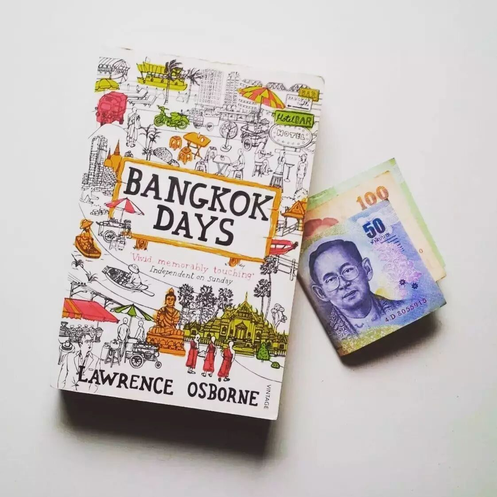

hasher9

On the flight, I flipped through *Bangkok Days* by Lawrence Osborne, a *New York Times* travel writer, and was captivated.

I find it harder and harder to get through superficial travelogues. I gravitate instead toward sharp, perceptive, intelligent essays. A slim volume like this one — just right.

As the plane neared landing, I followed Mr. Osborne along the river, wandering the streets of Bangkok in reverse, breathing in the city's scent, feeling it come alive: instinctual, contradictory, magnetic.

**1 Casa Pagoda · Luka / 9:00**

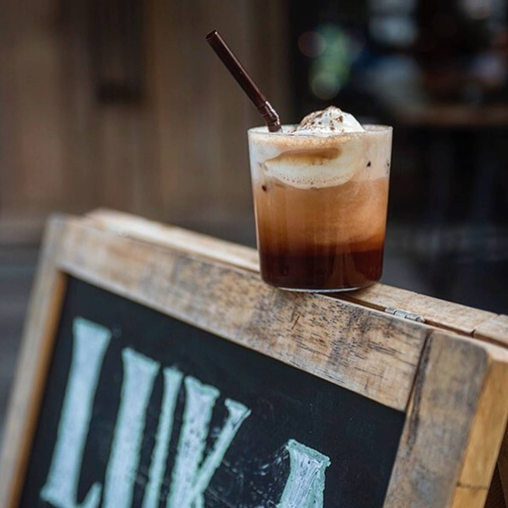

No matter where I am in the world, my morning does not truly begin without a cup of coffee.

I cycled down a quiet stretch of Pan Road and stopped at Luka, a standalone cafe. The moment I pushed open its recessed wooden door, a burst of youthful energy rushed toward me: lively chatter, someone working alone on a design, witty laughter. Every young person there, glowing and alive, existing in their own little universe.

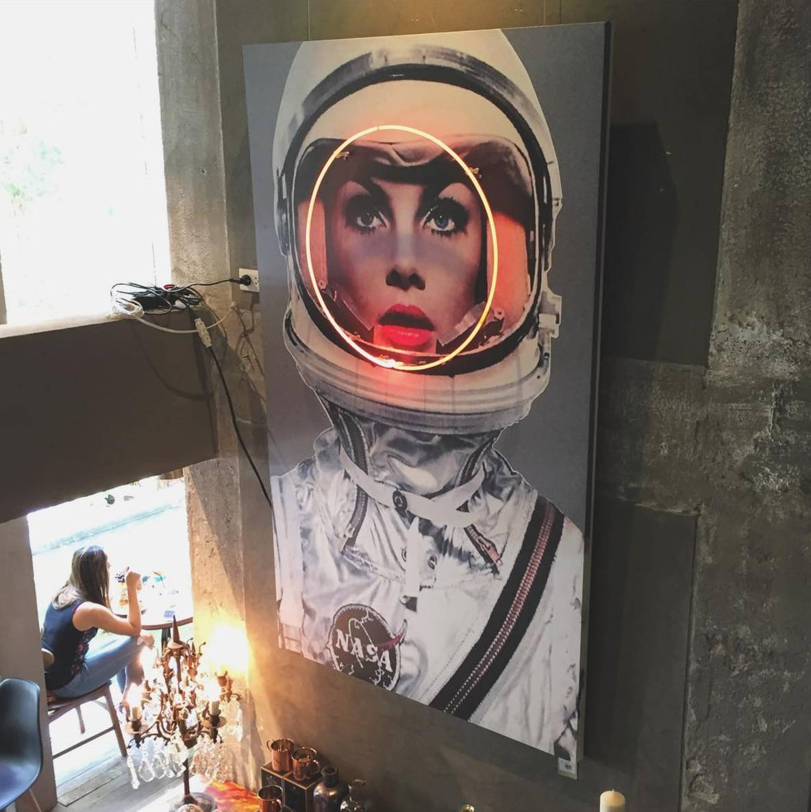

@naeled

Beyond the coffee, the ground floor serves an incredible brunch: avocado toast, salmon salad, poached eggs, fresh juices, and the wildly popular bottled teas from Tea Atelier.

The walls are decorated with neon lights in bright yellow and powder blue — seriously cool. It carries the scent of youthful summer hormones. "As if a flame burns inside the heart, forever bright."

📍 Luka | 64 Pan Road, Silom, Bangkok

☎️ +66 2 637 8558

📕 10 AM – 7 PM (weekdays), 9 AM – 7 PM (weekends)

💰 400 THB

**2 Shugaa / 10:30**

The Ekkamai district, where the morning unfolds, is Bangkok's creative hub — a treasure trove of distinctive little shops, best explored on a bicycle, discovering the beauty of everyday life.

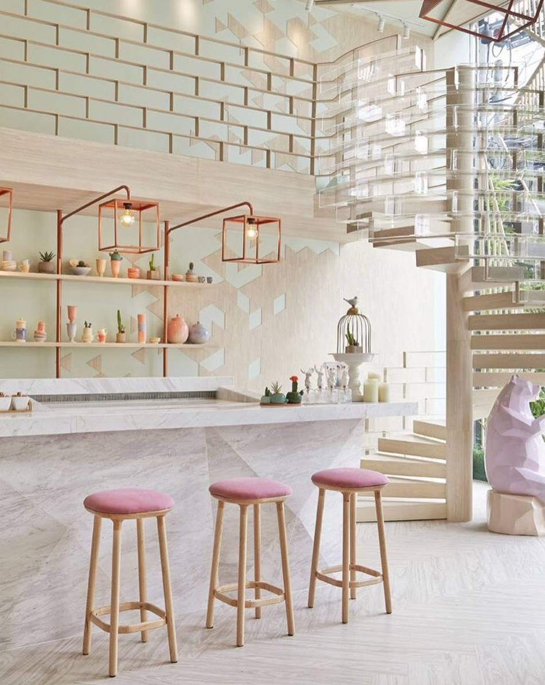

Follow Soi 61 and you will spot a transparent glass house called Shugaa — arguably Bangkok's most photogenic dessert parlor.

Its color palette is a feast for the eyes: low-saturation macaron tones, gray-white marble, rose gold... No matter how cool a girl you are, the moment you step inside, you melt into a soft, sweet version of yourself.

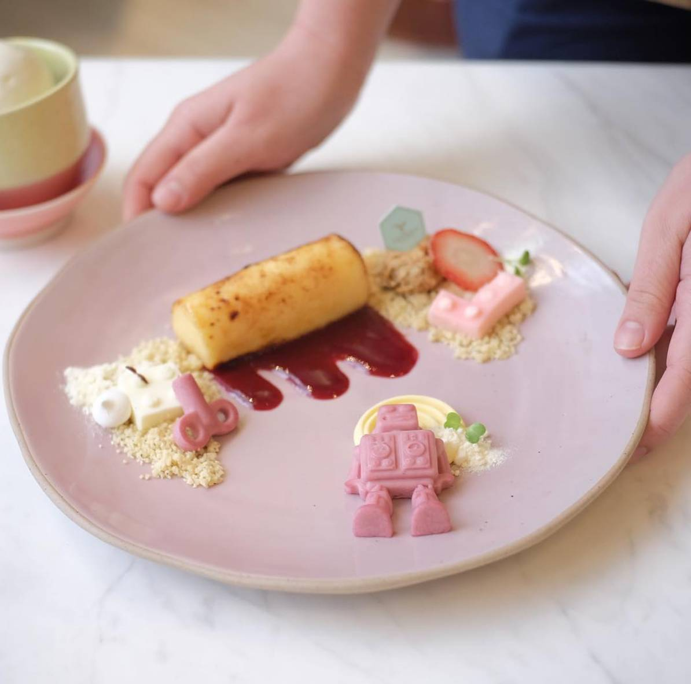

Even if French patisserie is not your thing, come experience it firsthand: Bangkok truly is a stylish place, filled with stylish people.

📍 27 Sukhumvit 61, Klongtan-nua, Wattana, Bangkok

📕 10:00 AM – 8:00 PM

**3 (Un) Fashion Vintage / 11:00**

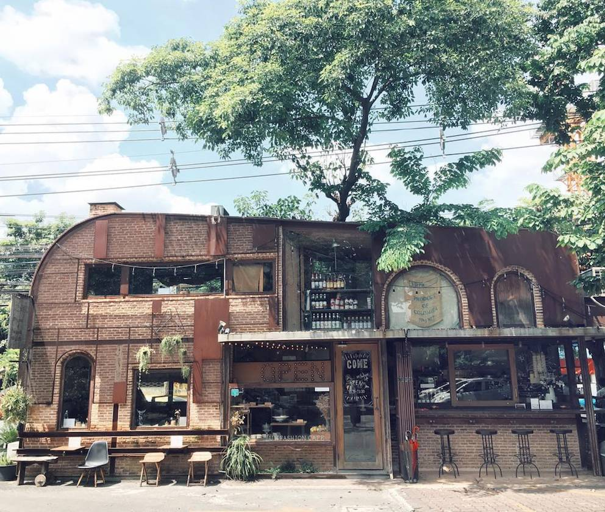

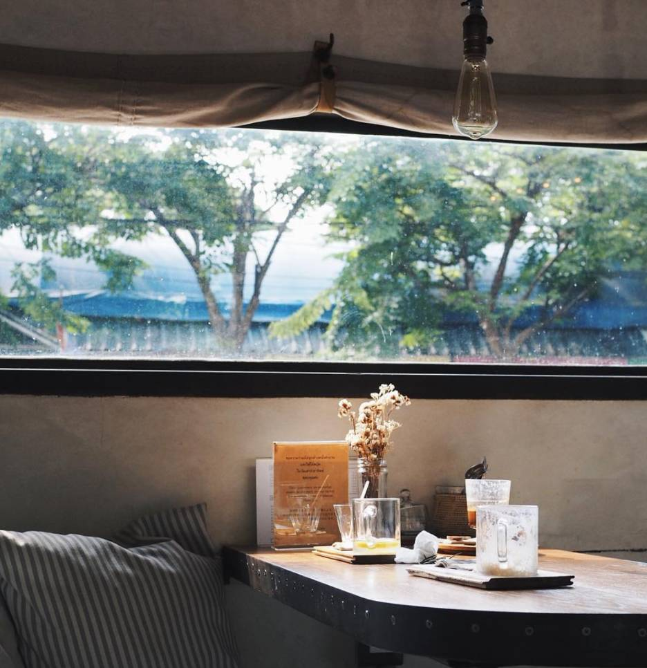

Right across the street is one of Bangkok's premier vintage communities, called **(Un)fashion Vintage**.

When traveling in Europe, I often spend half a day with friends exploring vintage markets, so I naturally made my way here.

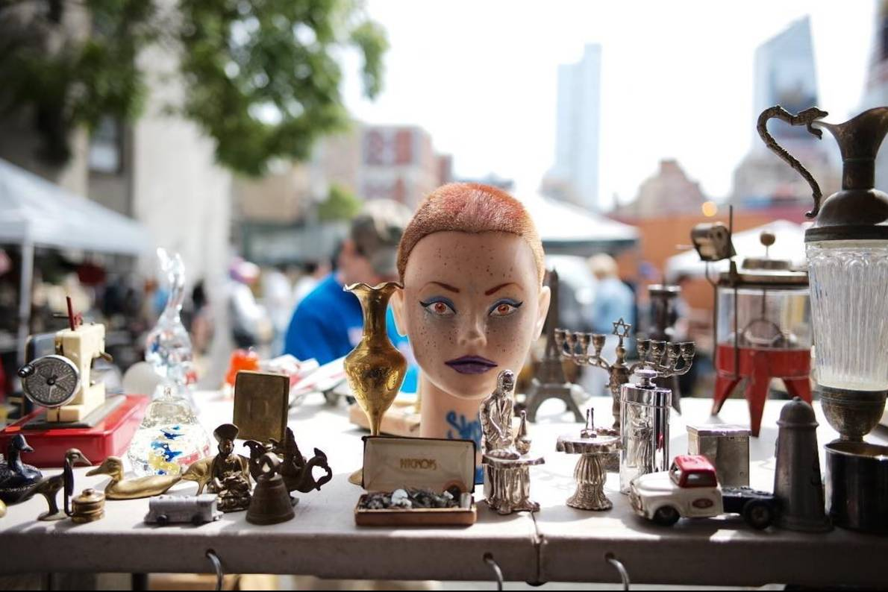

The surrounding area is packed with all kinds of vintage shops where you can dig up plenty of fun little treasures. Absolutely worth a wander.

I recommend Machine Age Workshop (American industrial-style goods — you can even buy vintage license plates from different U.S. states)...

And **Cocue Basics** (one of Bangkok's largest vintage clothing secondhand shops — great for finding dresses, earrings, accessories, and jeans, perfect for a photo shoot).

📍 1/7 Soi Ekamai 2, Sukhumvit 63, Bangkok 10110

📕 +66 2 002 6874

**4 P' Aor / 13:00**

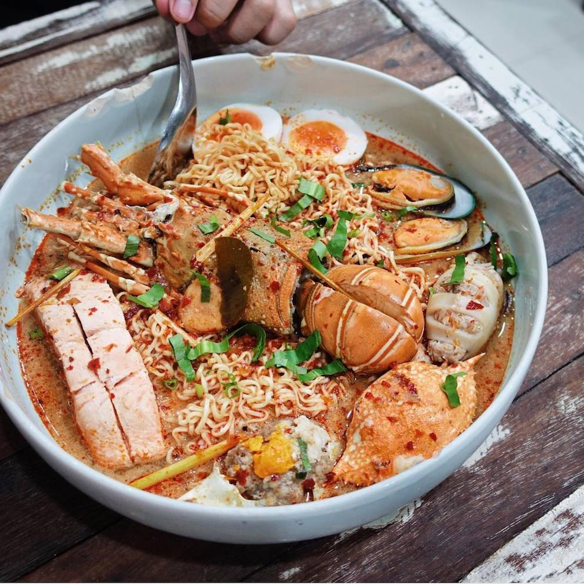

@travlim

This is my secret little noodle shop — **the best tom yum restaurant in all of Bangkok!** Every time I visit Bangkok, I make a detour just to eat a bowl of their lobster noodles here.

Tucked away in a hidden alley in the Phaya Thai area, the broth is simmered from Thai spices and the natural sweetness of fresh seafood. A meal here can cost as little as 10 RMB!

📍 Pee'Aor, 68/51 Soi Phetchaburi 5, Soi 5-7, Phaya Thai, Ratchathewi

☎️ +65 8363 7614

📕 Mon – Sat: 8 AM – 7 PM

**5 After You / 14:00**

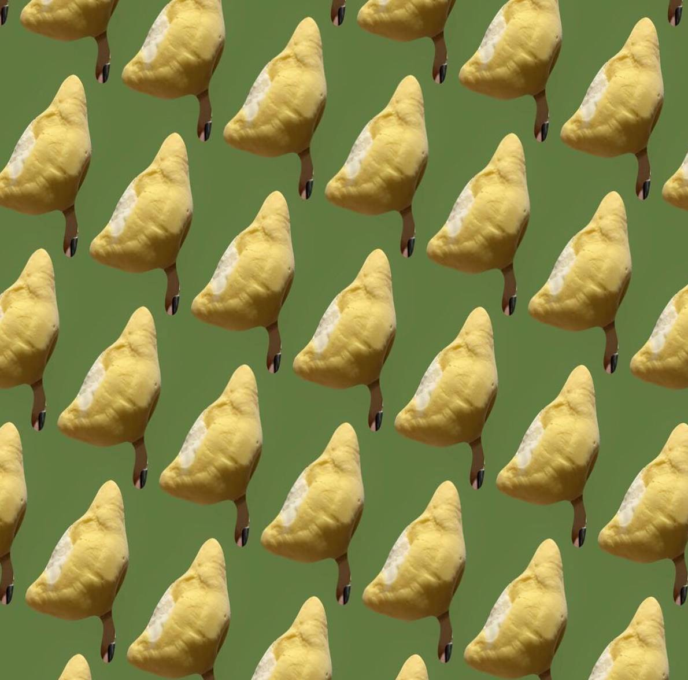

The food in Bangkok is simply OVERWHELMING! From street stalls to artsy cafes, from design-forward Thai restaurants to upscale colonial-style dining... the choices are endless.

Prices are generally about half of what you would pay at comparable restaurants in Beijing or Shanghai! As a foodie, I am honestly tempted to move here.

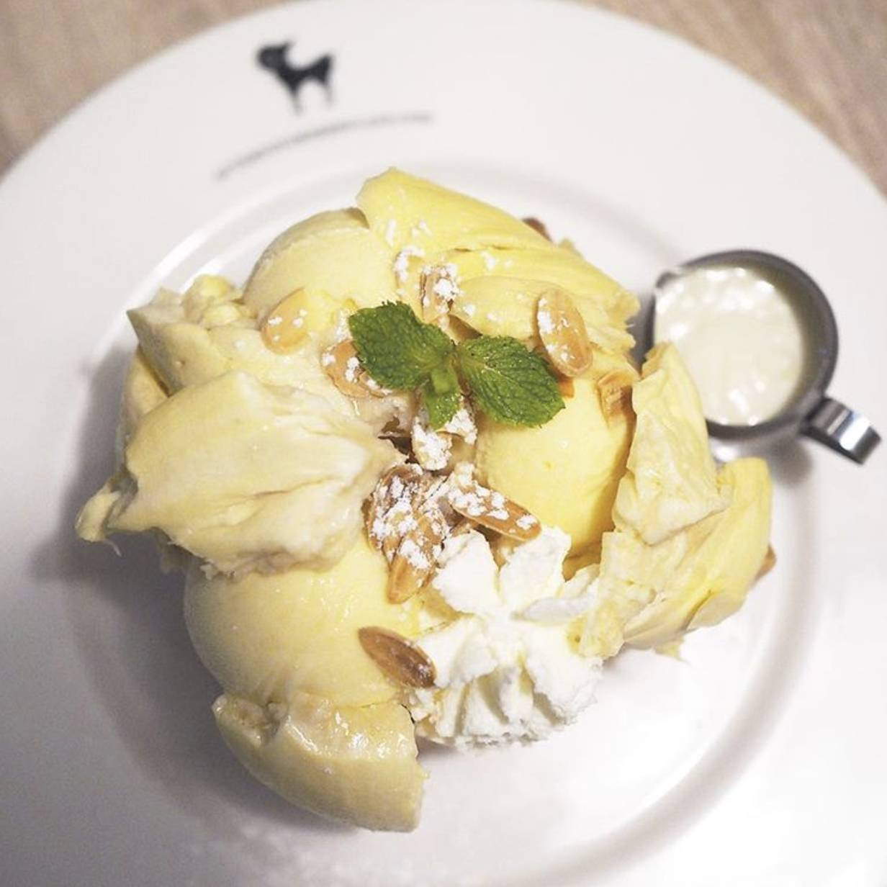

@thyme.w

Oh, and if you love durian, give After You a try — about a ten-minute drive from the lobster noodle shop. It is not exactly an off-the-beaten-path spot, but the moment you dig in with your spoon, you will know: **the ingredients are incredibly generous, and the durian flavor** is absolutely worth it.

📍 G/F, Siam Paragon, Rama 1 Rd., 02-610-7747

📕 10:00 AM – 10:30 PM

**6 Divana / 15:00**

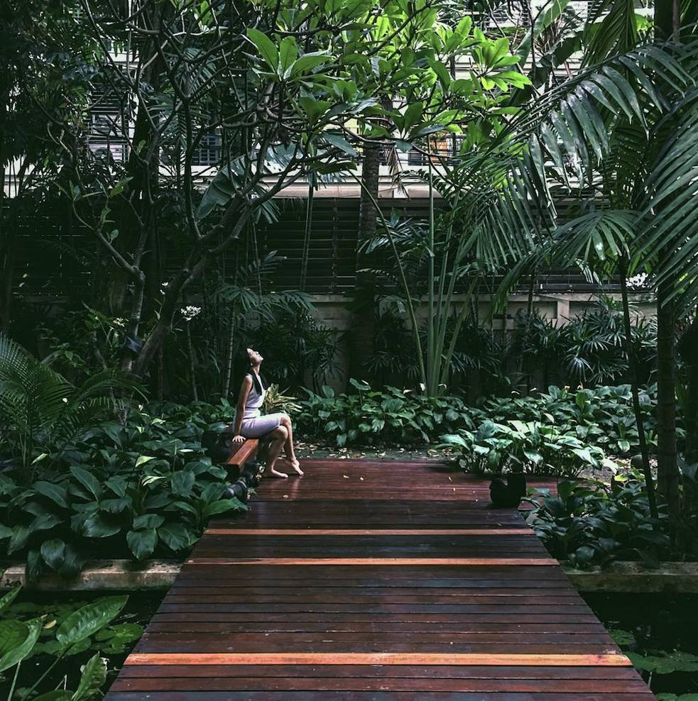

@vvalentines

In the summer heat, head to Divana on Soi 25 for a Thai massage. This place even appeared in Lawrence Osborne's book.

Lying in a tropical garden, surrounded by drifting mist inside a bright, airy room, a spa session sweeps away every trace of fatigue — leaving you ready to keep exploring on foot, or cycling through the afternoon.

📍 Wattana, 7 Sukhumvit 25 Alley, Khlong Toei Nuea

☎️ +66 2 261 4818

📕 11:00 AM – 11:00 PM

**7 The Jam Factory / 17:00**

Nearly five o'clock. "A cluster of factory buildings stands in a lush courtyard, dotted with old bodhi trees, warm sunlight resting on the shoulders, the rustle of wind through the leaves."

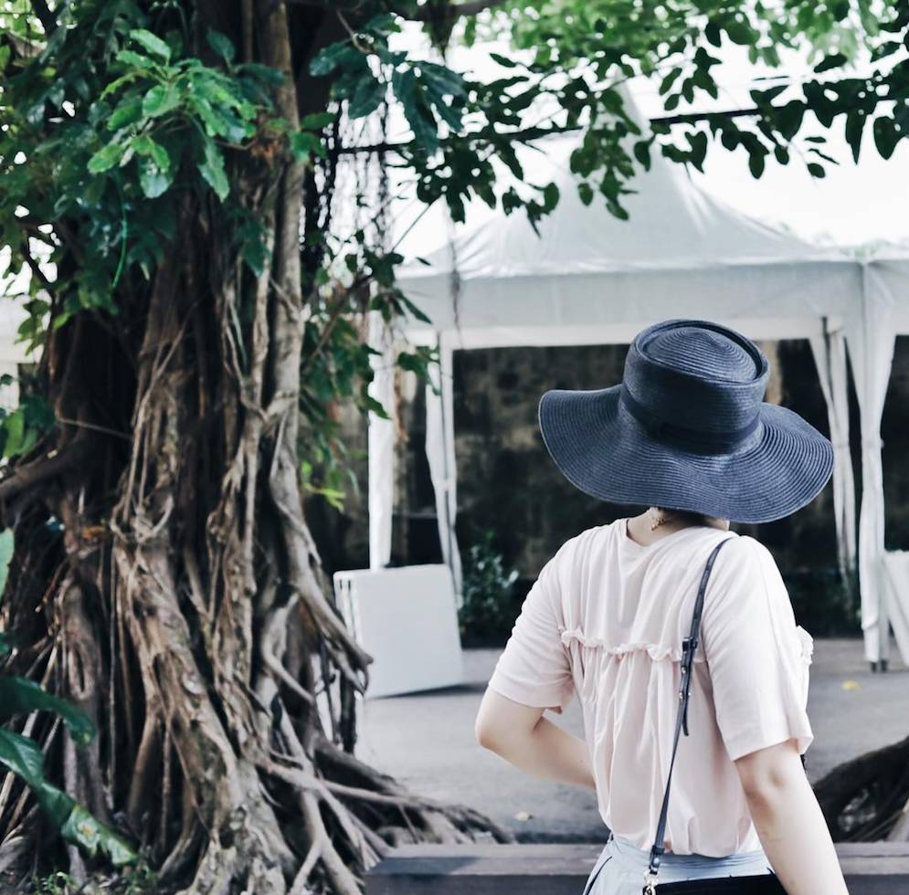

I arrived at the long-anticipated Jam Factory. Originally a riverside warehouse, it was redesigned by the master architect Duangrit Bunnag into a creative space saturated with artistic atmosphere.

It is a "factory" that houses charming handmade-goods shops, galleries, furniture showrooms, designer studios, a bookstore, and fashion boutiques — all under one roof. On weekends, it hosts markets and live music events, making it a paradise for Bangkok's discerning young creatives.

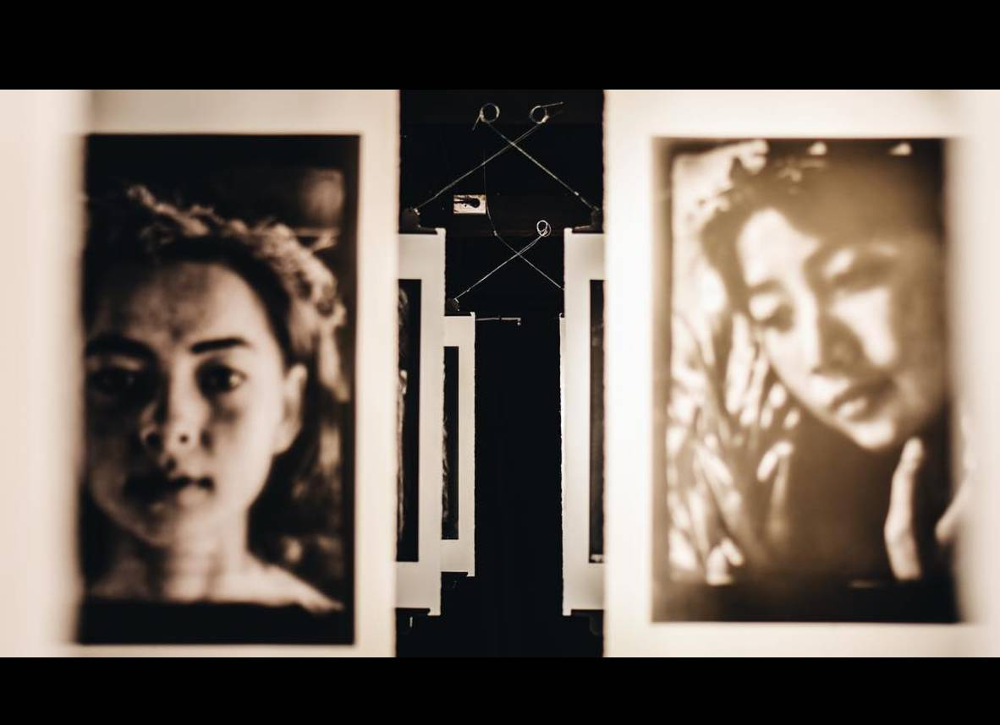

With few tourists around, you can browse the work of Bangkok's designers, leaf through locally published indie magazines and books, and admire the photography on display. It makes you realize just how creative a city Bangkok truly is.

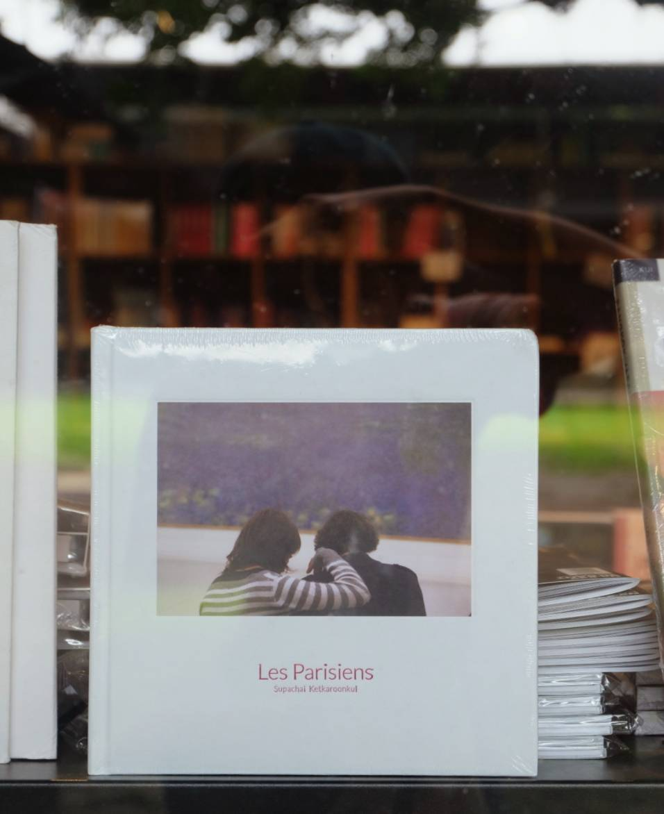

I bought a few stunningly designed photo books, then slipped into the coffee section. The bookish atmosphere quieted the mind. An iced coffee and a Thai tea later, and I felt a world away from Bangkok's sweltering streets.

📍 41/1-5 The Jam Factory, Charoennakorn Rd., Klongsan, Bangkok, Thailand 10600

**8 Never Ending Summer / 19:00**

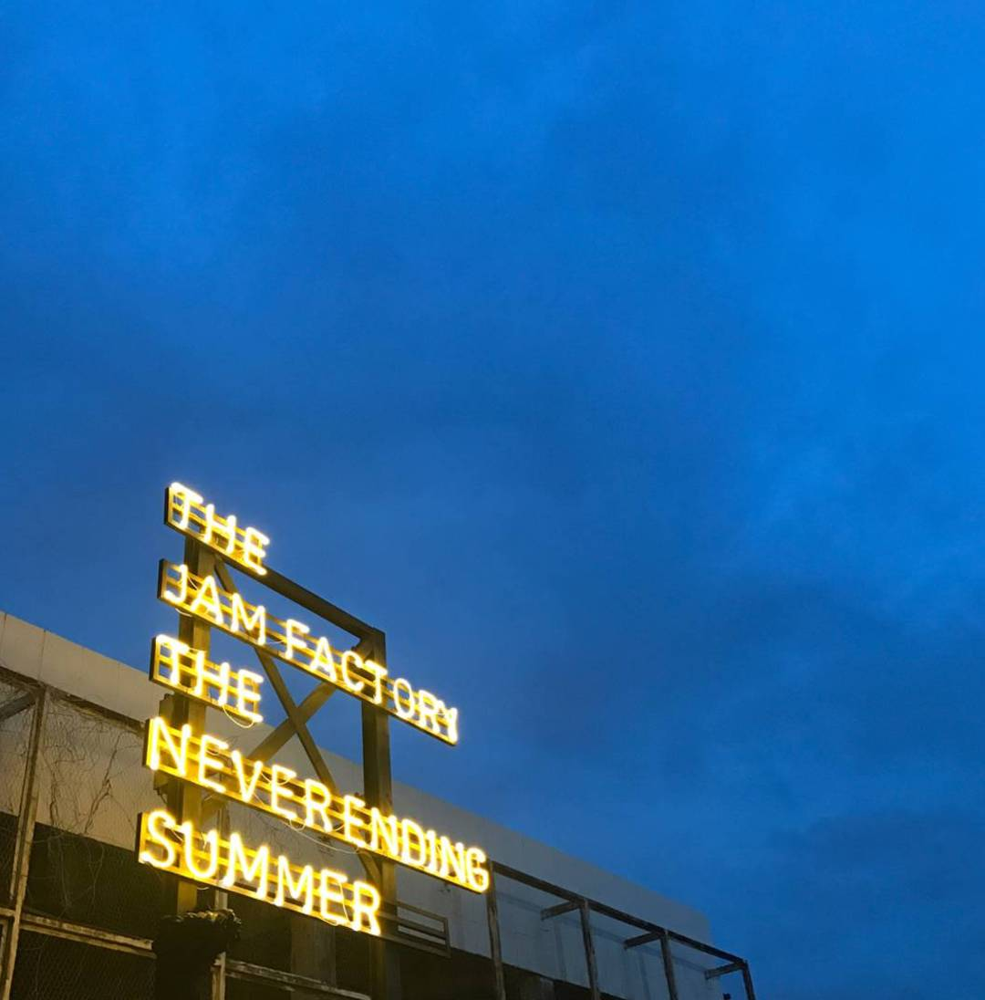

Inside the "factory" is an unbelievably beautiful garden restaurant: The Never Ending Summer.

It has a terrace facing the Chao Phraya River, with spaces draped in hanging greenery. Every so often, a boat drifts by — life feels like a fleeting dream. Have a long, unhurried dinner in a summer that never ends.

**9 Cloud 47 / 21:00**

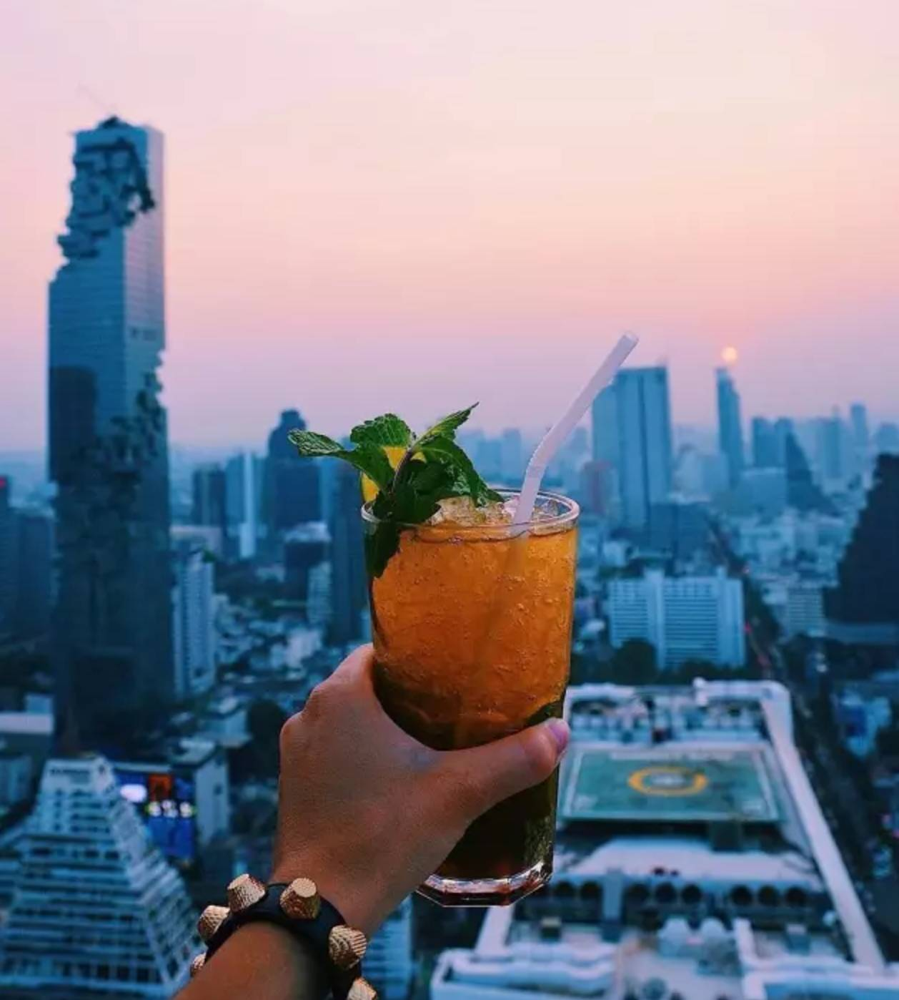

@vendelatressfeldt

After dinner, cycle a little further along the riverside path downstream — the air is refreshingly crisp. Then head to Cloud 47, a rooftop bar, to have a drink at the city's highest point and take in the 360-degree nightscape, the neon lights glittering. The nightlife in the City of Angels is slowly waking up...

📍 47th Floor, United Center Building (Office Zone), Silom, Bangkok, Thailand 10120

6:00 PM – 1:00 AM

📕 Drinks around 300–400 THB (30–100 RMB)

**10 Kasert Nawamin / 23:00**

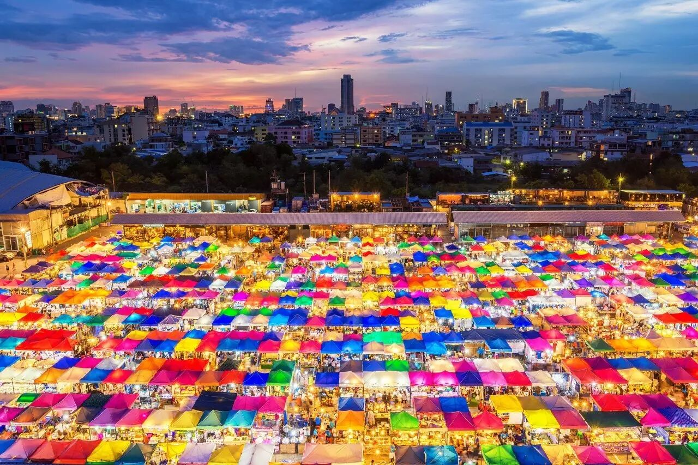

After eleven, head to the night market food stalls for a late-night snack: Thai fried noodles, coconut ice cream, a Singha beer...

Kasert Nawamin, with Huamoom right next door — at both spots, about 80% of the customers are locals. Not too crowded, but plenty of good things to discover.

Down-to-earth, authentic Thai night market life will show you that Bangkok, for all its avant-garde fashion and haute style, also has a rich, intoxicating dose of street-level soul.

📍 Kasert Nawamin: Kaset-Nawamin Rd., Buengkum, Bangkok, Thailand

Huamoom: 11 Kasertnawamin, Ladprao, Bangkok 10230

And that is a beautiful summer day, just like that.

But honestly, is 24 hours nearly enough? It would take 24 days in Bangkok to do it justice. And one article can barely scratch the surface.

I could keep writing:

Bangkok 24 Hours of Joy and Delight Vol 2 – Vol 10...

A One-Day Bangkok Coffee Map

A Day at Chatuchak Weekend Market

Bangkok's 10 Most Worthwhile Hidden, Low-Key Spots

The Top 10 Cafes Loved by Fashion Bloggers

10 Offbeat, Photogenic Lifestyle Experiences

........