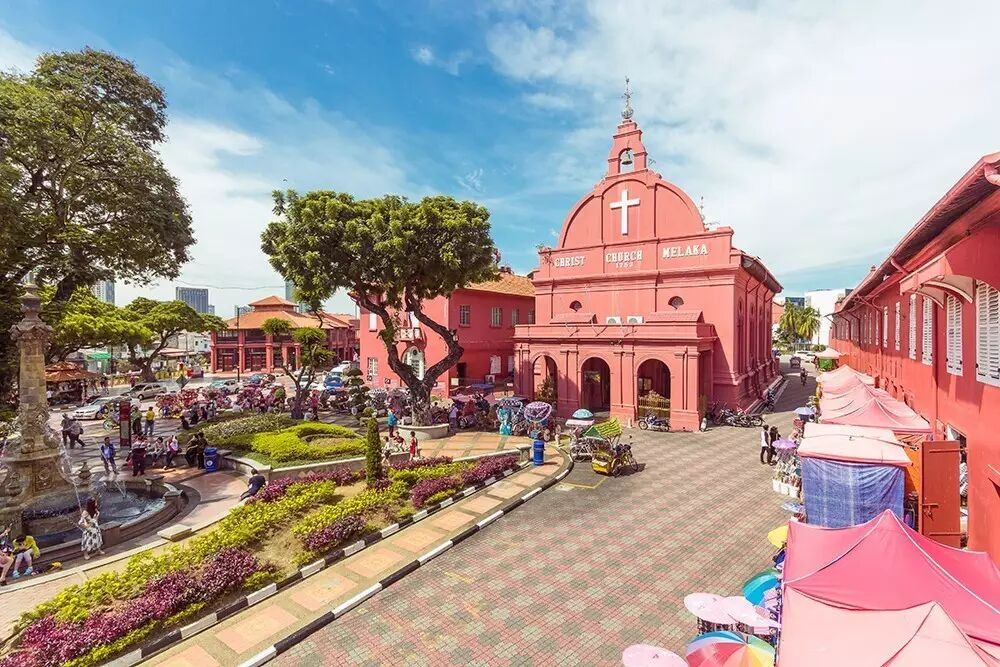
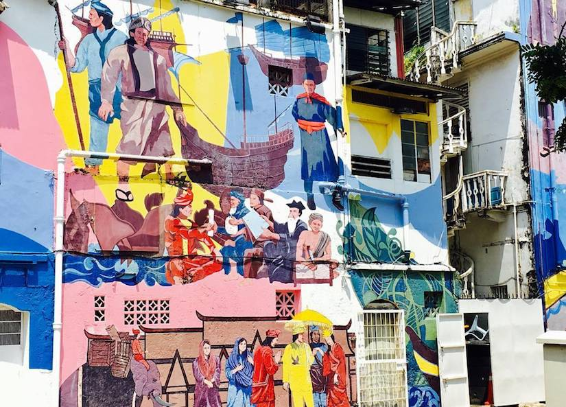
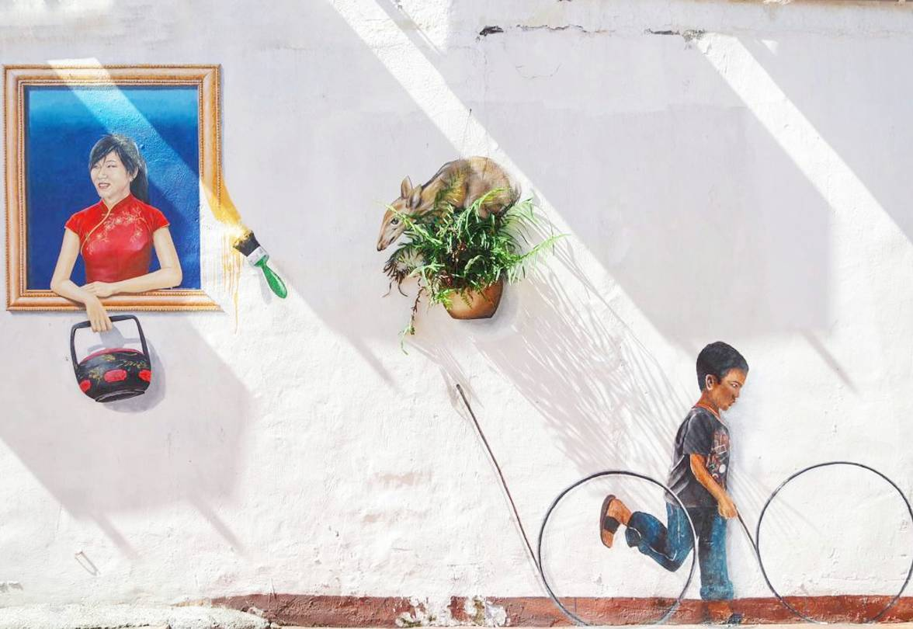
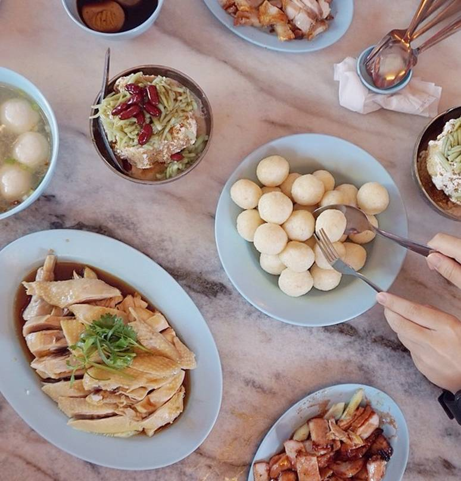
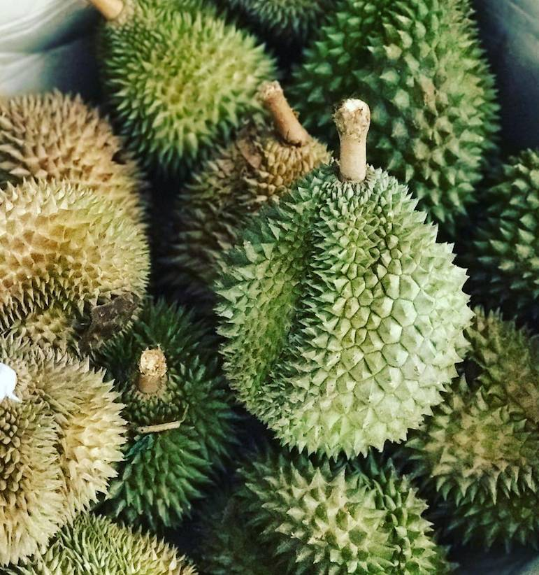
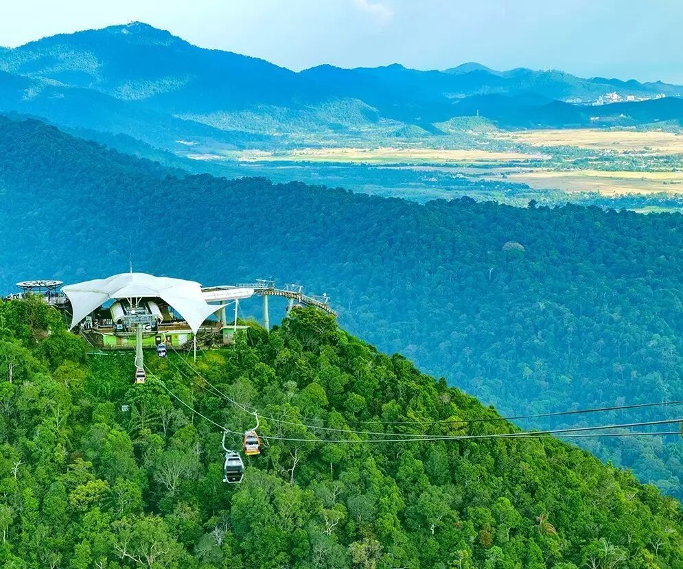
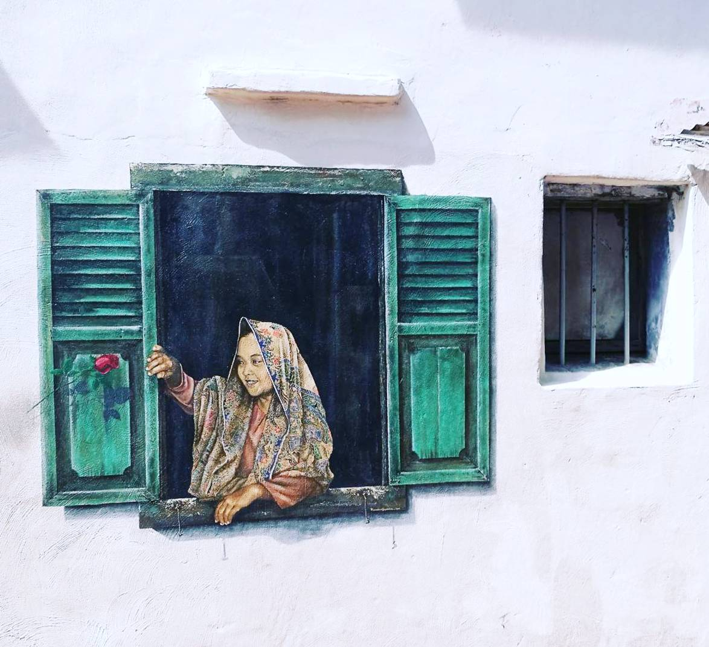
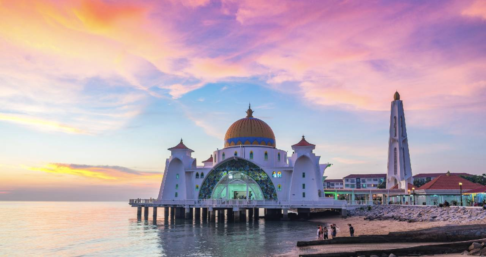

# Malacca: 24 Hours of Joy and Delight · City Checklist

*Geng Yue · Travel Guides*

This edition of "City Checklist" is **Malacca**.

"There is a kind of place, or a kind of person, that you only begin to miss and appreciate after you have left it behind for a while —

yet when you were actually there, you never felt it was anything remarkable. This is a strange thing."

This piece is **about travel, and about wandering.**

❤️

Malacca

This willful **literary city checklist — spend one day in Malacca

** slowing your steps, relaxing your body, breathing slowly **

My impression of Malacca had previously been limited to middle school geography textbooks. I had imagined it as a rugged strait port — I never expected it to be such a refreshingly gentle city.

In an ancient town that is anything but ordinary, **I am a willful traveler. Not in a hurry, not crammed with plans, not chasing landmarks — just eating something good, aimless, following my whims.**

**1 6:00 Awakening**

The ancient city is waking up. The summer heat has not yet risen.

My photographer companion dragged me out to shoot the sunrise, but we caught nothing. Half-asleep, I saw distant figures of worshippers shuffling toward a temple. A local told me that living here, you hear the call to prayer five times a day.

**2 8:00 Going Back to Sleep**

The best time along the Malacca River is early morning — the earlier, the better.

At this hour, there are few tourists. Most people will crowd over to the Dutch Square. Those who come to the river mostly choose to take a boat. Cycling or walking are both fine — wander a little, stop a little.

But I decided to go back to bed and laze around for a while. I have never been good at turning a journey into a frantic race from one stop to the next.

(PS: If you want to snap a photo at the Dutch Square, do it before 9 AM, before the surging crowds swallow you whole.)

**3 10:00 Ancient Places**

@mcfor

If you have the energy in the morning, hop on a bike and wander through the many ancient spots.

I particularly enjoy looking at the murals on the walls — they remind me of the graffiti I saw in Berlin. But Malacca's style carries the emotions of an old city: glory, anger, and forgetting.

gezmelerdeyim

In the old town, you will see countless buildings marked with the era "19××": Dutch-style, Portuguese, British colonial, and Malay Sultanate...

Over a thousand such heritage buildings remain, now listed as a UNESCO World Heritage Site. The Chinese quarter has three main roads with four cross streets running through it, woven together by countless small lanes and alleyways.

When you see the traditional Chinese characters, hear the accents of Hokkien and Teochew mingling in the air, and watch an elderly man in a white shirt, fanning himself with a palm-leaf fan, stroll past — scenes from the old Nanyang era flicker before you like a silent black-and-white film, a familiar kind of estrangement.

**4 12:00 Streets of Good Food**

Even if you are just a lazy foodie today, Malacca will put you in an excellent mood — because you will encounter endless deliciousness.

**Jonker Street**

This is an easy spot to find on any cycling route. It is hugely popular because, in Malacca, virtually every culinary need finds a perfect solution on Jonker Street. The restaurants and small eateries tucked into every corner are like tiny treasures.

michellectting

**Chicken Rice Balls**

On this street, the most conspicuous signs are for chicken rice balls. This ancient city's chicken rice balls (the shop is very famous, and the taste is excellent).

Chicken rice balls are a Malay rice dish, fragrant with glutinous rice and paired with chicken-fat seasoning — utterly satisfying.

If it is your first time trying chicken rice balls in Malacca, start with a small portion to taste — first, to see if you like it, and second, because you still have so many delicious little shops to explore. Save your stomach space and preserve your foodie stamina.

**Fruit**

Fruit lovers will find easy satisfaction in Malacca. One street is lined with far too many tropical fruit stalls, absurdly cheap — practically sold by the heap — with an impressive variety.

The fruit stalls are usually at the end of the street. Just follow the street all the way down and you will find them.

August is durian season in Malaysia, and of course Malacca is no exception. If you have always been a durian skeptic, you might come here and discover — oh my god, durian is actually this delicious! And it is so cheap: about 20 RMB for one, and half a durian is just right for one person.

I especially recommend the durian specialty shop at the end of the street — durian cake, durian crepes... all delicious.

**Seafood**

Eating seafood in Malacca is wonderfully easy. Like fruit, delicious and cheap seafood is everywhere: fried sotong (squid), boiled white prawns, steamed pomfret...

**5 15:00 An Ideal Afternoon**

In the afternoon, I cycled aimlessly through the small park at the town center. There were weathered, venerable green plants, and quite a few locals sitting idly, lost in thought.

My heart felt very quiet. I parked my bicycle and sat on the stone steps. Someone nearby was singing softly — the melody carried a calm, contented, unadorned quality.

I was reminded of a collection of essays by the Taiwanese writer Shu Guozhi: *An Ideal Afternoon*.

Sitting down like this — what kind of place is the most comfortable?

"I can only say: any place where you sit down, and end up sitting for five or six hours, without ever thinking of getting up, without ever thinking of changing spots, as if there were nothing in the world that needed attending to. That is the kind of comfort I mean. It is full-body relaxation. **It is a forgetting of the ordinary you.**"

**6 17:00 The Peaceful Locals**

Every day between four and five in the afternoon, many of the small shops here close their doors. The local residents have long grown accustomed to this peaceful rhythm of life.

Before coming to this small town, I had imagined Malacca as a neon-lit, bustling harbor. I never expected its pace to be so unhurried. In this moment, my heart feels especially calm, grounded, and joyful.

**7 19:00 A Pink Sunset**

As a photographer, I must recommend one excellent spot for photos: if you are not too far from the Straits Mosque, go catch a sunset.

Around 7 PM, the light is exceptionally photogenic — the golden mosque set against a pink-and-blue sky, like something out of a fairy tale. There is a good chance you will capture a landscape shot worthy of your desktop wallpaper.

Today I am a willful blogger, so I am not posting too many pictures. Malacca is not that big — I will leave some room for your own imagination.

And that is that. **On your own journey, fast or slow — you are the one in charge. "Look broadly, listen lightly, taste shallowly, walk slowly. Constantly change scenes, constantly move. Winding hutongs, narrow deep lanes, shop windows. Like passing through an archway — just pass through, no need to linger."**

Some atmospheres, some wordless words — only those who understand can hear each other.

With thanks to **Shu Guozhi, *An Ideal Afternoon***