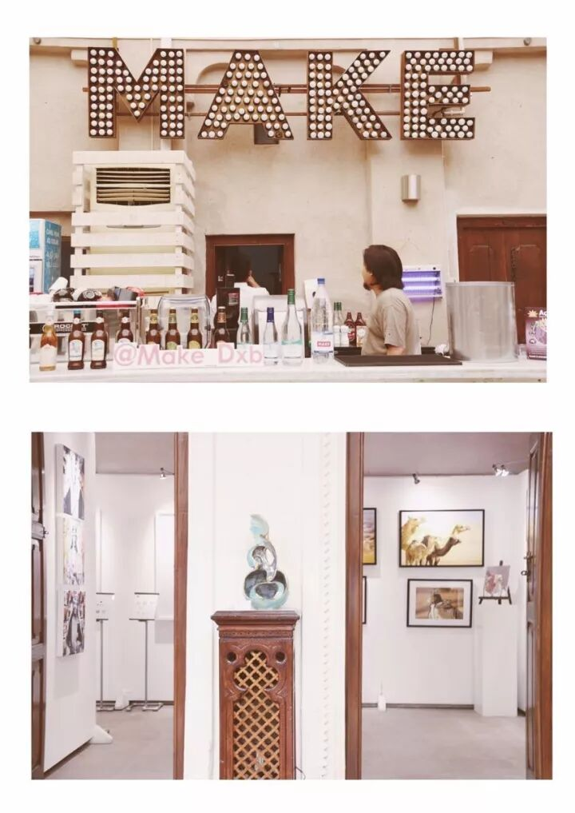
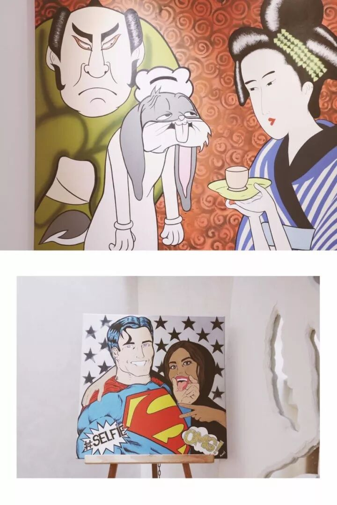
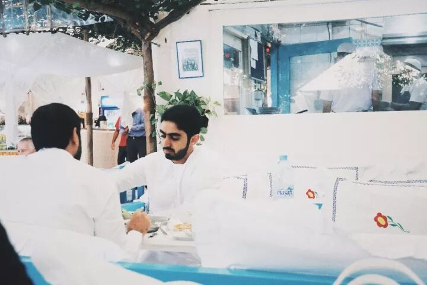
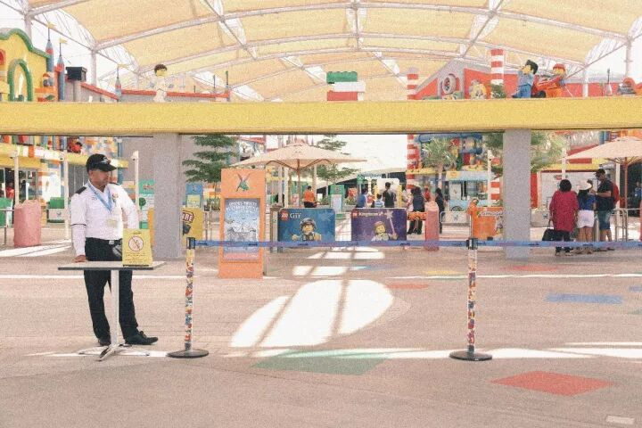
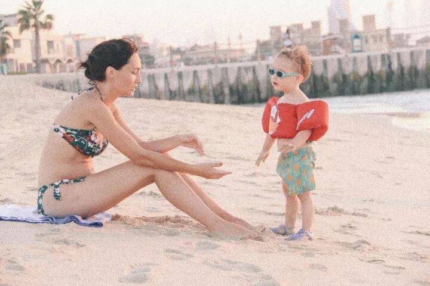
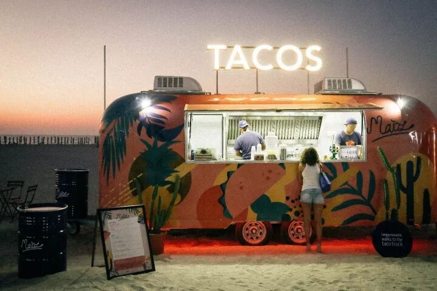
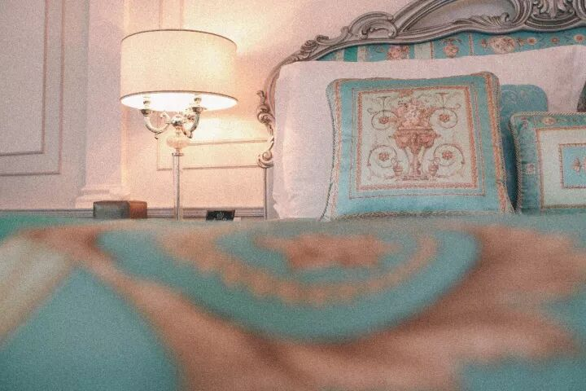

# Dubai: 24 Hours of Joy and Delight · City Checklist

*Geng Yue · Travel Guides*

This edition of "City Checklist" is **Dubai**.

"Our eyes cannot tolerate a single grain of sand, yet they can hold an entire vast desert.

The hardest part is starting. The even harder part is ending."

**How many misunderstandings do you carry about Dubai?**

❤️

Dubai

There is no **gold-paved streets or supercars everywhere — spend one day navigating this surreal, magical city**

To be honest, Dubai was never on my travel list. I had pretty much never considered it. I suppose I just had no particular fantasies about this kind of place.

Before this trip, I even asked a friend who had been there: is Dubai fun? (Hoping to raise my expectations a little.) **My friend replied: probably the most boring place I have ever been.** Then added: just treat it as a box to tick.

But once I was actually in Dubai, I realized that everything online, everything my friend had told me — it was all a "fake Dubai." **This is clearly a city bursting with imagination and excitement.** Over and over, I found myself asking: what on earth were you people doing here?!

**1 8:30 Old Town Tour**

There is an old Arab saying: not every dark cloud brings rain. But in Dubai, rain can fall on you. This is a place where **"anything can happen."** I need you to clear your mind of all doubts and start this day with an open, imaginative spirit.

This is Dubai's old quarter, the Al Fahidi District — a neighborhood saturated with artistic atmosphere. **If you can, I believe you will want to spend an entire day here.**

In *Chungking Express*, Faye asks Cop 663: "Where do you want to go?"
Cop 663 answers: "Anywhere. Wherever you say."

That scene — "go wherever you want" — suddenly popped into my mind. Even now, looking at it through a screen, I still cannot meet that gaze directly.

And this place really is a "anywhere, I'd wander aimlessly with you" kind of place.

Wander into any cafe, and it seems almost standard: a cafe always comes paired with a gallery. Order a coffee you like and, amid the artworks, you will see a completely different Dubai.

**Elements that seem utterly unrelated suddenly fit together** — inexplicably harmonious.

**📕** Make Art Cafe

📍 Al Serkal's Heritage House, Bastakia, Al Fahidi Area, Meena Bazaar, Dubai

**☎️** +971-4-5597856

**2 11:00 Try Traditional Arab Food**

This restaurant is right at the entrance of the old quarter. After exploring the district, you can eat here. The restaurant is classically Arabian in style, the entire courtyard in blue and white, draped with canopies. **Sunlight filters through, dappled and beautiful.**

I went in with the idea of just trying the local cuisine, but found it unexpectedly delicious. Middle Eastern flavors — the salad with flatbread was excellent. **I later discovered that Emirati flatbreads in general are pretty wonderful. The lamb skewers deserve a special recommendation:** delicious, delicious, delicious. Well-marinated, fragrant, spicy, tender — though a touch on the salty side. Most importantly, no gamey mutton taste at all.

**📕** Arabian Tea House Cafe

📍 Bur Dubai, Al Fahidi R/A

**☎️** +971-4-3535071

**3 12:30 A Theme Park With No Queues**

I visited three theme parks on this trip. At the first one, I wanted to ask: **"Where is everyone???"**

At first, I could not get used to the fact that there were **no queues.** Later, seeing any people at all became surprising. I asked around and learned that Dubai simply has so many theme parks that on weekdays, empty queues are completely normal.

I really want to bring my girlfriends here and replay everything, to heal the heart that wept standing in lines at Disney.

**(Tip: Dubai's weekend is Friday and Saturday.)**

Of the parks I visited, I recommend IMG Worlds of Adventure — the world's largest indoor theme park, covering 1.5 million square feet, equivalent to 28 football fields.

It is divided into four zones: Marvel, Lost Valley Dinosaur Adventure, Cartoon Network, and IMG Boulevard. **The most compelling is the Marvel zone, exclusively licensed by Marvel Studios — the only one of its kind in the world!**

There is also the Velociraptor roller coaster that accelerates from 0 to 100 km/h in just 2.5 seconds, the Haunted Hotel, and loads more fun. Of course, there are kid-friendly attractions like The Powerpuff Girls. **Highly recommended for parents with children — you will be "crazy happy" here.**

**📕** IMG Worlds of Adventure

📍 E311, Sheikh Mohammed Bin Zayed Road

**🕙** 12:00–20:00 (Daily)

**4 17:00 Sunset at Kite Beach**

I imagine you will be a little tired after the IMG Worlds of Adventure. At this point, Kite Beach is exactly what you need. **A gentle sea breeze, the slanting light of the setting sun, a cold drink, lie down — and you will completely relax.**

From here, you can also glimpse the Burj Al Arab in the distance. But more than that, you will see people freely strolling and playing along this stretch of beach.

**Dubai is actually very well-suited for family trips.** You will see many parents with their children playing on the beach — some playing volleyball, some jogging along the shoreline. I spotted an especially adorable little boy. Watching him play with his mom, my heart practically melted. So warm.

Not far away, there are food trucks lined up — each with its own character, all quite charming.

**I don't know why, but it reminded me of a scene from *La La Land*. Deep down, I felt this was a place made for dancing.** If you were beside me, I might actually start dancing with you.

Under the sunset, everything feels romantic and justified.

**📕** Kite Beach

📍 Jumeirah Road opposite Burger Fuel Restaurant, Kite Beach

**5 19:30 Cuisine of Love**

The restaurant is in CITY WALK. In this bustling commercial district, you can choose to go shopping first, burn some energy, and then come for this meal filled with love.

Pick a seat by the window, order your favorite food, and watch the hurried traffic outside. **It feels as if you truly live in this city.** Travel is magic — it gives us the possibility of being elsewhere.

And the loveliness of food lies in this: good food lets you feel the city's "love" for you. In that moment, **the food tells you the story unfolding between you and this place.**

**📕** Gran Caffe Londra

📍 G 09, - 8 Boulevard Walk Tower - Dubai

**6 21:30 Why Not Catch a Show?**

I am not usually a fan of large-scale magic-spectacle shows. I prefer stage plays and contemporary dance. But watching La Perle's water show in Dubai, I could only describe it as **"Amazing."**

**The way it works with the entire stage design is intensely visceral — utterly breathtaking, incredibly powerful.**

The show runs for 90 minutes. It is a "carnival" of local culture, blending all kinds of elements together. You will see acrobats, divers (performers rise high into the air, then suddenly free-fall — **crashing into the water pool**), motorcycles, all kinds of circus-style acts. **The tense, thrilling performances can sometimes leave you breathless.**

After the show, you will applaud the performers with genuine admiration. But honestly, it is hard to understand the narrative behind every act. **This is not a narrative-driven piece like a stage play — it is a conceptual work.**

Just enjoy the stagecraft and the performers' stunts to the fullest.

**📕** La Perle By Dragone

📍 Al Habtoor City, Dubai, United Arab Emirates

**🕙** 19:00–20:30 & 21:30–23:00 (Tue–Fri); 16:00–17:30 & 19:00–20:30 (Sat)

**7 23:30 What We Do Best Is Dream**

Versace has only two hotels in the world: one in Australia, and the other right here in Dubai.

Staying at Palazzo Versace is about experiencing Gianni Versace's philosophy of life. Unlike Armani's minimalism, **Versace embodies its creed of "More is more."**

You will also notice his personal love for neoclassical architecture.

Palazzo Versace is saturated with brand symbols: the Medusa head, the Greek key motif, and the house's classic prints are everywhere. **Every single detail is exquisitely designed.**

Every piece of furniture and every fabric is custom-made for the hotel by Versace Home Collection — pure haute couture. Weaving one sweet dream after another for you, the guest.

"On this vast, boundless planet, the most conspicuous primates are called humans.

And after over 10 billion years of evolution, what are humans best at?

**What we do best is dream.**"

Good night, Dubai — as distant as a dream. 🌛

**Tips**

▼

**Q: Do I need a visa for Dubai? A: No.** Dubai offers free visa-on-arrival for Chinese citizens. No need to apply in advance — just buy a plane ticket. Entry procedures are as simple as coming home, and airport immigration is incredibly fast.

**Q: Time difference with China? Is it safe? A:** Dubai is 4 hours behind Beijing time. The crime rate in Dubai is near zero. Whether day or night, the city is absolutely safe. If you need help, dial the emergency number 999.

**Q: Cultural taboos in Dubai? A:** Avoid pork, patting children on the head, drinking alcohol in public, giving stuffed dolls as gifts, and photographing or physically touching local women.

**Q: Will there be a language barrier? A:** No need to worry at all. Use Chinese when shopping in malls, English at hotels, in taxis, and restaurants.

**Q: What currency does Dubai use? Can I use Alipay? A:** The currency is the Dirham, with an exchange rate roughly double the RMB. US dollars are accepted, but Alipay has not yet become widespread. However, UnionPay cards work perfectly — just tell the cashier "Union Pay."

**Q: Electrical voltage? A:** Power specifications are 220/380V, 50Hz, 3-phase — the same as in China. Plugs are the three-pin flat type, UK standard.

**Q: Can I drink alcohol in Dubai? A:** Due to religious beliefs, public alcohol consumption is prohibited in Dubai. However, hotel restaurants and bars are licensed to serve alcoholic beverages.