# 奥克兰 24 小时清单 · 一场属于风帆之都的梦

*Geng Yue · Travel Guides*

这是JUSTGO推出「城市清单」原创栏目的第 05 篇文章。来聊一聊新西兰最大的城市奥克兰。

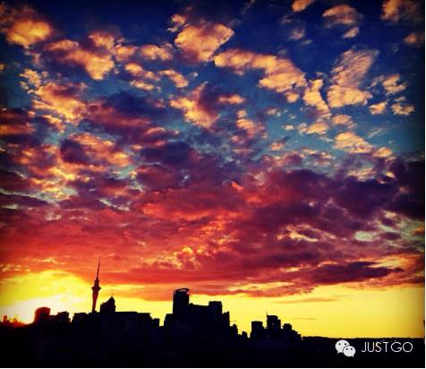

Shane Lawrence，奥克兰官方旅游网站

许多慕名新西兰纯净风光的人们，常会忽略北岛的奥克兰，而直奔户外天堂的南岛。

在奥克兰，人们最引以骄傲的不是玩命工作，将自己变成一个经济动物，而是他们捍卫和创造的田园生活。木屋、大海、花园，是住在新西兰的精髓所在。在街边小店喝喝咖啡、在海滨小径上跑跑步、驱车找个幽静的渔船码头钓鱼……

奥克兰人的生活：**他们健康的小麦肤色，穿着随意地在海滩散步，草坪上慵懒的午后小憩。**

奥克兰人骨子里弥漫的那股生活热情极富感染力，他们将大部分的智力和财富都用来享受生活，如果你是第一次来到奥克兰，这座城市极有可能会重新修订自己的人生方向，这就是它的魅力所在。

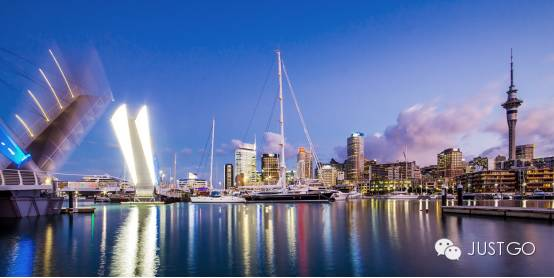

奥克兰官方旅游网站

**奥克兰**

05 ◇ 城市清单

新西兰的人自称Kiwi，这个昵称源自奥克兰的国鸟，一种不会飞的奇异鸟。

奥克兰，一半是城市，一半是海水。数不清的岛屿和火山。阳光、沙滩，空气里的海洋味道。码头停靠的密密麻麻的豪华游艇。这里是新西兰最大的**港口城市**。

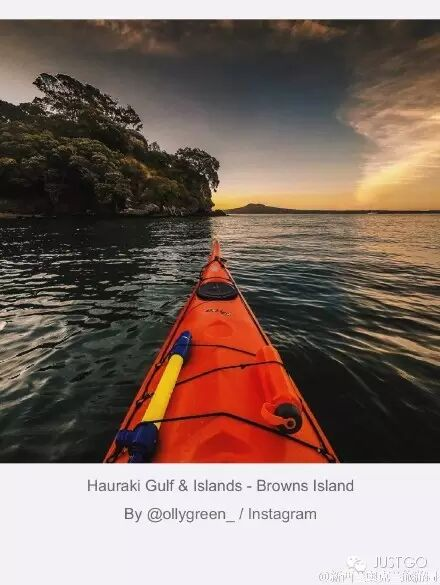

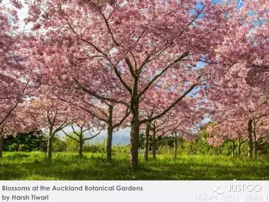

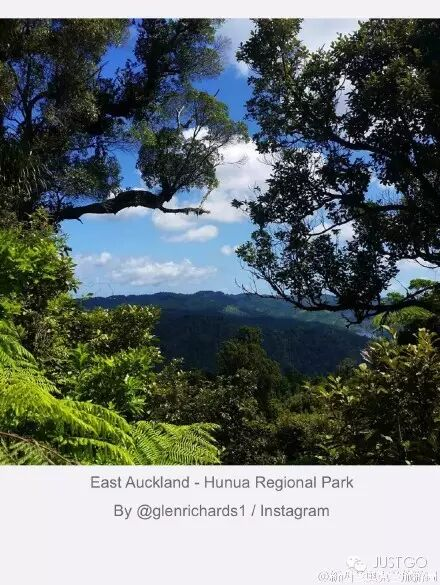

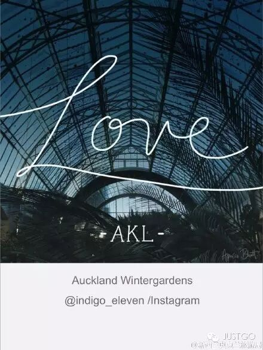

奥克兰有一个暧昧的毛利名字 - Tāmaki Makau Rau，其名在毛利语中的意思是"纯洁的少女和一百个情人"，也有译成"一千个情人的地峡"。可见奥克兰宜居的生活环境。

早在数百年前，奥克兰的美就引得众多部落为之争夺，奥克兰的美，或许可以用 '芳泽无加，铅华弗御'来形容。**既然如此，为何不前来一亲芳泽？**

奥克兰官方旅游网站

奥克兰的早晨，暖暖的阳光，新鲜的空气，热情的迎接远道而来的旅者。

想入乡随俗，可用毛利语和自己说声早安"Kia Ora"，也可以和身边朋友用毛利人的礼仪碰鼻子"hongi"的可爱问候。

**Kia Ora！**

**◇ 9:00 AM 在码头望尽千帆**

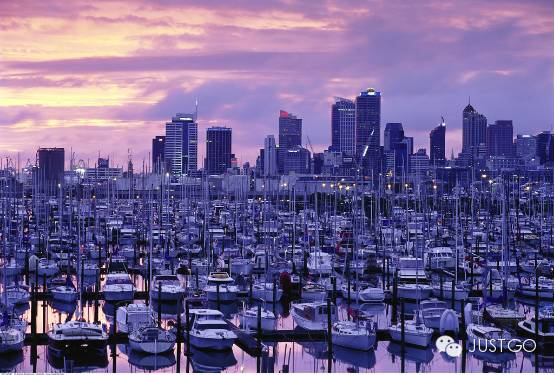

锦衣，穷游网

奥克兰人有3大爱好"海滩、划船、烧烤野餐"。

走在岸边，密密麻麻的风帆排成众列，非常的壮观。

据说在这里，平均每三个奥克兰居民就拥有一艘游艇。天气好的周末，当地人会选择扬帆出海，去附近任意一个小岛上，消磨一天的惬意时光。

码头大楼

99 Quay Street, Auckland Central

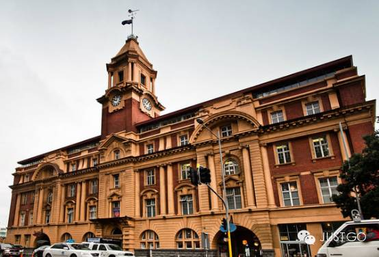

风清扬，蚂蜂窝网

离码头不远处，望见栋醒目明黄色巴洛克风格的大楼，就是码头大楼(Ferry Building)，也是奥克兰的标志性港口建筑之一。远远望去，大楼的裙墙是花岗岩，上部是由红砖和沙岩砌筑，红黄色彩相间，大楼外的铁栏杆，房内的煤油灯都非常的复古，整座建筑犹如一件独具特色的艺术品。

大楼始建于1912年，早期是英国海关办公署，静静的陪伴着这座城市走过了许久。

1982年，新西兰历史建筑信托基金会将轮渡大厦收录入遗产名录，并在 1986 到1988 年期间对其进行大规模修复。现在它的底层大部分是商店和咖啡馆，大部分渡轮业务则搬到了新大楼。

皇后街

Queen Street, Auckland Central

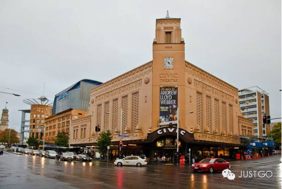

风清扬，蚂蜂窝网

离开码头大楼往南走，便是奥克兰 downtown 最繁华的商业区皇后街(Queen Street)。这里汇集了琳琅满目的商店百货，餐厅酒店，也是市区最热闹的地方。

Queen Street 建于1840年，以维多利亚女王命名。街道两旁的建筑是一大看点，除了前面经过的奥克兰码头大楼(Auckland Ferry Building)，还有19世纪希腊复兴式风格的新西兰银行大厦(Bank of New Zealand Building)、和奥克兰市政厅(Auckland Town Hall)。

复古的历史建筑与现代的高楼大厦交错林立，繁华的街区又带着份庄重感。

天空塔

Corner Victoria St W and Federal St, Auckland Central

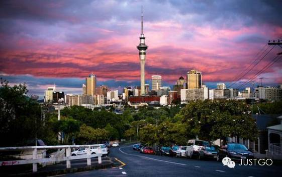

Carl Madsen on Twitter

在皇后街上走，远远的就望到了奥克兰的地标天空塔(Sky Tower)，其实你可以在奥克兰市区的任何地方望到它，感觉看到它就不会迷路。

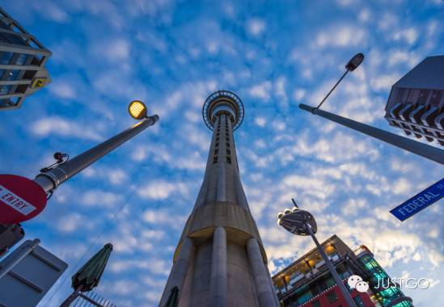

saviourwin，穷游网

在Queen Street与Victoria Street West相交的路口拐弯上，到Victoria Street West，再向上走300米，就可以走到它的脚下。

天空塔高328米，是迄今为止南半球最高的建筑。登上塔顶的观景台，奥克兰城市的全景尽收眼底，无论是白天、黄昏还是夜晚，景色都非常怡人。喜欢刺激的还可体验"SkyWalk"和"SkyJump"，在云端让肾上腺飙走。

**◇ 11:00 AM 享受来自高空的午餐**

天空塔作为南半球最高的建筑，历时 2年零9个月倾力打造。

登上高塔，宛如身在云端，如果再来顿美味大餐，一口一景的享受奥克兰的城市风光，最美妙不过。

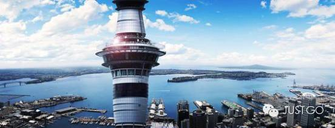

网络图片

Orbit旋转餐厅(Orbit Revolving Restaurant)位于天空塔上，190米的高空，每小时360度旋转一周。

坐在窗边，一边享用新西兰的美食，一边俯瞰奥克兰的美景，悦目又抚胃。餐厅消费适中，菜肴可口，并且在这里用餐可以免费进入天空塔主观景台观景。餐位非常的紧张，要去用餐需提前至少3天预订。

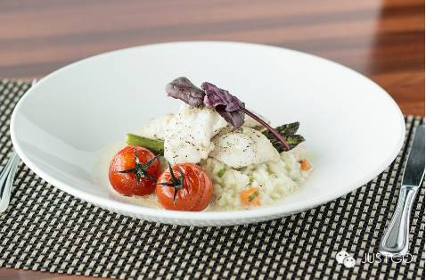

网络图片

来到奥克兰绝对不可错过去品尝当地的海鲜：小龙虾、牡蛎、青口，肉质嫩滑，汤汁鲜美。

**◇ 13:00 PM 饭后去感染点人文气息吧**

奥克兰大学

22 Princes St, Auckland

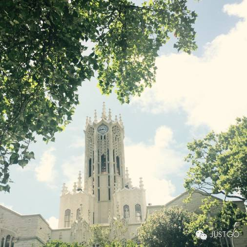

introlaughing，穷游网

从皇后街穿过奥克兰市亚伯特公园（Albert Park），眼前出现座白色梦幻钟楼，

这就是奥克兰大学 (The University of Auckland)。

奥克兰大学是世界著名的大学，也是新西兰最具影响力的学府。没有大门，没有围墙，整所大学宛如建立在花园之中，静谧而幽美。在校园里漫步，看草坪上和林荫大道上来往的学生，迎面扑来的青春气息，这也是每个人梦中的校园吧。

奥克兰中央公园

20 Park Road, Auckland

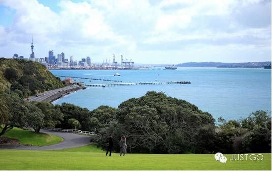

竹风萧萧的新浪博文

参观完奥克兰大学，再出发往东南走，会看到一大片一大片的绿地，那就是奥克兰中央公园(Auckland Domain)。中央公园占地面积非常大，有大片的草坪和树林。

这里是奥克兰市民们周末最常来休憩的地方。早晨有很多人在这里晨练，天气好的周末，大人带着孩子们在这里踢球、遛狗，悠然自在。如果开着车子绕着公园向上行，还可见到成群牛羊怡然自得地慢慢吃草，还有其他一些小动物出没。

漫步在这座城市花园里，整个身心都放松下来，无限羡慕奥克兰人的慢生活。

奥克兰博物馆

The Auckland Domain, Parnell, Auckland

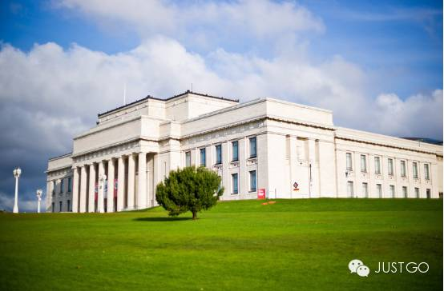

TINTINANDSNOWY的相册《奥克兰》,穷游网

在中央公园的一座小山丘上，望去有一座白房子，下面有足球场和跑道，顺着小路往上爬，就来到了奥克兰博物馆，也称战争纪念博物馆(Auckland War Memorial Museum)。

奥克兰博物馆是一座新古典主义风格的哥特式建筑，馆内陈设品丰富，共有三层，是收藏新西兰历史和民族文物的综合博物馆。管内最为特色的当属新西兰土著民毛利文化，每天会有三场毛利文化表演，非常值得一看。

参观完博物馆，慢慢走下山，离开古老的奥克兰中央公园。慵懒的午后和甜点最相配，来杯暖暖的热茶，吃一块美味的糕点，惬意的享受慢节奏的休闲时光。

**◇ 16:00 PM 不得不尝的奶油蛋白酥**

新西兰的奶制品享誉全球，其中奶油水果蛋白酥(Pavlova)是新西兰最具特色的甜点。这款甜品得名于上世纪的 20 年代的一位到南半球国家巡演的著名俄罗斯女芭蕾舞蹈家安娜·巴芙洛娃(Anna Pavlova)，据说是以此表达新西兰人对这位女神的敬意，为了纪念她而发明的。

Pavlova是一种类似蛋白酥皮饼的蛋糕，外表是松脆的蛋白酥皮，配以松软的馅料，再裱上厚厚的鲜奶油，奶油上满满的点缀当季的时令水果，光看起来就十分的可人。

城中许多家餐厅都可以尝到这款甜品，可以在前面的Orbit餐厅品尝，或者到高架海港（Viaduct Harbour）附近奥克兰最顶级的Euro Restaurant & Bar（@ Shed22 Princes Wharf Auckland）品尝搭配了奇异果及Lemon & Paeroa饮料（新西兰超人气的软饮料）的奶油水果蛋白酥给你带来意想不到的味觉体验。

**◇ 17:00 PM 去海边吹吹风**

使命湾

Mission Bay, Auckland

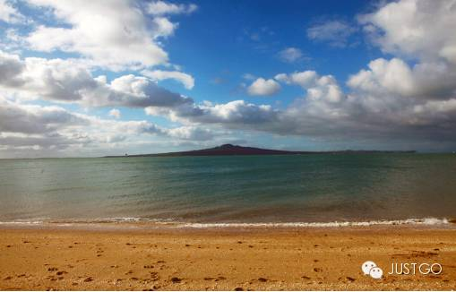

锦衣，穷游网

因为海滨城市，放眼望去就能望到碧蓝的大海。循着海的气息，不知不觉就走到了海边。湛蓝的海水，淡淡的海风，吹走心中的烦恼。

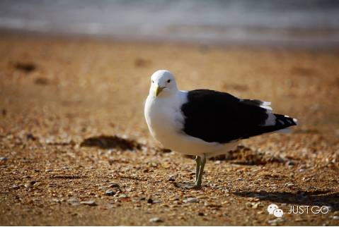

锦衣，穷游网

使命湾(Mission Bay)是离奥克兰市中心最近的海滩，坐公交车也不过10几分钟就可以到达。周末的时候，拖家带口来这儿烧烤晒太阳，是很多奥克兰人喜欢做的事情。

往西可以看到海港大桥，正北是朗伊托托火山岛（Rangitoto Island），东北方向则可以遥望到激流岛（Waiheke Island，官方中文名字是怀赫科岛），当然还有随处可见的天空塔。

天气好的时候，海滩上会有很多人在晒日光浴，男女老少，来自各个国家的人们。遇到友好的当地人，还会邀请你和他们一起野餐，感受这片土地的热情和包容。

**◇ 19:00 PM 落日中的依恋**

伊甸山

260 Mount Eden Road, Auckland Central

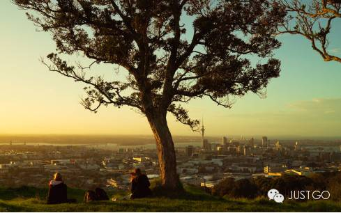

saviourwin，穷游网

傍晚，寻觅一个观看日落的好地点，看着夕阳慢慢下沉，在落日的余晖中，心也跟着柔软起来。

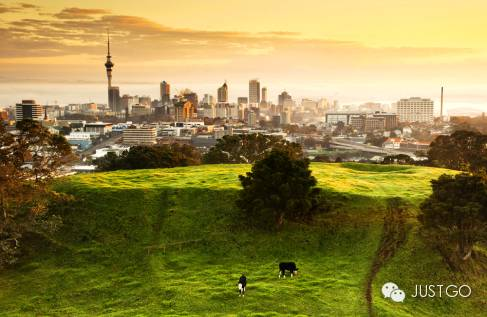

Kenny Muir Photography

奥克兰多火山，而伊甸山(Mount Eden)是奥克兰众多火山锥中最高的一个，也是奥克兰自然地貌的最高点。现在火山锥的坑底是一片茂盛的绿地，看起来非常神奇。伊甸山海拔196米，站在山顶，可以将市区和附近海面一览无遗，包括天空塔、独一树山（One Tree Hill Domain）和朗伊托托火山岛等。

是免费观看奥克兰全景最佳的去处，日落时分，尤其醉人。

saviourwin，穷游网

一天，何其短暂。如果，你愿意给奥克兰更多的时间，可以去往附近的众多小岛。其中激流岛是诗人顾城最后隐居的地方(@124 Fairview Cres, Rocky Bay)。

"黑夜给了我黑色的眼睛，我却用他来寻找光明"，可惜他最后选择带着自己的妻子离开这个世界，也让这座小岛蒙上了淡淡的忧伤。

喜欢顾城的朋友，可以登到岛上，看一看诗人眼中的乌托邦。

**奥克兰的美，不在乎多惊艳。那是一种自然、放松的生活态度。**光是在海边吹风，在沙滩上看当地人玩耍，就很动人。

**Ka kite ano！**

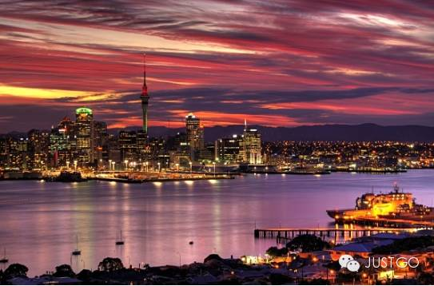

我多么希望，有一个门口

早晨，阳光照在草上

我们站着

扶着自己的门扇

门很低，但太阳是明亮的

草在结它的种子

风在摇它的叶子

我们站着，不说话

就十分美好

——顾城《门前》

撰文／大梦

编辑／悦 文逸 卡卡