# 城市清单 · 首尔 72 小时 — 我全在吃

*Geng Yue · Travel Guides*

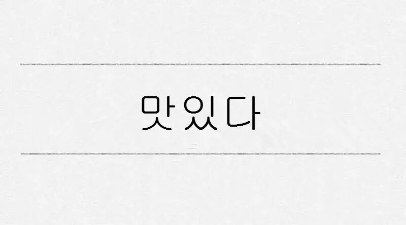

한국｜불고기 / 치킨 / 동대문

先来看个视频

每次看这三只小可爱—大韩，民国，万岁三胞胎吃东西的时候，心里都在想韩国美食到底有多好吃！！！

今天 JUSTGO 的「城市清单」栏目，**我们只说吃 ~**

深夜党，保重。

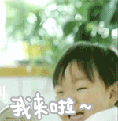

05 ◇ 城市清单

韩国并非一个食材丰富的国家，来来去去也就是那几样。米饭类：石锅拌饭、紫菜包饭；面条类：拉面、冷面、方便面；锅物类：部队锅、参鸡汤、排骨汤、海鲜汤；肉类：烤肉、泡菜包肉。当然，每一样都少不了大大小小的**泡菜碟，这也正是我眼里的韩国美食。而到底有哪些值得吃？**在72个小时内，我吃了大大小小30种不重复的韩国经典美食种类，同时，逛遍首尔经典区域。如果要推荐一些，我会告诉你这些值得吃的。

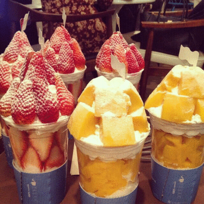

**●○ 东大门**

巨型批发市场

「东大门」是韩国的服装批发市场，这里不单单聚集了布料市场，更多的是淘宝韩款店铺的进货基地，或许类比这里是北京的动物园，你对此的形象立马可以鲜活起来。

不过并非全是廉价服装，如果逛街，这里的「Doota」也是值得一逛，5层楼的商场集合了很多设计师品牌店和常见的品牌，最厉害的在于，营业时间到凌晨5点。

由于这次行程住在东大门的「JW Marriot」，所以在附近觅食的概率高得多，也就自然对东大门的美食有几分心得，所以首尔的第一块美食区域就从这里开始吧。

**烤肉 | 하루연가**

하루연가

198-2 Hyehwa-dong, Jongno-gu, Seoul

烤肉自然要吃，而这家店铺是酒店韩国服务生推荐，他们年轻人时常聚会于此，烤肉是韩国料理中非常常见的一道美食，尤其适合家庭聚会，牛肉、猪肉、五花肉在炭火的烤制下滋滋出油，很热闹喜庆。

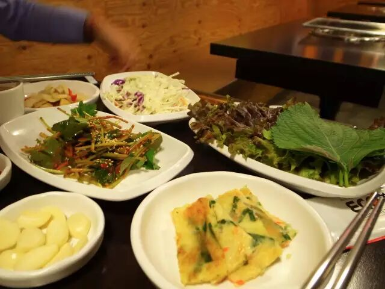

每家烤肉都会配上蒜瓣、大酱、胡椒、盐等佐料，烤熟的肉蘸着佐料裹着生菜入口，大快朵颐的感觉。

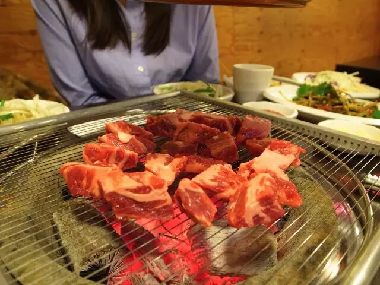

这家店铺**「하루연가」**，肉类丰富，牛肉、济州岛黑猪肉、五花肉，都有很不错的成色，尤其牛肉，不用等着烤到全熟，食用起来满嘴牛肉味十分爽快，再配上地道的韩国米酒，亦是一场享受。

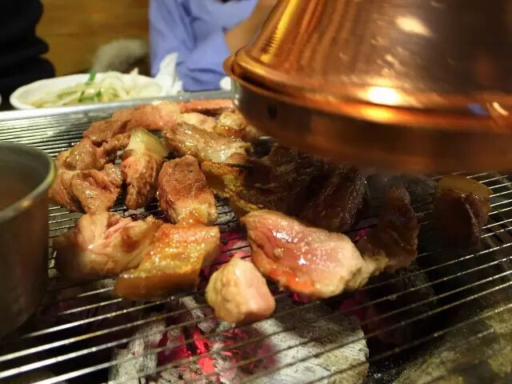

**排骨汤 | 유가네닭갈비 동대문점**

유가네닭갈비 동대문점

동대문 디자인플라자&파크, Seoul

韩国人很爱喝汤：大酱汤、部队汤、参鸡汤、海鲜汤、排骨汤等等，其实也是因为韩国食材匮乏的原因，把很多食材放在一锅里炖熟来，就着各种小菜和米饭，吃起来很热闹。

这家店不仅仅有排骨汤，同时还有部队锅，排骨是大腔骨，肉多，在辣白菜里的炖煮下，肉也十分入味，特别适合冬天的夜晚，和三五好友来上一锅。

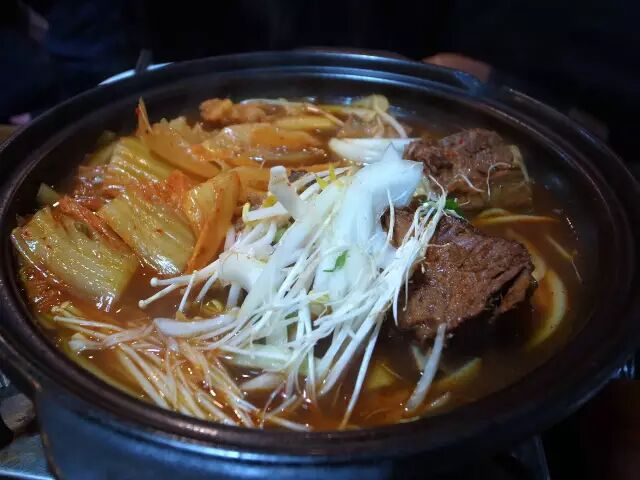

**三明治 | Issac Toast & Coffee**

Issac Toast & Coffee

198-2 Hyehwa-dong, Jongno-gu, Seoul

一向热爱在美食上创新的首尔，将传统土司、鸡蛋以及肉制品改成年轻人火爆的早餐。地点更是遍布首尔，不管是热闹的明洞，还是学生密集的鸿大，都可见到Issac Toast & Coffee。

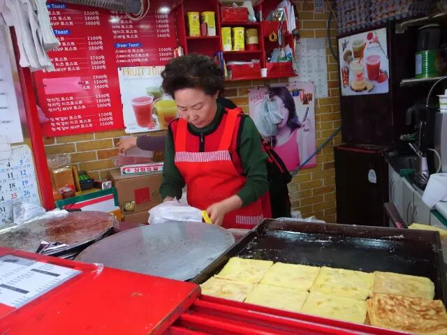

煎制土司，配上方形的鸡蛋、奶酪还有肉饼，在放些洋白菜，挤上一些番茄酱和美乃滋，就是一份甜甜、咸咸、酸酸、脆脆、味蕾丰富的Toast。

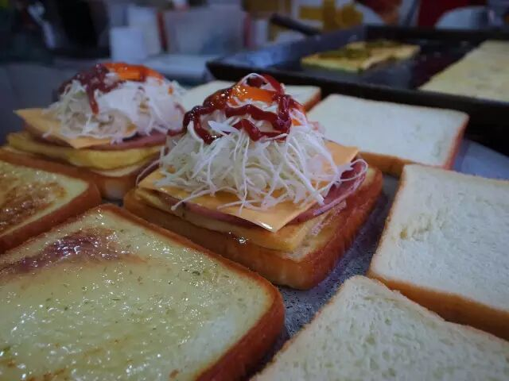

**夜市 | 东大门夜市**

Dongdaemoon Square, Seoul

东大门还有一处热闹的地方，就是商场门口沿街的小摊贩，那里卖着地道的韩国典型街边小吃：米肠、年糕、卤煮、饺子、甜品等。

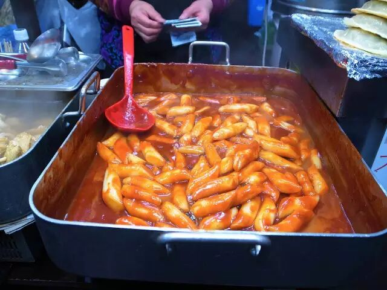

其实，和中国很多城市一样，这些街边食物真是韩国市井气的存在，不过，越来越多的中国人的光顾，让这些小摊贩门都挂出标牌来，写着「可用人民币」。

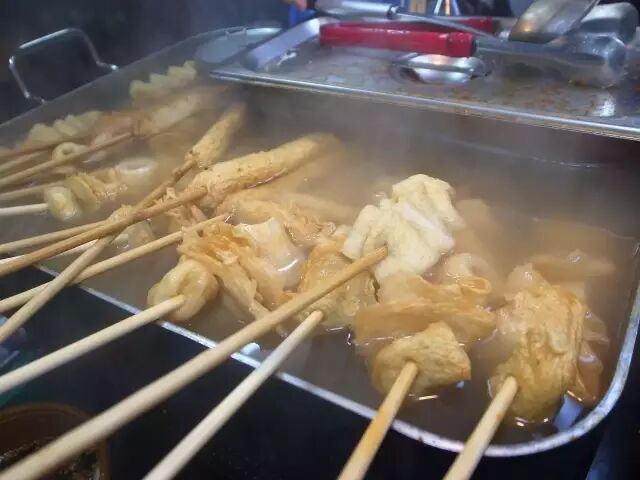

**甜品 | REMICONE 乌云冰淇淋**

REMICONE

서울특별시 강남구 신사동 547-12 1층, Seoul

乌云冰淇淋可是最近首尔城里让人趋之若鹜的甜品，造型独特让人爱不释手。其实做法倒是不难，底部牛奶冰淇淋打底，上面乌云造型的棉花糖，再撒上漂亮金粉，十分上相，自然也受女生的喜爱。

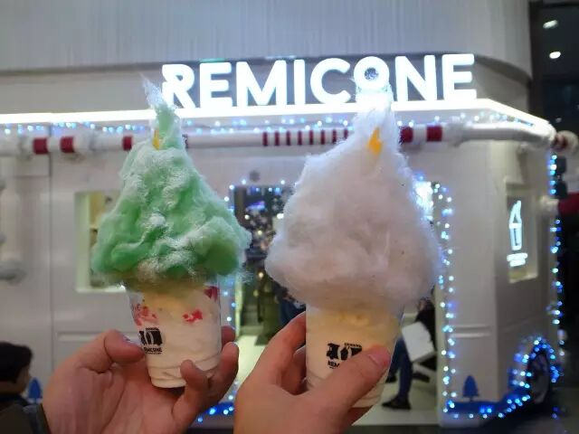

**●○ 新沙洞林荫大道**

设计师店和有趣甜品的集合地

江南区的新沙洞林荫大道，**是我最喜欢的地方，聚集着不少设计师品牌店、有趣的咖啡馆和甜品店、以及好玩的古着店，**逛街购物体验也比东大门和明洞等都要好，同时，食物的体验也更年轻化，尤其是甜品，**首尔有趣好玩的甜品都可以在这里找到，**比如明星庆功派对常常订购的「Deux Cremes」；将冰淇淋和蛋糕完美结合的「설빙」；多种口味装饰成冰淇淋花朵的「Amorino」，每一家甜品都精致又不失美味，实在太适合发朋友圈了。

**清酒 | Chez Maak**

Chez Maak

강남구 도산대로11길 22 (가로수길), 신사동, Seoul

不过这一区域的第一家餐厅，我要介绍这家有着 80 年历史的韩国酒厂的直营餐厅，里面不仅可以喝到这家酒厂的酒，更有好吃的拌饭。

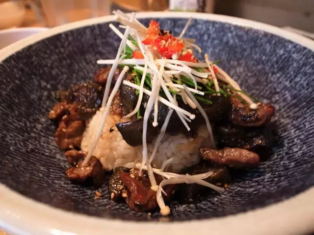

韩国人喜欢吃拌饭，因为**拌饭可以在短时间内迅速的补充各种能量和维生素，**不过这家「 Chez Maak」，并非传统的石锅拌饭，而是如同这一区域其他店铺一般，改良后更像日式的「丼」，牛肉、猪肉盖上去，再加上一些酱汁和韩国特色的调料，搅拌均匀也是一次不一样的「丼」体验。

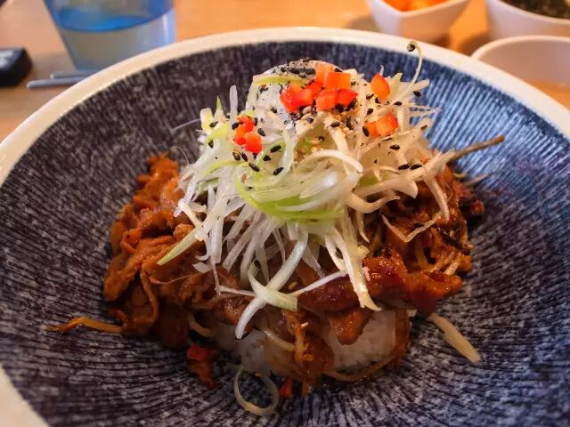

**甜品 | Deux Cremes**

Deux Cremes

강남구 압구정로12길 32, 신사동, Seoul

这是首尔顶级蛋糕店之一，没有抢眼的门面，但很多名人韩星庆功时爱到这里订蛋糕。单是鲜奶挞类的甜点品种就有 20 多种，卖相和口味都是五星级水准，每天售罄。

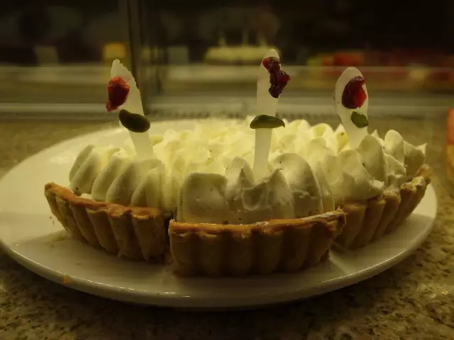

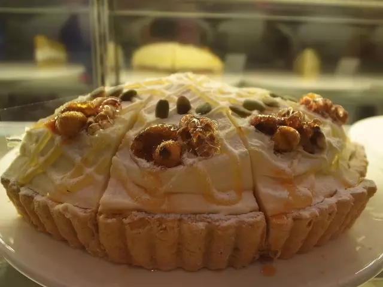

**甜品 | 설빙**

설빙

강남구 강남대로152길 45 (가로수길점), 신사동, Seoul

这家译名为「雪冰」的甜品店有着众多连锁，如起名，甜品的特色将冰和蛋糕融合在一起。

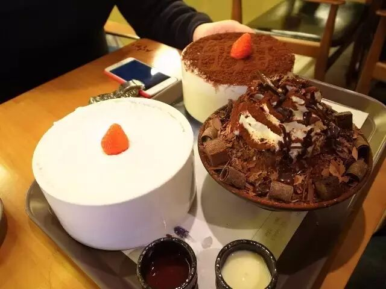

雪白的草莓塔下面藏着扎实的蛋糕，厚实却又柔软，入口冰沙融化但却留下蛋糕的绵软，十分奇妙。

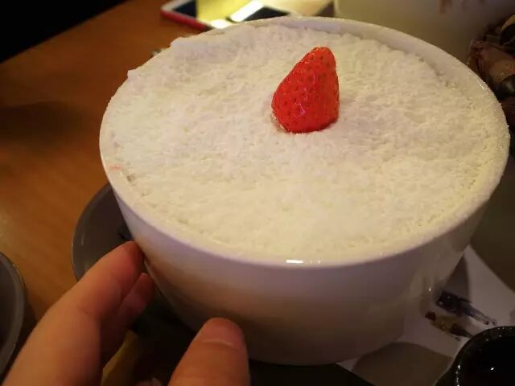

不过分量也比想象的大，点的三份，四个人都没有吃完。

与布朗熊合影

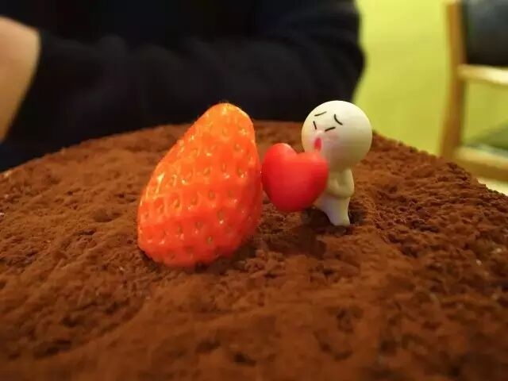

巧克力冰沙，是时常会出现在韩国甜品店中的甜品，奶油、巧克力酱、巧克力碎、冰沙，一份的量足足与好友分享。

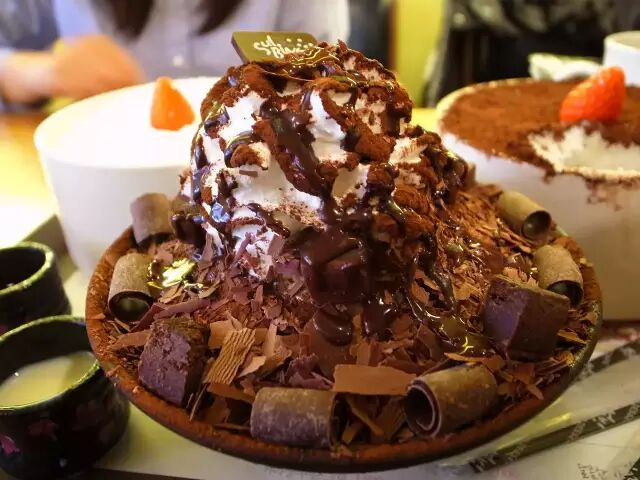

**甜品 | Amorino**

Amorino

강남구 신사동 536-3 (가로수길점), 신사동, Seoul

将多层冰淇淋口味打造成花朵的形状，一层一层的削成薄片贴上去，「Amorino」这家冰淇淋店，有多达二十几种冰淇淋口味可供选择，足足满足冰淇淋爱好者的选择。同时，你可以自己挑选，打造出属于自己颜色的花朵状冰淇淋。

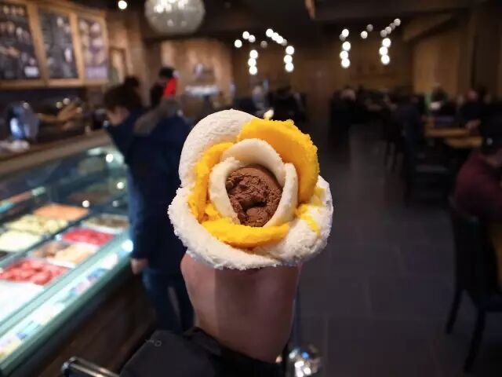

**●○ 明洞**

都是中国人

明洞是中国人聚集地最多的地方，这里不仅仅有两大免税店（乐天和新世界免税店），同时充斥着各式各样的韩国服装和化妆品品牌店，不过要说与上面的区别，明洞的消费较之林荫道，属于中低端的区域，而和东大门相比，更多零售店铺。这里的商铺十分密集，人流量也是最大。当然有很多美食可以探索，晚上有夜市出摊，喜欢夜市和热闹的朋友必然喜欢这里。

**参鸡汤 | 全州中央会馆**

全州中央会馆 明洞总店

전주중앙회관 명동본점, Seoul

在明洞，我们挑了这家「全州中央会馆」，因为这里的参鸡汤和全州石锅拌饭甚是有名。

「全州中央会馆」是一家拥有几十年历史的老店，可口的石锅拌饭已经流传到了第三代人。它的美味，不仅在韩国国内家喻户晓，在中国也常常出现在电视和旅游美食指南等刊物上，所以知道「全州中央会馆」的名字的人应该不少。店里张贴的各种奖章和荣誉证书，似乎也在讲述着「全州中央会馆」的美味故事。

参鸡汤，这是韩国的**传统饮食，**韩国人在夏天三伏，初伏、中伏、末伏这三天都要吃，他们认为以热制热，能够在夏天补充体力，避免中暑等疾病。一般参鸡汤是将肉鸡内脏掏空，放入糯米和人参后，放入红枣、蒜等煮熟便可。

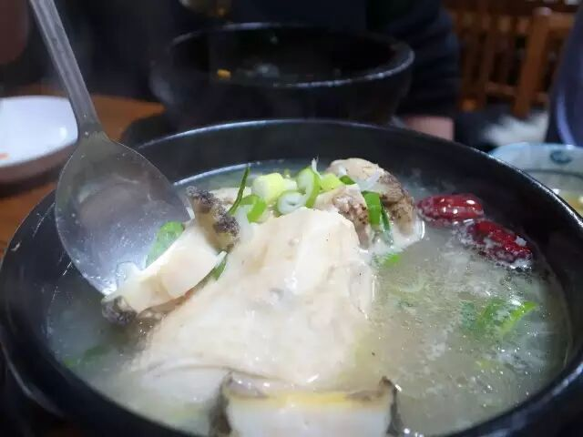

这家的「牛肉锅」也十分有特色，嫩肥牛在滚烫的锅壁上一烫就熟，在裹着汤汁十分鲜美入味。

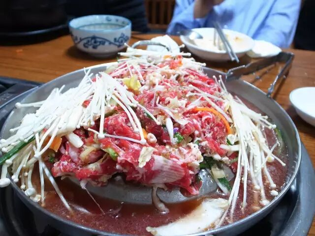

**甜品 | Gusttimo**

Gusttimo

중구 퇴계로 131, 신일빌딩 별관1층, 명동, Seoul

又是家把甜品极度富有创意的改造的甜品店，把巴黎的马卡龙放大，中间甜腻的馅去掉，换成多种多样的冰淇淋，这就是「Gusttimo」的马卡龙冰淇淋，多达 20 种口味可以选择的冰淇淋，让爱冰淇淋的女生欲罢不能。

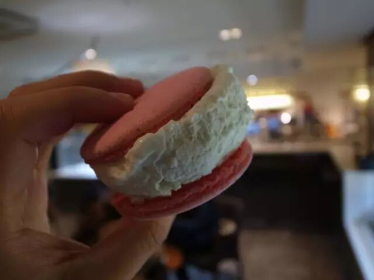

**●○ 三清洞**

首尔的南锣鼓巷

三清洞位于景福宫和离宫昌德宫之间，北侧为青瓦台，南侧与仁寺洞相连。可以从景福宫开始逛，顺着走入三清洞步行街，再荡到北村看看传统的韩屋村，然后继续走到仁寺洞、清溪川等区域。

三清洞比较**年轻化、也很闲适。**街道上充斥着画廊、服饰店还有许多咖啡厅、手作店。另外藏着很多各种主题的小型博物馆，比如世界饰物博物馆、猫头鹰博物馆、玩具博物馆等等。

**咖啡 | Innisfree Green Cafe**

Innisfree Green Cafe

서울특별시 종로구삼청로 104호, Seoul

三清洞的「Innisfree Green Cafe」是我这次最喜欢的一家咖啡馆，来自于济州岛的化妆品品牌，也把济州岛的自然理念运用到咖啡上，咖啡馆位于化妆品店的二层，不过装饰简约而又充满绿色，木制的桌椅很舒服。

如果单说环境我很喜欢的话，那你就错了。它家的咖啡和甜品都十分好看美味。紫色的紫薯蛋糕不甜腻，蓝莓芝士也十分好吃。

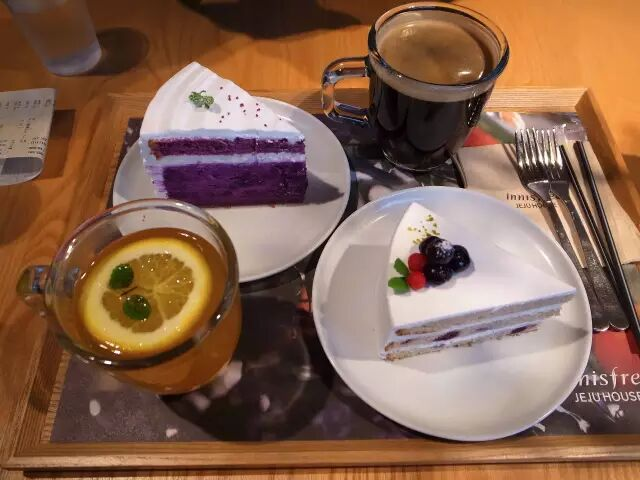

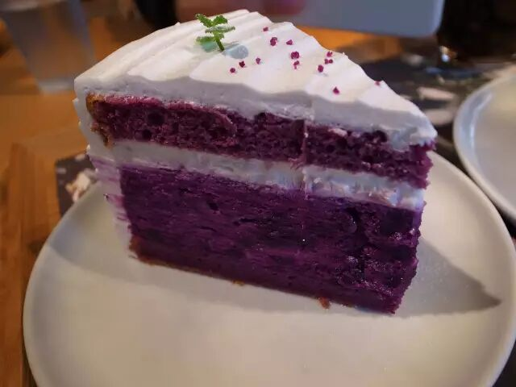

紫薯蛋糕

**●○ 狎鸥亭和清潭洞**

富人区

这里是韩国上流社会的富豪和明星聚集的地方，有着媲美东京「表参道」的**奢侈品街道，**这里有在韩剧中出镜率超高的**罗德奥时尚街，**东面的清潭洞名品街则**云集了世界各国的名牌专卖店和情调高雅的餐馆。**这里也是著名的**整容街道，**时常可以看到脸上绑绷带的女生们。

**咖啡 | Allo Papergarden**

Allo Papergarden

44, Apgujeong-ro 10-gil, Gangnam-gu, Seoul

这家位于狎鸥亭的餐厅，简直是首尔漂亮男女的约会圣地，不仅有下午茶咖啡，晚餐的牛排供应出品也值得称赞。

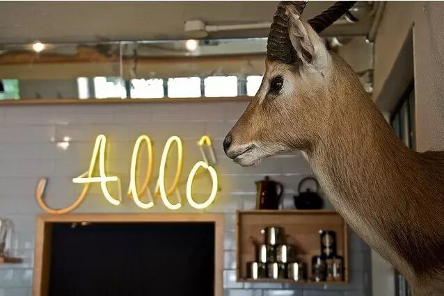

**●○ 特别推荐**

再远也要去吃一顿

**酱蟹 | 一味酱螃蟹**

一味酱螃蟹

서울특별시 동대문구 장안2동 367-3, Seoul

酱蟹其实早在韩国人民生活中流传开来，而「来自星星的你」的全智贤又把这一传统美食推广到全亚洲。「一味酱螃蟹」（ 일미간장게장 ） 坐落在本地人专门吃酱蟹的地方，这一条街都是吃酱螃蟹的地方，十分地道。

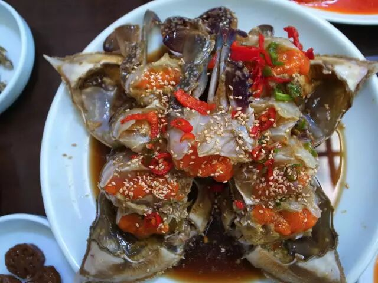

酱螃蟹味道鲜美，而且价格便宜，合算下来一份比北京便宜一半还多，十分划算。

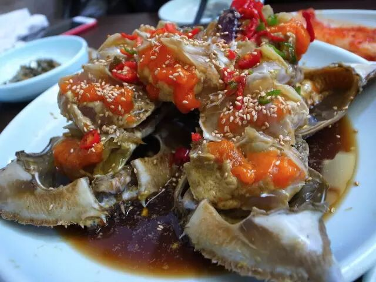

**烧肉 | 站立烧**

站立烧

서울특별시 마포구 노고산동 109-69번지，Seoul

餐厅内放着10多个银色油桶，客人都围站在桶边，站着烤肉。主吃烤牛肋骨，肉质鲜嫩而多汁，大受欢迎。不过店内没有吸烟系统，所以切忌穿着正式去吃，不然一身烤肉味会长久伴随。

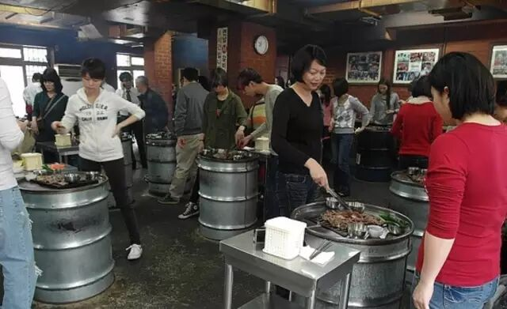

这家店中午12点开门，食材售罄就关门，所以建议下午五点前去品尝。

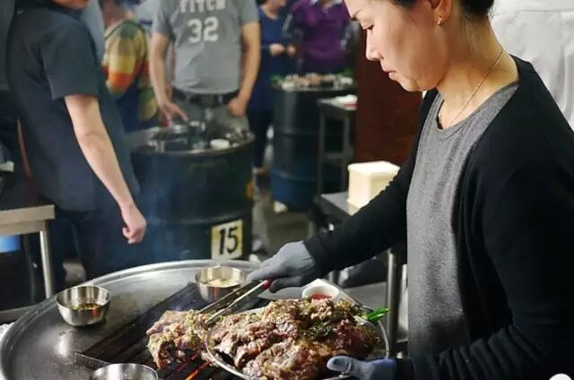

**炸鸡 | BHC 炸鸡**

BHC

성동구 고산자로6가길 44 (행당한신점)，Seoul

这也是因为全智贤而风靡亚洲的韩国食物，吃过那么多炸鸡，「BHC」的最好吃，恰好也是全智贤代言，尤其是它家的「Best-Seller」，外焦里嫩，十分入味。而这一店铺分店众多，可以轻易寻找到。

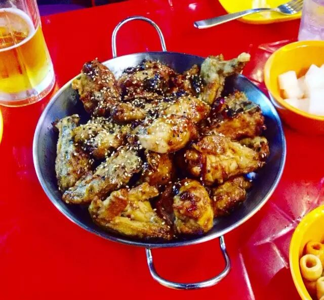

说了那么多，其实我还去「鸿大」的夜市吃了一圈。

●○

说了这么多，你饿了吗？早点休息吧，hhh

爱你的「JUSTGO」

原文转载自／什么值得吃

撰文／马达

图片／马达

编辑／文逸