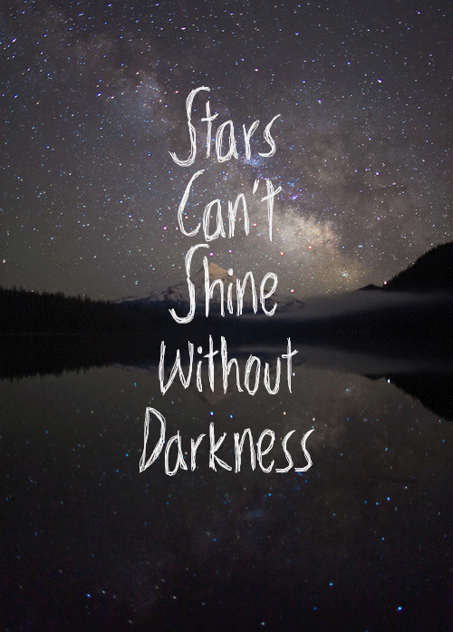
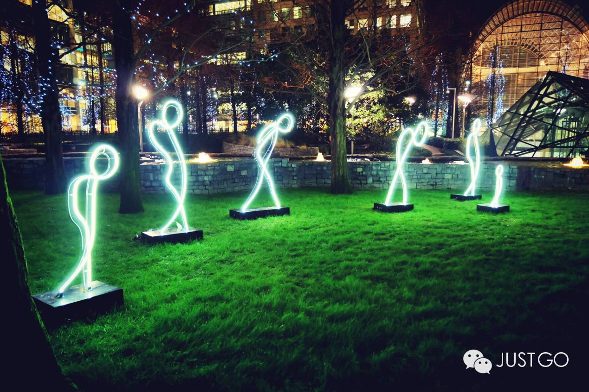
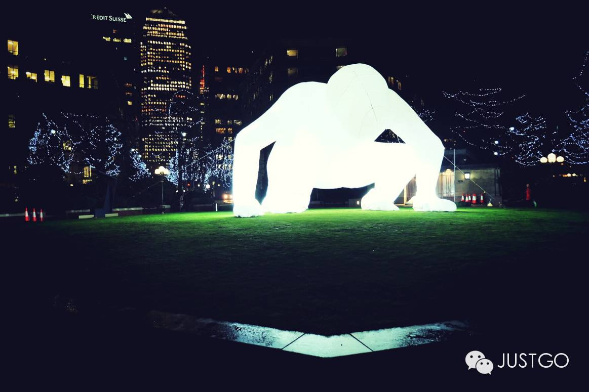
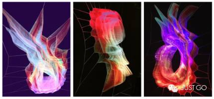
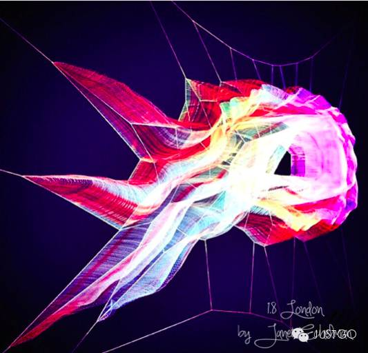
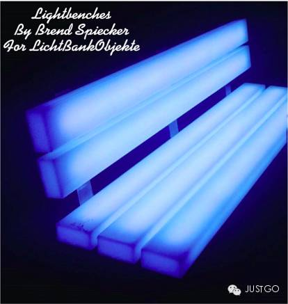
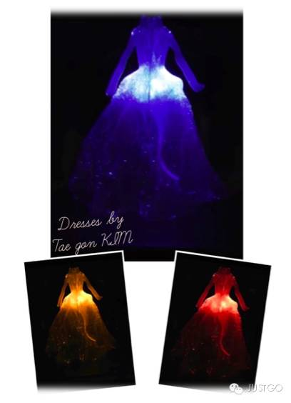
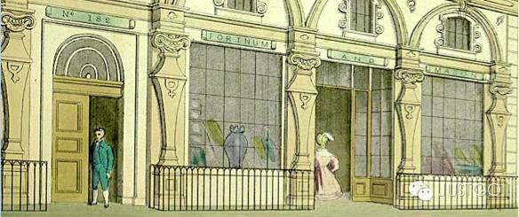
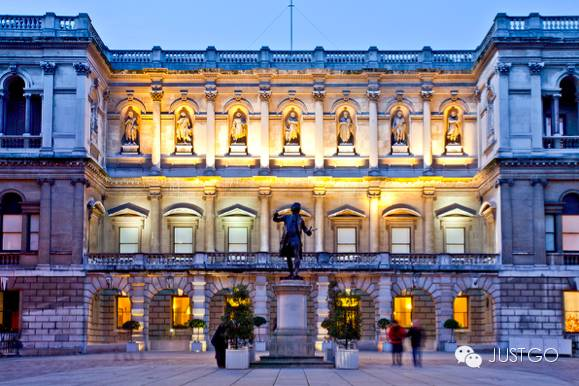
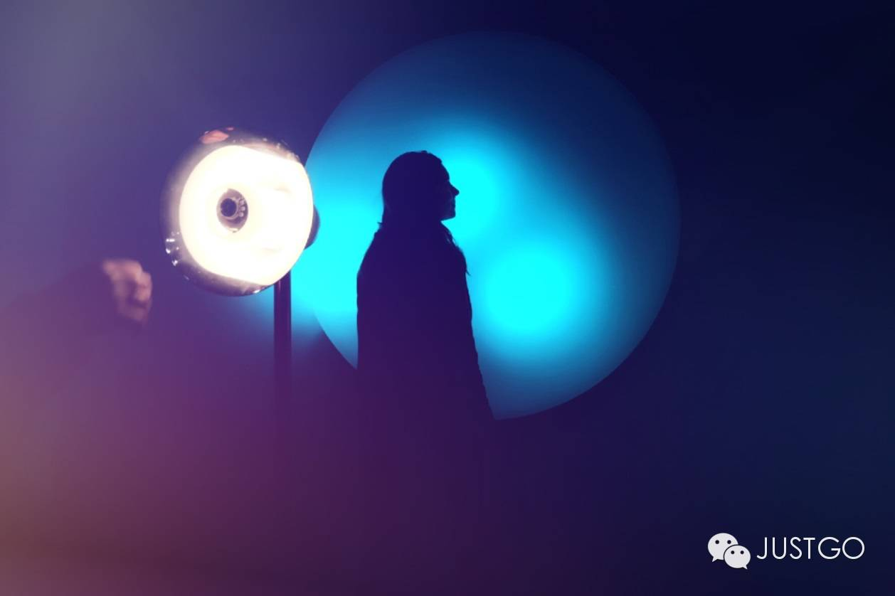

# City List: London Illuminated After Dark

*Geng Yue · Travel Guides*

**Welcome to London.**

This is the 3rd article in JUSTGO's original "City List" series. This time, let's talk about London lit up by lights.

** London **

/

*The dark night gave me dark eyes, **yet I use them to seek the light.*

*— Gu Cheng, "A Generation"*

/

Having stayed in this city for years, I had long grown accustomed to its daytime clamor and bustle. Then one evening, as night fell and the city I knew so well shed its daytime noise, I passed by places I frequent and suddenly saw lights being kindled one after another. I stopped to admire them, and suddenly discovered the beauty I had been overlooking all along.

**In truth, they quietly illuminate this city with their gentle glow.**

I attended the annual **Lumiere London** light festival, held from January 14th to 17th. Though lasting only a few days, it was truly unforgettable. Imaginative light installations spread across London, **artists using the art of light to tell the story of this city.**

This year's main exhibition featured **30 installations** covering several of central London's **busiest and liveliest** areas, including Mayfair, King's Cross, Piccadilly Circus, Regent Street, St James's Park, Trafalgar Square, and Westminster. At the same time, other light exhibitions large and small complemented the festival throughout London.

The luminous treasure box is dazzling. If this box could only be opened three times, I hope you might recover the following three shards of time scattered across the city.

/

*We've traveled so far, searching for a light.*

/

〇◎

**Start**

/

*First shard of time: "1.8"*

*Artist: Janet Echelman*

*Location: Oxford Street*

/

**Sometimes, all it takes is slowing down to discover the overlooked beauty around you.**

The massive tsunami and earthquake that struck Japan in 2011 accelerated the Earth's rotation, shortening the length of a day by 1.8 microseconds — and that is how this work got its name. Janet rendered the Japanese tsunami waveform in 3D. This floating, net-like, colorful structure was suspended above Oxford Street, drifting with the wind, ephemeral, enhanced by shifting lights to create a remarkable sensory experience.

After graduating from college, Janet applied to several art academies but was rejected by all. She had never studied architecture, engineering, or sculpture, yet she won the 2014 Smithsonian American Ingenuity Award for Visual Art and was named "America's Greatest Innovator Today." Janet combined traditional craftsmanship with high-tech materials and engineering techniques, **creating a new form of sculpture.**

Her creative inspiration came from life. When Janet was invited to exhibit in India, her works failed to arrive before the opening, forcing her to improvise. In a fishing village, she encountered fishing nets for the first time, and her artist's intuition led her to experiment with soft, lightweight materials — **cleverly using freely changing forms to express the power of wind and choreography, creating a sensual, fluid quality.**

In her TED talk, Janet recounted: "I got a call from a friend in Phoenix, a lawyer at a law firm who had no interest in art and had never been to an art museum, yet he pulled his colleagues out of their building to lie beneath the sculpture. In their suits, they lay on the grass, watching the sculpture's form shift with the wind, **sharing with strangers the wonder of rediscovering beauty."**

/

*Second shard of time: "Lightbench"*

*Artist: Bernd Spiecker for LBO-Lichtbank Objekte (Germany)*

*Location: Mayfair*

/

**"Hello Stranger, please have a seat"**

In the darkness, a park bench emitting a faint blue glow catches the eye from afar, **drawing people to stop and chat with those beside them about this magical chair.** The first luminous bench was created by artist Bernd Spiecker in 1982. Made from stainless steel and translucent acrylic glass, it incorporates the latest LED technology. Bernd hopes to install one hundred such benches around the world, **allowing people to experience an entirely new sensation in familiar spaces.**

City life moves so fast that you may unknowingly become a stranger in your own city, and relationships between people grow distant. Perhaps you don't know your neighbors, perhaps the people you encounter daily on the subway share only silent indifference. Many people touch the bench to feel its temperature, but perhaps, as Bernd hoped, that warm feeling actually comes from **a simple greeting and a big smile between people.**

/

*Third shard of time: "Dresses"*

*Artist: Tae gon KIM*

*Location: King's Cross*

/

**"The existence of tears proves that sorrow is not an illusion." — Roland Barthes, A Lover's Discourse**

Tae gon KIM is a Korean artist based in Strasbourg, France. He found his inspiration in Roland Barthes' 1977 book A Lover's Discourse. Just as Barthes described the wildly free-flowing thoughts of lovers, **people in love never follow a fixed script.**

Tae gon KIM's LED dress changes colors at random, inviting viewers to ponder the question: **"If we could wear our desires, who would we want to become?"** He once said of the work, **"When we fall deeply in love with someone, sometimes we yearn to become that person. This magnificent dress takes you into a dream to fulfill your longing."**

/

*Rather than idly waiting for darkness,*

*why not wander the nearby streets.*

/

If you've been paying attention, you may have noticed that the shards of time are scattered across the city's intriguing corners. These places are memorable landmarks and scenic spots by day, and by night they have their own special way of astonishing you. Even when the clock hands rest at the same position, day and night are like two sides of a page — incomplete without either one.

〇◎

**Fortnum and Mason @ 181 Piccadilly, London W1A 1ER**

Over three hundred years of **royal warrant holder department store**, renowned since the Victorian era and one of London's landmarks. Sip Earl Grey tea, enjoy various desserts, and bask in the afternoon.

〇◎

**Hamleys @ 188-196 Regent St, London W1B 5BT**

With over 250 years of history, **this British toy store** is also the world's largest and most famous chain toy store. A paradise for children's dreams, and the young-at-heart will find many childhood memories here.

〇◎

**The Royal Academy of Art @ Burlington House, London W1J 0BD**

The Royal Academy of Arts is **Britain's oldest art school.** Its courtyard frequently displays various art installations, cleverly integrated with the classical architecture behind, presenting artistic concepts to visitors.

〇◎

**Regents Street Cinema @ 309 Regent Street, London W1B 2UW**

Regent Street Cinema is **London's oldest cinema.** It has also served as a photography shop, film studio, examination hall, and even an adult cinema. After renovation, this historic cinema has reopened to the public.

/

*The night deepens, all grows quiet, the bright moon rises.*

*Goodnight.*

/

When the city's daytime clamor fades, **London under starry skies and bright moonlight offers a different sensory feast.** I hope you will make your own memories in this city. If you plan to visit Britain next year and want to experience a different London, remember to come to next year's light festival and open your own luminous treasure box.
