# City List: Taiwan's 10 Most Literary Independent Bookstores

*Geng Yue · Travel Guides*

Hemingway reads the sea

And discovers that life is a fish that takes a lifetime to hook

Van Gogh reads the wheat fields

And discovers that art takes shelter in the shade behind the sun

Freud reads dreams

And discovers a secret passage straight to the subconscious

Rodin reads the human body

And discovers a beautiful coastline that Columbus never found

Camus reads Kafka

And discovers that half the truth has already been told

— Li Xinpin

A  P A G E  O F  T A I P E I

Today, let's talk about reading

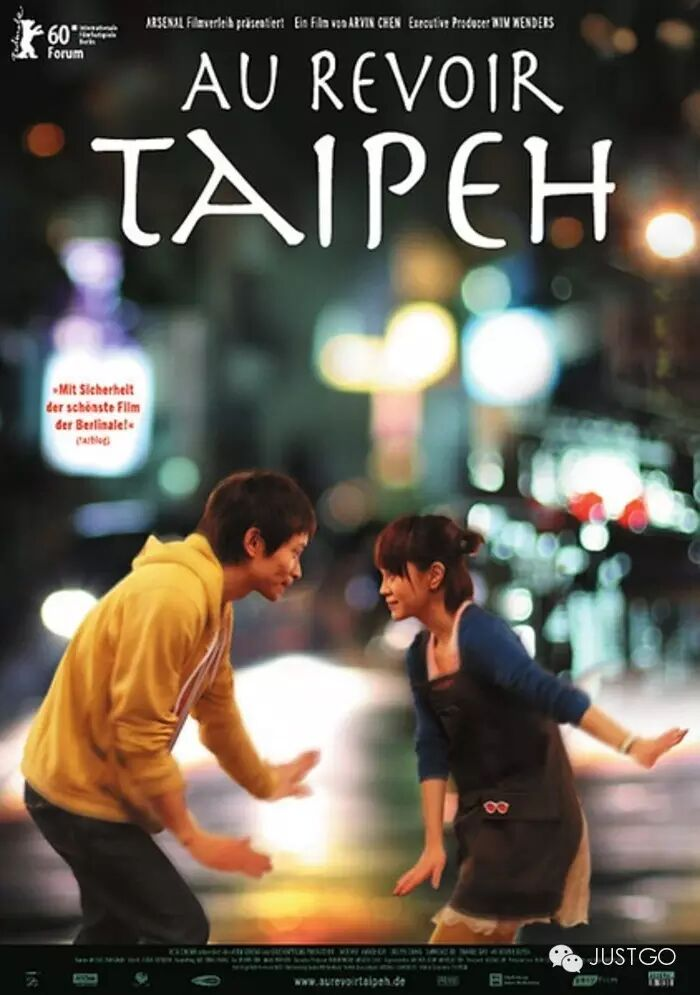

If you love Taiwanese cinema, you must be familiar with the charming film *Au Revoir Taipei*. Beyond the film itself, its setting— the Eslite Dunnan bookstore— leaves a deep impression.

In reality, the atmosphere of Eslite Dunnan has always been beguiling. Inside that bookstore you can see all kinds of people, and too many stories unfold within its walls.

The bookstore once witnessed Wong Kar-wai's cinematographer Christopher Doyle, strolling down an alley off Anhe Road with a young beauty in tow. As night falls, the row of street vendors outside the bookstore comes alive, most peculiar among them the tarot card fortune-tellers.

The bookstore has also witnessed every sort of encounter— literary youth and design architects always linger here. When you leave it, you miss it— not just the scent of books, but the stories.

And beyond Eslite, there are ten more bookstores that will hook you.

▼

**The only places I want to go are bookstores**

04 ◇ City List

**First Stop: Taipei — VVG Something**

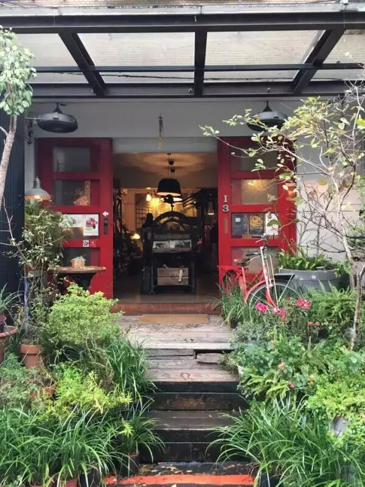

Pic: facebook — VVG Something 好樣本事

Keywords: vintage, literary, thoughtful

Address: Lane 40, Alley 181, Section 4, Zhongxiao East Road

Selected as one of the world's 20 most beautiful bookstores in 2012, it hides in a narrow alley. At just 13 square meters, it specializes in foreign recipe books, photography collections, design aesthetics journals, and fashion magazines, complemented by books, handcrafted ornaments, and vintage furniture that the owner collected from travels around the world—zakka meets vintage.

Pic: Mafengwo — 多啦C梦的口袋

Every corner and every object in this shop reflects the owner's attitude toward life. She has managed to place everything she loves here, coexist with it, care for it tenderly, and cherish every book and every world, every blade of grass and every flower.

**Second Stop: Taipei —唐山书店**

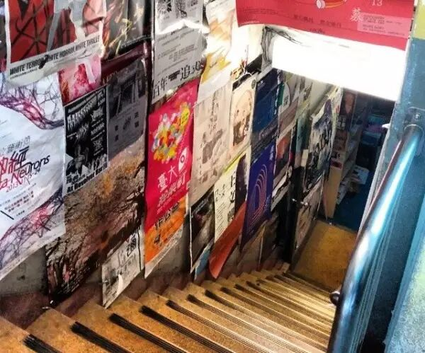

Pic: ins — theparliament

Keywords: underground of undergrounds, niche of niches

Address: B1, No. 9, Lane 333, Section 3, Roosevelt Road, Taipei City

(Opposite NTU, inside the alley)

This bookstore is quite special, situated in a dimly lit basement.

In the book *Taiwan Bookstore Travel Notes*, Wang Yun-yan wrote: "Ducking into Tangshan is like entering a darkroom—daylight vanishes, pale fluorescent lights cast their glow, the air carries a hint of mildew and damp, and the floor, worn by years of footfalls, is uneven and mottled. It is utterly unlike the fresh, refined design trend of modern bookstores, yet it subtly echoes its refusal to follow convention—its consistent, marginal, left-leaning stance."

**Third Stop: Taipei — 茉莉二手书店**

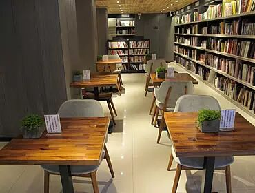

Pic: 茉莉二手書店

Keywords: revere heaven, love people, cherish things

Address: No. 17, Lane 10, Lane 244, Section 3, Roosevelt Road, Taipei City

The books at Mollie are meticulously organized—each one is carefully restored and cleaned by the staff before being shelved.

The interior is bright and pristine: vintage desk lamps, wooden floors, and French windows create a wonderfully comfortable atmosphere.

The bookstore has long been committed to environmental protection and public welfare. Its decor uses old timber from the Japanese colonial period; it does not provide shopping bags, and if necessary, customers can use donated miscellaneous bags. The owner says books are alive—each book sold reduces the chance of a tree being felled. The bookstore bears the responsibility of life's passage.

**Fourth Stop: Jiufen — 乐伯二手书店**

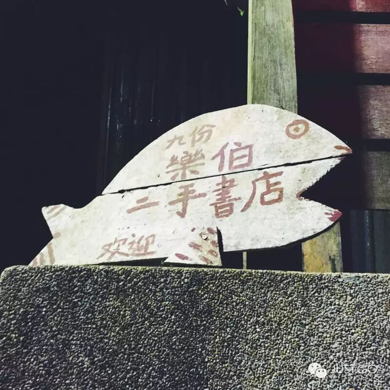

Keywords: thoughtful, nostalgic, persistent

Address: No. 31, Fotang Alley, Jiufen, Ruifang District, New Taipei City

Jiufen's most interesting shops are often hard to find. Within the scattered and tangled alleys of Jiufen Old Street, surprises often hide.

Lebo Used Books is concealed in one such labyrinth of narrow lanes.

The bookstore serves no drinks, holds no salons or lectures to draw crowds, and has no fancy decor. It operates in the simplest form, dealing mainly in secondhand books on literature, history, philosophy, and art. Lebo says: what matters isn't the rest—the most important thing in a bookstore is the books.

**Fifth Stop: Hualien — 时光二手书店**

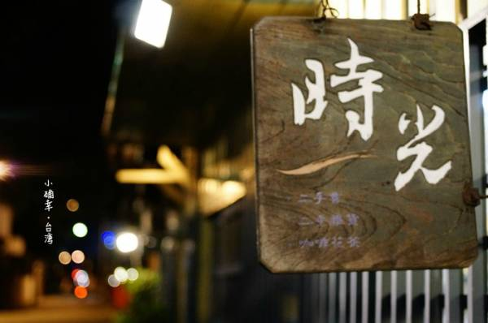

Pic: Mafengwo — 萌小兔和熊先森

Keywords: Japanese-style, simple, nostalgic

Address: No. 8, Jianguo Road, Hualien City, Hualien County

Time Used Books is well known in Hualien. Its Japanese-style wooden house is simply and unassumingly furnished—push open the door and the scent of old books rushes to greet you, along with a cute, well-behaved cat who will welcome you warmly. Perfect for the slow traveler.

Here, you can order a coffee, read a Taiwanese history book, and buy a secondhand book that carries its own story. The shop stands in vivid contrast to the bustling Hualien streets outside—pause here and linger in time.

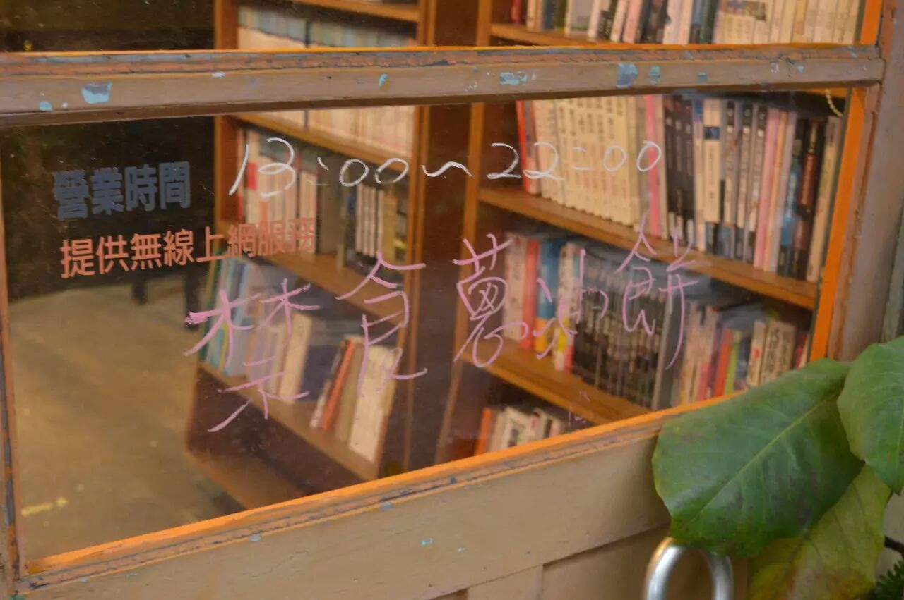

The bookstore breathes daily life. There's a partition with an old desk—order a coffee and you can sit undisturbed all afternoon. When I visited, a design student was there, drawing something.

Neighbors bring in books they no longer want. I overheard an older lady asking the owner whether they'd accept a certain type of periodical.

As I left, an elderly gentleman was just coming in. Between coming and going, dusk had fallen.

On the door, a sign forbids eating scallion pancakes. I couldn't help but laugh when I first saw it—how endearing. It turns out that just a short distance away, there's a famously good "fried-egg scallion pancake" shop—recommended for when reading makes you hungry.

Sixth Stop: Kaohsiung — 三余书店

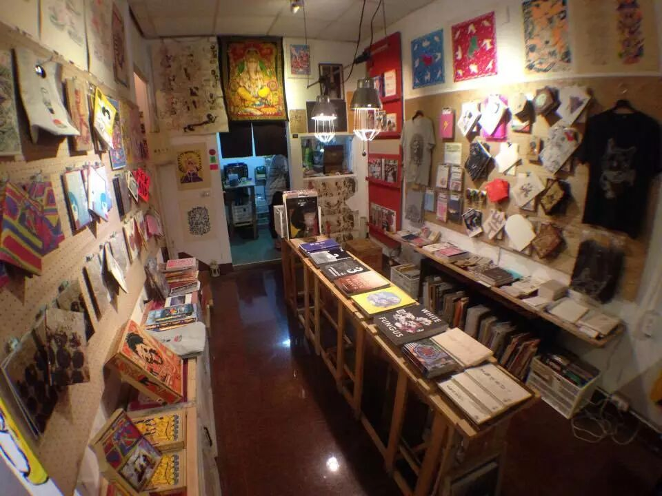

Pic: facebook — 三餘書店 TaKaoBooks

Keywords: local, faith, ideals

Address: No. 214, Section 2, Zhongzheng Road, Xinxing District, Kaohsiung City

The classics say there are three kinds of leisure time suited for reading: winter, rainy days, and night—this is the origin of the name San Yu (Three Leisures).

The store primarily sells "Kaohsiung books," with a dedicated section for writers from Kaohsiung and books whose scenes or characters are set in Kaohsiung.

It is more than a bookstore—it is a place for reading, a space for gathering and exchange, a venue for cultural and artistic exhibitions. It draws more people to San Yu, weaving cultural activities together through books and connecting book lovers with cultural figures, introducing Kaohsiung to the world.

"One with the land" is the philosophy and lofty ideal that San Yu Bookstore upholds.

Seventh Stop: Chiayi — 洪雅书房**

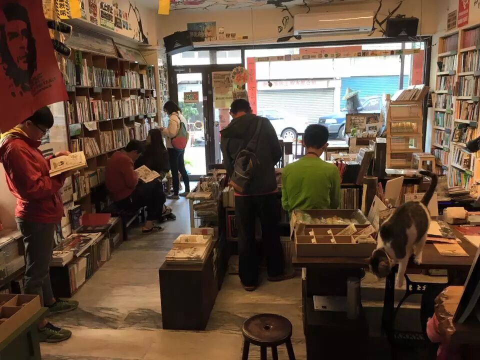

Pic: facebook — 洪雅書房

Keywords: most famous, most active, independent bookstore

Address: No. 116, Changrong Street, Chiayi City

Hong Ya Study is honored as "the most socially active bookstore south of Zhuoshui River," located on Changrong Street in Chiayi City.

Small as it is, and selling rather niche titles, its energy never wanes. Besides books, CDs, and environmental conservation merchandise, it holds free talks and reading groups every Wednesday evening—over six hundred sessions and counting.

Eighth Stop: Taipei — 旧香居**

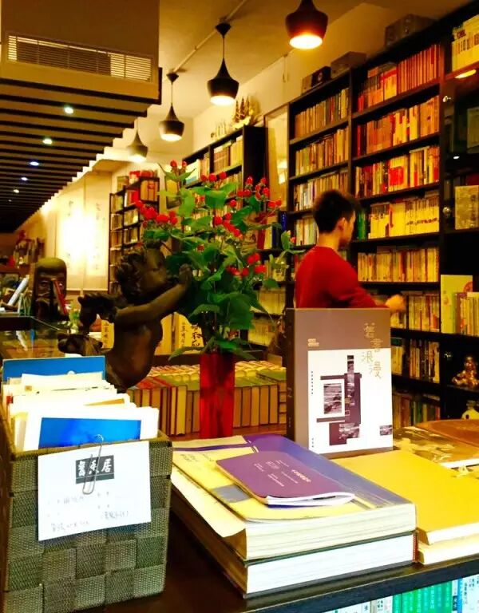

Pic: facebook — 舊香居

Keywords: time tunnel

Address: No. 81, Longquan Street, Da'an District, Taipei City

Jiuxiangju, with its rich antique charm, is also called the old bookstore. It sells only secondhand and antiquarian books, ranging from the 1960s–1970s all the way back to earlier eras.

The closer you get to the counter, the older the books and the more brittle and yellowed their pages. A promotional card in the shop reads: "Seek new passion and new ideas from the memory of old things." Here, the old and the new strike a delicate balance—

From ancient times to the present, this place is like a "time tunnel."

Ninth Stop: Taipei — 有河book**

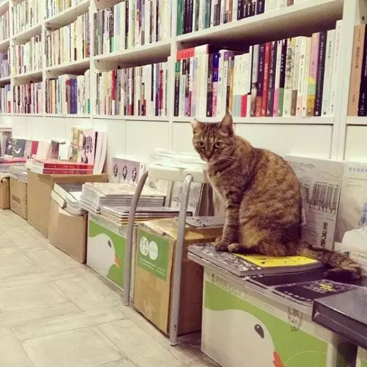

Pic: ins — minnlinnn

Keywords: books, river, light

Address: 2F, No. 26, Lane 5, Zhongzheng Road, Tamsui Township, Taipei County

Step out of the Tamsui MRT station, walk about three short minutes, and you'll see the blue-and-white sign of "有河 book."

The bookstore is on the second floor. The stairway walls are plastered with notes, posters, and arts announcements, leading you to a world of books, river, and light. Street cats of Tamsui also visit—let them follow their own paths and please don't disturb them.

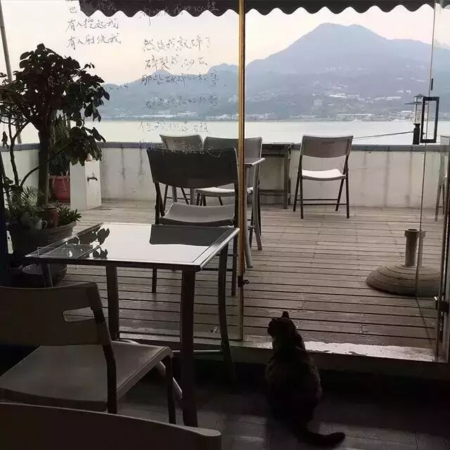

Pic: ins — vino_de_april

This is a fortunate bookstore: besides the outdoor balcony space, it offers a sweeping view of the Tamsui River and Guanyin Mountain.

Nestled in a bustling tourist district, it nonetheless retains a calm and settled character. One of its great features is the "glass poetry"—poems copied by the owner or visiting authors onto the floor-to-ceiling windows that frame the beautiful scenery.

In every corner of this shop, you can feel the owner's devotion and the bookstore's unique spirit.

Tenth Stop: Taipei — 布拉格书店**

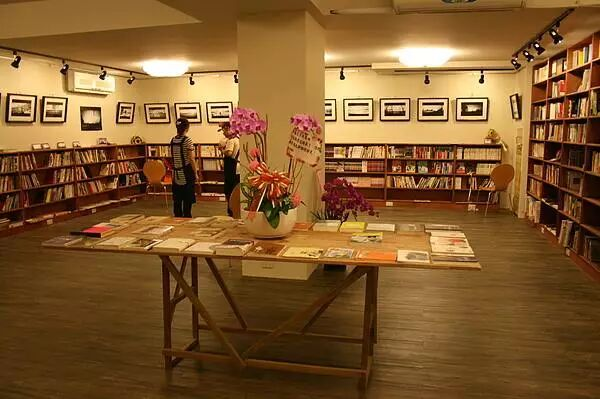

Pic: facebook — 布拉格書店（荒野夢二）

Keywords: Renaissance style

Address: B1, No. 9, Lane 60, Taishun Street, Da'an District, Taipei City

Before opening this physical shop, Prague Bookstore existed online as "Silver Bowl of Snow Study" (inspired by Lin Yaode's out-of-print poetry collection), later renamed "Prague Secondhand Bookstore" (because Prague is the hometown of Kafka, the owner's beloved writer).

Running an online bookstore can attract countless readers, but it also means you can never meet them face to face.

And "a bookstore is a place where people and books encounter each other"—this conviction gave birth to the physical shop. Hidden in a basement, coexisting with a café, it gathers scattered readers to feel together the Renaissance of this era.

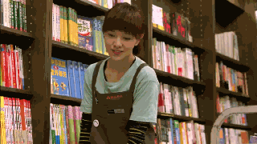

## **Farewell**

My impression of Taiwan has always lingered in the films of Hou Hsiao-hsien and Edward Yang. Countless times in the world of cinema, I've wanted to touch everything about Taiwan—the scenery, the food, the people.

So many go to Taiwan seeking beautiful sights and delicious food, yet when they leave, what they miss most is the warmth of human connection.

What you cannot take with you are the fragments of daily life in Taiwan—there is memory, but not necessarily warmth. Yet the hours spent in bookstores become the most deeply missed part. If you ever go to Taiwan, visit the bookstores for me—say hello to those old friends.

