# How to Travel the World on Very Little Money

*Geng Yue · Travel Guides*

If you're reading this, you surely have a restless heart that longs to break free.

"Time when you have no money, money when you have no time"—this seems to be the greatest shackle holding people back from setting out.

Every time you want to start something, you feel you're never quite ready enough.

You might recall that line from Ang Lee's *Eat Drink Man Woman*:

"Life is not like cooking—you can't have all the ingredients ready before you put them in the pot."

So what price do those who are perennially on the road actually pay?

During my two years of traveling the world, the question I've been asked most by readers is: where does the money for your journey come from?

As the person you see as "that enviable someone who travels all over the world," today I'll answer this question in earnest, with plenty of actionable, practical advice.

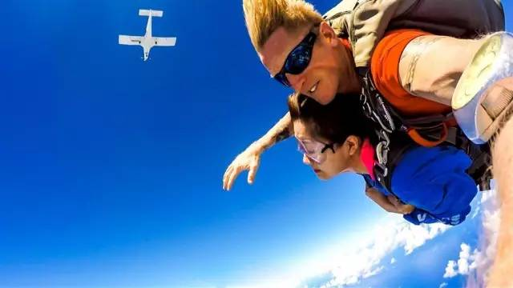

△ Checked skydiving off the dream list ✔️

I was once a nine-to-five office worker myself—a miserable editor working late into the night in a cubicle. The worst part was that after three years of overtime, I had almost no holidays to travel. But after I resigned, I essentially realized my dream of traveling the world in two years.

Someone asked: "Yue, I don't know how to take photos—does that mean I can't travel?" The truth is, you just need to make the most of whatever you're already good at.

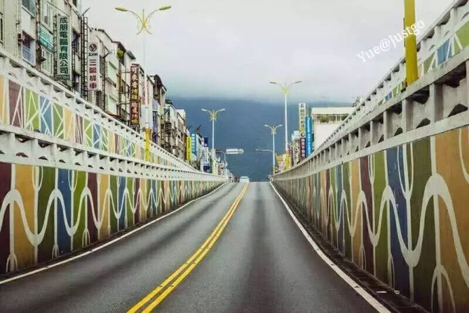

△ In Taiwan, encountering Hualien for the first time—looking up, I was stunned by this road: graffiti on both sides, sea and sky straight ahead.

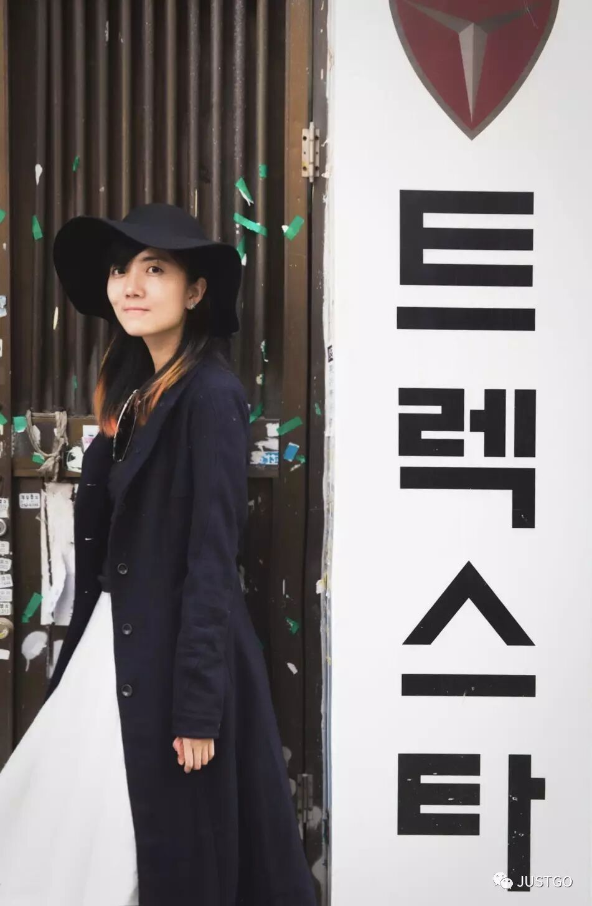

△ In Busan, South Korea, eating secret-recipe barbecue—the port-city vibe was thick. Just before boarding and leaving, I met a black hat.

What you need most of all is **to hone a marketable skill.** Ideally, one that matches travel. If you already have one, learn to wield it. If you don't, start practicing and cultivating one now.

When I wanted to realize that seemingly impossible travel dream, I learned photography from scratch, aligning every skill I'd need on the road and practicing them one by one—writing, photography, retouching, shooting and editing video, English, losing weight to look good on camera, even physical fitness (because I'd have to carry heavy equipment bags).... Before hitting the road, I invested everything into my travel dream.

**If your situation is similar to mine, or even better, then if I could make the dream come true, you certainly can too.**

What I want to say, **distilled to three words**, is simply: **"Rely on yourself."**

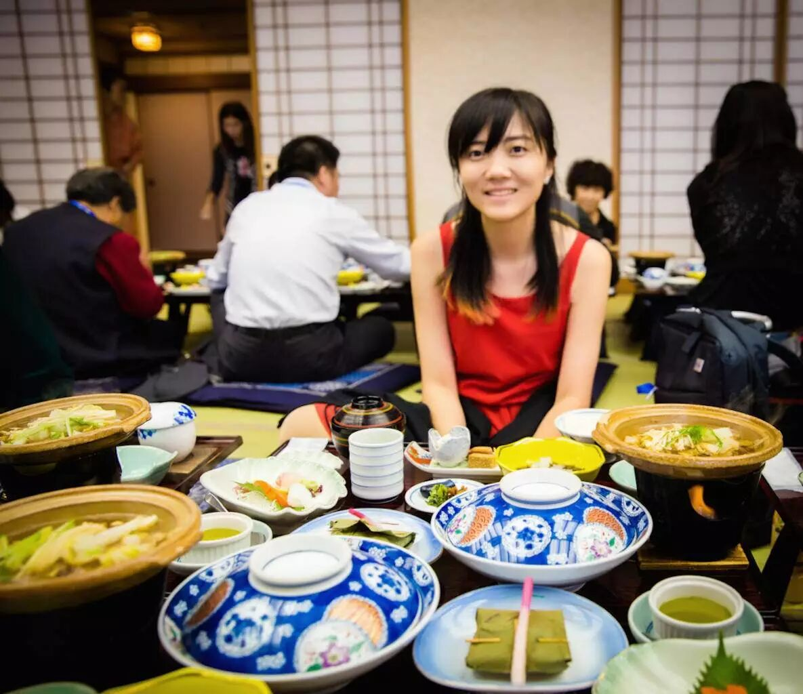

△ Eating sushi, sipping matcha, and savoring salmon in Japan. Through the glass windows, green bamboo leaves swayed in the courtyard.

Once you possess solid skills, you can seize certain opportunities: **the chance to work while you travel.**

When I took the leap and fully resigned from my job as a magazine reporter, I became a freelancer. Gradually I became a collaborating photographer for various international tourism boards, a columnist for several travel and fashion magazines, an Airbnb contracted writer and home-stay experience ambassador... Opportunities for travel assignments multiplied. This means you can trade your skills for work that covers your travel expenses.

Thanks to these opportunities, I traveled to Seattle and San Francisco in the U.S., Greece, Kenya, Morocco, Guam, Okinawa and Tokyo in Japan, Seoul and Busan in South Korea, Rome in Italy, countries along the Mediterranean, and more.

As one distant destination after another on my dream list was reached, my heart still yearned for many more places. For those, I paid out of pocket—using wages I'd saved from my regular work to go precisely where I truly wanted.

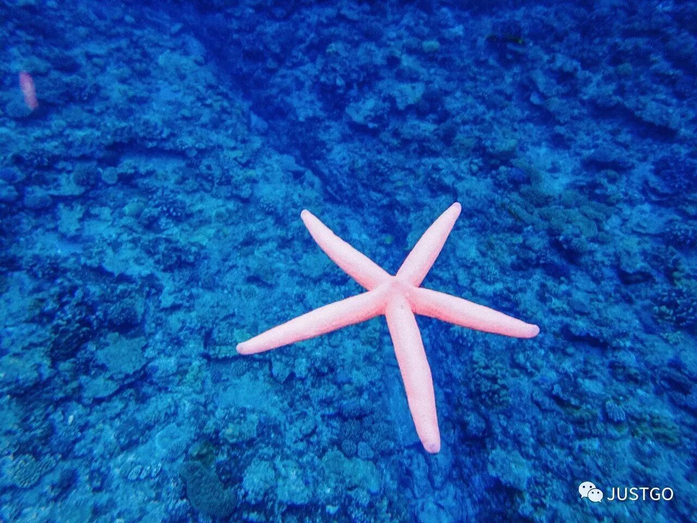

△ Diving in the Pacific—pink starfish in the deep blue sea, utterly adorable

I deeply believe the words of Japanese architect Tadao Ando:

"When I told my grandmother of my resolve to travel, she said: money isn't for hoarding—it has value only when put to good use on yourself."

Those powerful words let me leave the country with an unburdened heart. Thereafter, during the four years before I established my practice, whenever I saved enough money I would go traveling. Just as my grandmother said, **the memories of travel in my twenties became an irreplaceable treasure for the rest of my life.**

---

## How to Travel More Affordably

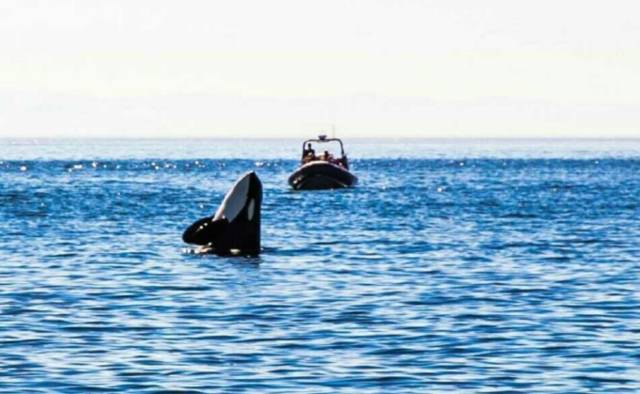

△ Sailing through the open sea, a lovely whale leapt from the water!

If you're young, you might start with Asia—Southeast Asia and the like.

The food is delicious, costs are low, and choices abound.

Asia has many cities with the makings of international metropolises—stylish, fun, great value, design-forward, tasteful and beautiful, constantly inventing fresh experiences for young people. Some places are no less impressive than Europe.

Then, collecting entry stamps from several Asian countries is hugely helpful when you later apply for U.S., U.K., or Schengen visas.

Moreover, if you truly want to save money, you can couchsurf or do work exchange along the way (trading 2–4 hours of labor for room and board), WWOOF (World Wide Opportunities on Organic Farms), and hitchhike. In some parts of Asia, hitchhiking should be fairly easy (I haven't tried it myself, just going by guides)—you can usually get a ride in 5–30 minutes, so it doesn't cost much. If you can endure some discomfort, going with budget airlines and budget hotels works too.

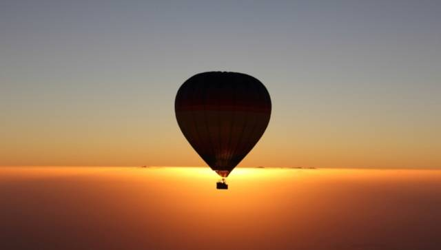

△ In the Dubai desert, floating up to 1,500 meters above the clouds to watch the sunrise.

## How to Earn Money While Traveling

**1 Writing**

Writing travel stories has won me many travel opportunities. I'm happy to share a bit.

△ Won a prize in a Weibo campaign a couple of days ago, thanks to a story I wrote.

Writing your travels into words earns some freelance fees, though they won't be especially high. It's earnings from talent and hard work. Also, practical "how-to" writing tends to be more popular.

**But consider two prerequisites: first, you have enough time and energy to write; second, you can persist.** Writing articles and running a public account demand considerable time and a reliable internet connection. Fragmented travel time always seems to lack something—sometimes no power, sometimes no internet, or you've walked all day and by the time you reach the hotel and open your laptop, you only want to sleep, unable to lift a pen. Ultimately, it comes down to self-discipline.

If you want writing to cover everything entirely, becoming a well-known blogger is ideal—once you have a readership and traffic, opportunities multiply. But before you build influence, what matters most is the quality of your work: what you write must have value.

**2 Travel Photographer**

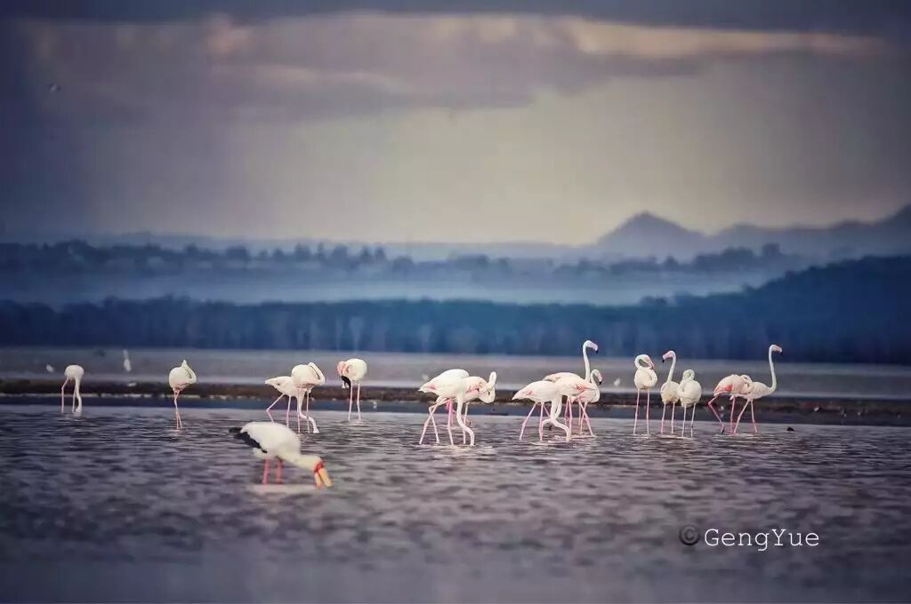

△ Thanks to being a travel photographer, going to Africa to photograph pink flamingos

If your photography skills are superb and you enjoy creating travel images, try posting your work on high-quality photography platforms or submitting to publications—you may win invitations and collaborations from travel organizations.

You can also consider selling your photos to stock libraries and becoming a contracted photographer. But this requires good equipment, extraordinary shooting technique, and familiarity with stock-photo requirements. For instance, enduring minus-twenty-degree cold to capture a single photo you find satisfying:

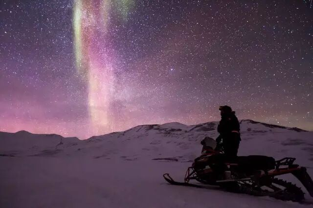

Travel photography (旅拍) is also a popular way to travel. With the technique, a team of at least two, and a client base, it's a solid proposition.

**3 Working**

This is hard mode—I haven't tried it, but I've read stories. If you want to do what others can't, you must endure what others won't. That's the simplest principle of equivalent exchange.

Beyond finding a job, many websites abroad offer work-exchange stays—you help with farm work and get free lodging. There are also kitchen helper, cashier, and restaurant server positions...

**4 Applying for Experience Programs**

The internet is full of experiential travel programs—teaching in Bali, feeding baby elephants in Thailand, being a fashion experience officer in New York, trying sheep-shearing in New Zealand. If you can document the entire process, build a resume in the area, and your personality fits, these programs aren't hard to get into.

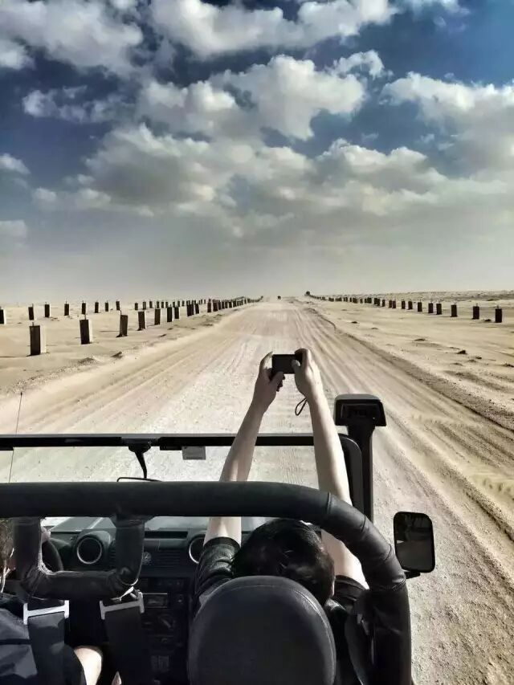

△ Dune bashing in a SUV across the Dubai desert—racing along as if speeding through a magical-realist film

**5 Leveraging Existing Assets**

Renting out your own home can supplement your income monthly. If it's a property in a tier-one city, the rent roughly equals your travel living expenses. You can also try short-term rentals while you're away—short-rental platforms are popular and easy to use, though they require attentiveness: promptly answering tenants' questions and handling unexpected issues.

**6 Translation**

If you have a strong foundation in a language, you might try translation work. Some people translate a whole book while traveling, but it's exhausting—you're better off settling in one place for a concentrated stretch.

As someone who's tried it says: "Translation rates aren't high. The going rate is 50–70 RMB per thousand characters. Publishing a book might earn you 4,000–6,000 RMB, but you'll basically spend a month on it. **The return on investment is rather low.**"

**7 Publishing a Book**

Publishing a book isn't rare anymore. There are many travel books on the market; the ones that truly catch fire are distinctive pioneers. Travel isn't that hard anymore—if you just follow the crowd with a book, prospects aren't optimistic.

And publishing is one thing; whether it makes money is another.

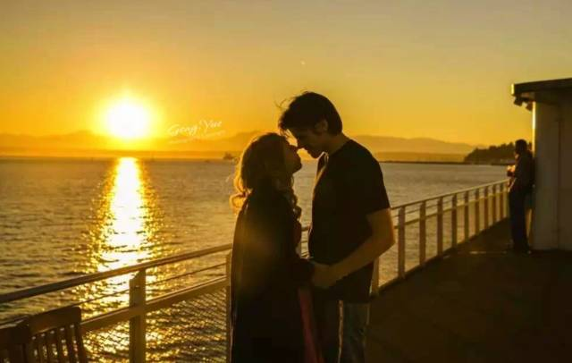

△ On a cruise ship, sunset light falling on a young couple

**8 Making Videos**

Video production has a higher barrier—more effort, time, technique, manpower, and cost than text and images.

If you're producing a show, you need to shoot, edit, and edit well—only then can you negotiate collaborations with travel organizations that need video. But without steady clients, that negotiation process is grueling.

If you're seeking sponsorships through video (the same logic applies to other methods), **what you make must genuinely have value, or you yourself must have influence—otherwise you won't attract sponsors.**

**9 Digital Nomad**

The digital nomad lifestyle, simply put, is using income from internet-based freelance work or entrepreneurship to support location-independent living and travel.

**10 Daigou (Personal Shopping)**

This industry is fairly mature. Basically, you buy a bunch of things while traveling—cosmetics, bags, and the like—then sell them frantically back home, earning the margin. Honestly, though, if you're earning money from daigou, forget about a carefree travel experience.

△ In a blue alley, children smile and wave at you

---

## Everyone Has Two Selves

The above draws on the viewpoints of various travel veterans and peers.

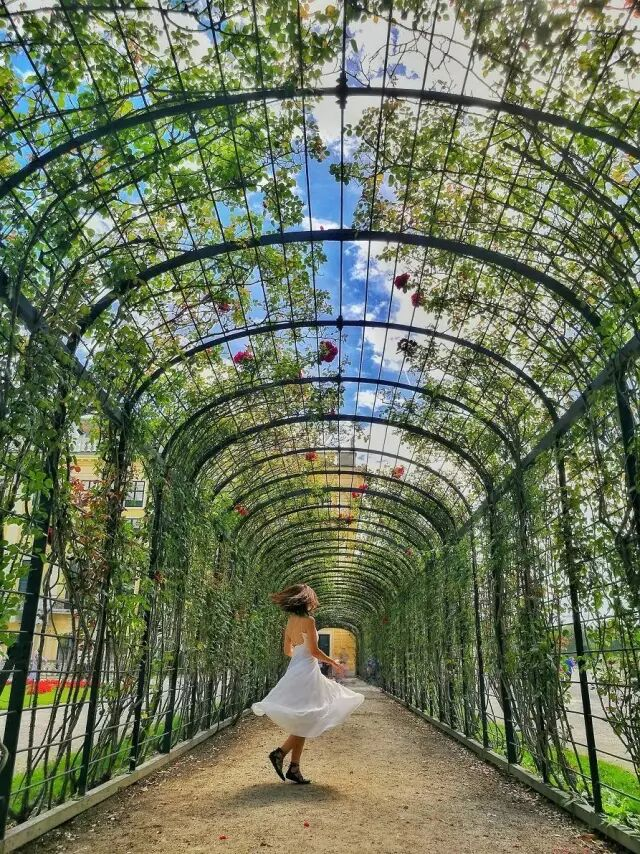

△ A rose garden that appeared in a film

For me personally, the methods above are mostly for those who want to be on the road long-term and are brimming with curiosity about the world. If you only take one holiday trip a year, there's no need to go to such lengths.

I don't actually advocate ultra-budget travel—it means compromising on experiences that should be wonderful.

If you're a student, choosing simple options like youth hostels is fine, but I don't recommend random hitchhiking or dangerous choices. If you lack skills, prepare your money and time as best you can before setting out. If you lack funds, use your skills to apply and exchange openly and honestly.

I once read: everyone has two personas—the homebody and the wandering soul.

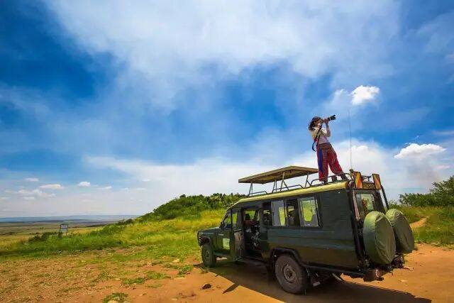

△ Driving an off-road vehicle across the great prairie

The truth is, everyone loves a cozy home and yearns to roam the world with a sword. But in the end, you must choose one as the dwelling of your soul. Many worry that a single wrong choice will ruin their life. In fact, there is no correct path—only the path you choose, and understanding what price it carries.

What matters most is your own thought and choice. Money can be earned; talent can be learned. But your life—will you choose safety, or adventure?

For me, life is like a story: what matters is not how long it is, but how splendid.

I want to spend this life feeling out the face of the world and trying to understand myself. So I chose a life on the road, becoming someone who writes stories while traveling. And please believe this: those who travel year-round have made vast preparations behind the scenes.

May every travel lover's dreams come true.

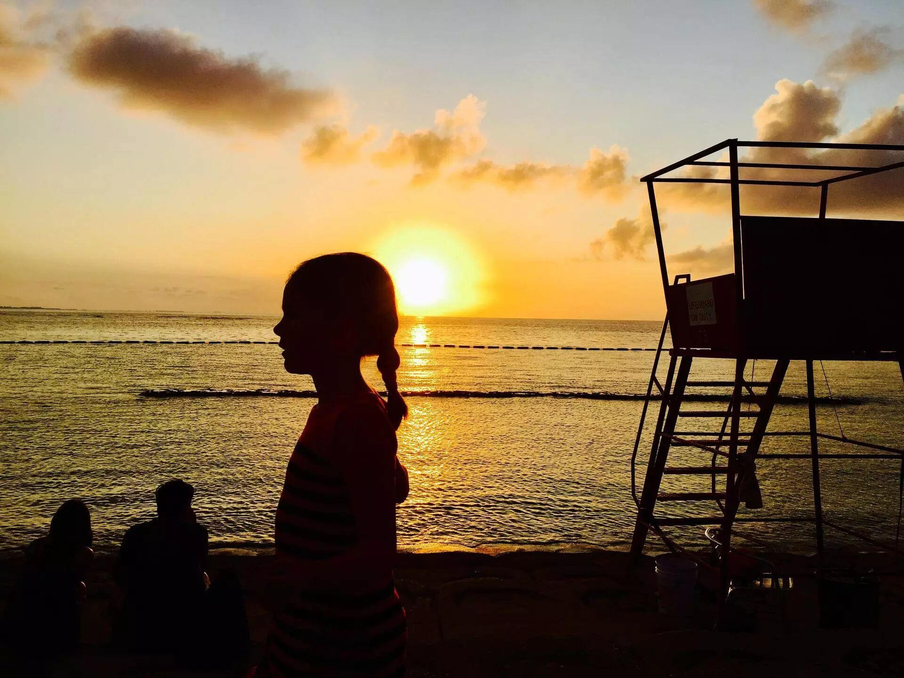

△ A golden sunset seen in Okinawa, Japan

I miss the fish-ball noodles at Taiwan's night markets, the shooting star I looked up to see from a white balcony in Kenting, the drizzly rain as we drove a camper along the coast in Okinawa, the sizzling barbecue on an iron grill in Busan...

Next I want to eat durian ice cream in Bangkok, stay in a treehouse in Sri Lanka, see the sea in the Maldives, ride the tram through Kamakura—home of *Slam Dunk*...

While you're young enough to roam, with a holiday approaching, go see the world... **Everyone has their own way of experiencing the world; what matters is to be as kind to yourself as possible along the way.**

Travel the world while you're young—it's not as hard as you imagine.

