# 那些一整年都在旅行的人，经济来源是什么？

*Geng Yue · Travel Guides*

**人生就像故事：最重要的不在于有多长，而在于有多精彩 As is a tale, so is life: not how long it is, but how good it is, is what matters.**

每次想开始做一件事情时，总觉得还没完全准备好。会想起李安的《饮食男女》里的那句台词：「人生不能像做菜，把所有的料都准备好了才下锅。」

对于爱旅行的人，常会想：如何能够经常出发，或维持很长时间在路上？经济来源是什么？怎样能有这么多时间？

那些满世界跑的人，我们很容易羡慕他们在路上玩得很爽的时光，但也要相信：一定也是在背后做了很多很多的准备。这是一部分经历者的故事和建议.......

**@沈浩翔**

从去年7月出发，**我们途径：**港澳、清迈、菲律宾（马尼拉、长滩）、新加坡、马来西亚（槟城、KL、马六甲）、澳大利亚（珀斯、西澳自驾、黄金海岸、布里斯班、墨尔本、大洋路自驾），**然后进入新西兰开始打工旅行。**

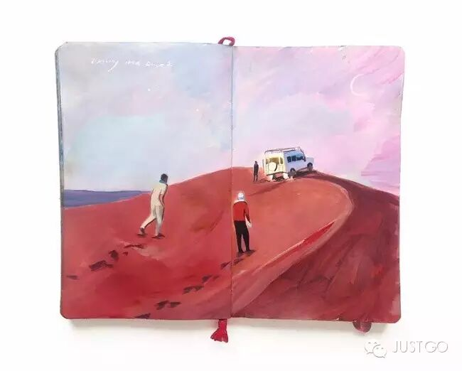

**我们的环岛路线：**奥克兰、旺阿雷、北岛北其他地方、淘朗加、罗托鲁亚、陶波、内皮尔、黑斯廷斯、怀普库劳、世界最长名字村、惠灵顿、皮克顿、尼尔森区域的村子、西港、卡拉米亚、格雷茅斯、福克斯冰川、瓦纳卡、箭镇、皇后镇、蒂卡波湖、Timaru、奥玛鲁、但尼丁、基督城。

**现在我们大致的财务状况是基本收支平衡。**

首先各位要明白，旅行不是旅游，旅行是长期的，要长期活下去，肯定不是旅游这种方式，所以平时可没有那么吃好喝好的。如果是非常小资的长期旅行，那一定是家底敦实或者拉了不少赞助的。

**◇先说说超级省钱大法——这基本是打工旅行者的不二法门**

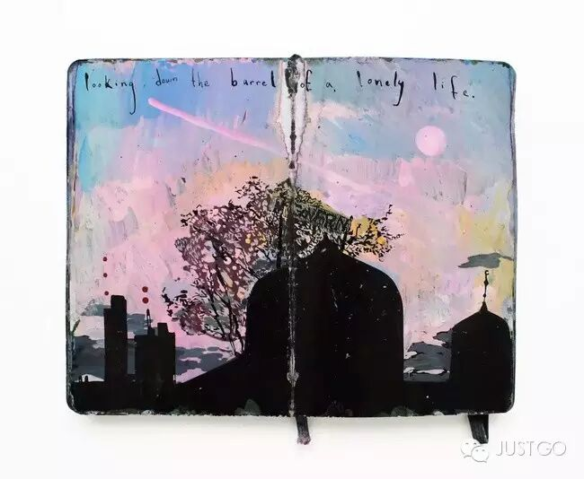

**东南亚，**消费低，廉价机票+廉价酒店（亚航旗下的Tune Hotel）基本很OK。吃东西，路边看店，不用规划指出。

**进入发达国家旅行的话，**则需要自备餐具、锅碗瓢盆、柴米油盐。如果还一日三餐下馆子，那就基本活不了多久。一般YHA（青年旅舍）和BBH（纽澳才有的背包客栈）都有厨房。

但是人均25刀以上一晚的床位仍旧不是长久之计，如果自驾游，时常要住车上。没车的则时不时要住个帐篷。一日三餐自己做饭，基本上一周的饮食花销可以控制在70刀左右。长期定居一个城市可以租房，一周花销在150刀左右，手机套餐，一个月20刀—30刀。这就是基本消费。定居一处的话，每周汽车油费大约70刀，长途跋涉的话，差不多每百公里油耗7.2L，每升油价2.15刀，不同地区不同。

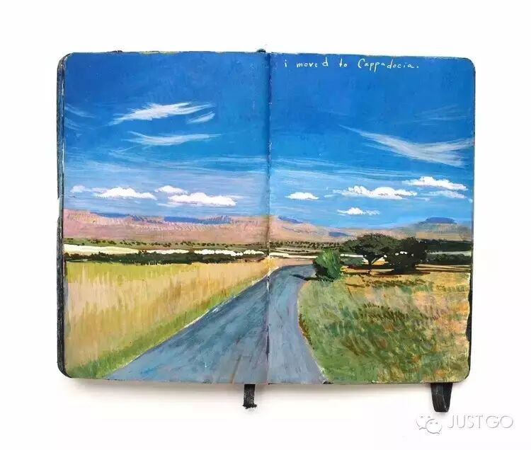

**纽澳适合自驾游。欧洲则适合火车游，**有各种类型的通票。纽澳有些1刀租车，是帮助把车换回原地，你要在规定时间内赶到某地的自驾。还有就是裸体巴士经常会有1刀的车票促销。

此外，**真要省钱，**还可住宿一路沙发客或换宿（以2-4小时劳动换取食宿）、wwoof（世界有机农场连连看），然后一路搭车。在新西兰，搭车非常容易，基本5-30分钟能搭到车。**除了鸟不拉屎的南岛西海岸路线。以这个方案去玩欧洲，其实也花不了太多钱。**

在以上基础下，我们双人在纽澳，定居在一个城市的时候，花销在1w1人民币左右。如果旅行起来，反而只要花7、8k人民币。如果在东南亚，4、5k一个月足矣。

**◇接下去再说大家关心的收入问题**

**1. 打工！最直接！(working holiday visa才可以合法打工，才能打税。其他的只能打黑工，毫无保障) 既然想做别人做不到的事情，就要吃别人吃不了的苦。这是最简单的等价交换原则。如果做过旅行者，你就可以见惯这个世界底层的生活～**因为旅行者要干的基本上是这个世界上最苦最累的活儿，和偷渡的人差不多。

我在新西兰奥克兰华人超市做男工三个月。有一传奇男工曾留下名言：**你想要老板的钱，老板想要的是你的命啊！**我每天工作12小时，除了吃饭基本没的停，一周6天。同时工作的小王，在我去之前半年没休息过～

当初三个月，我老婆在蔬菜厂做sorting，最长时一天要14小时，平时日均也要12个小时。后来问过其他打工旅行者，一般也在11—12个小时。

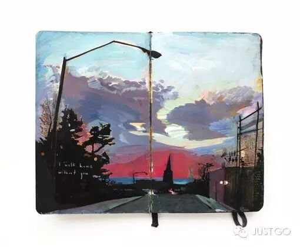

**当时我的日子是这么过的，**早上6点10分起床，打两杯咖啡，吃早饭，40分出门，送老婆去上班，7点送到，7点20到达自己上班的超市，看几眼自己要翻译的书的书稿，7点半开工。

把所有蔬果从冷库运到外面，约9点半。然后开始查看哪些货架有空，开始补货，**早则11点半能补到暂时半小时不用补货，那样可以吃个中饭，晚则停不下来。**送货的12点半至14点半都可能来送货，货到立马卸货入库，大概7到12个板子，每个板子20个框。平均每个框约18KG。

将货入完库立马补货。发现烂货要撤货，如果后台没有女工进行处理烂货，自己还要时不时处理烂货。4点半开始上第二天的货，运气好5点半上完货。打扫卫生半小时，6点开始收货，所有蔬果卸入筐中，入冷库。运气好7点就能收工，运气差7点半。

老婆没下班的话，自己赶紧回家吃饭，然后开始做饭。老婆下班了，随时出门去接。

然后老婆已经累瘫了，自己接着把饭做完，做完基本上9点半了。可以直接倒在床上睡觉了，洗澡的力气都没有。有时老婆下班早，会她来做饭。

其中试了一周多，晚上烧完饭再翻译2个小时，那一周让我直接崩溃了，后来放弃。

**这就是炼狱一样的打工阶段。**我每天可以吃一公斤米饭，仍然瘦了20斤～

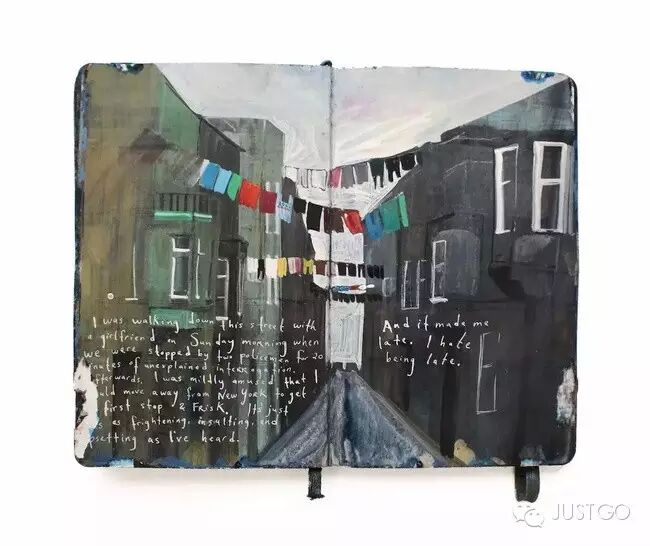

**而且打工时，超市后面有三个大垃圾箱。可以更让人看尽人间百态。**

穷逼的毛利人、岛人、白人，会来垃圾筒里挑一些烂菜叶子什么的。可能是回家种田喂鸡，也可能是自己吃。旁边的那些饭馆什么的，会来取纸板箱，恩，我们扔掉的纸板箱，他们拿来给客户装外卖用～

现在，我们在基督城打第二份工，开青口。每天早上6点至下午2点工作，2个小时能休息15分钟，手不停的开青口，开500个7.8刀，在培训阶段，按小时付费。培训期过，则开始计件。一周过去了，每小时能开750左右了，差不多能到每小时900，就比计时要赚了。**开青口的第一天，回家后，老婆手疼的睡不着觉，哭了。好了，开青口算是打工旅行中比较轻松的活。**比较苦逼的还有农场果园的采摘工。特别是冬季的一些剪枝工作，基本就是炼狱。所有中，最苦的应该是那些要"靠腰"的。

最轻松的应该是收银，小地方容易找，其次是厨房帮厨，一般不要女生，再其次则是清洁工作。

另外做过木工，**建筑工做的好了比较赚。但是基本不会有合同，碰到欠薪的情况很普遍。**我的第一份石膏板工，老板欠了其他人3w刀，去炒房产了。我干完第一周，哭诉着和老板说我房租都交不起了，雨夜11点，讨薪成功，然后开溜了～

**2. 翻译**

我在旅行期间参与了一本书的校对，出版了。我是按销量提成，再加上只是校对，基本没钱赚的。而且**在纽澳这种咖啡馆都基本没网络的地方，这种跨国界协作也是折腾。**

初次校对，我是在澳洲的飞机场里断断续续完成的。后来的大部分校对是主译完成的，所以我都不好意思要太多稿酬了。

最后攻坚阶段，项目组内部意见不一致的时，我正在fox glacier换宿，两周时间只有200m网络，我用了所有的流量，主要是收发邮件，强势制定了项目流程，甚至用强势压制自己的老师，没给老师留面子。

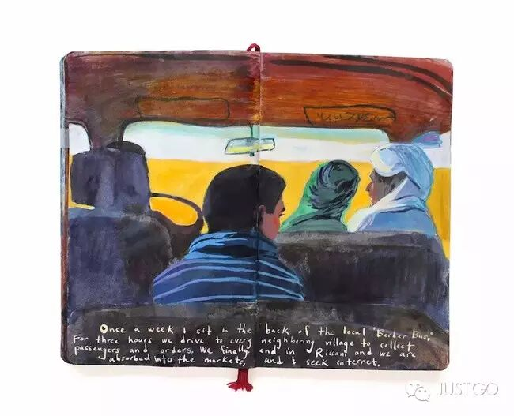

第二本书，我是在奥克兰打工期间翻译的，边打工边翻译，让我基本成了智障，后来，辞职后，连续两周集中时间翻译。**在旅行时，偶尔能在图书馆用网络时，和出版社沟通，每次我都尽量提前一周就完成工作，避免接下去的时间里没有网络，拖延了进度。但是翻译是不靠谱的，**普遍价格是一千字50-70元。出版一本书，大概就能弄个4-6000元，但基本你得花1个月的时间进去。投入产出比比较低的。而且我的稿酬都还早着呢，指望稿酬，我就得等着饿死。

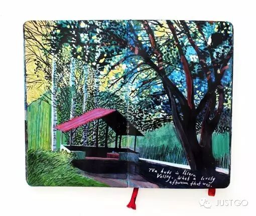

**3. 写作**

我在写书，但是纯粹只是兴趣。**第一，不知道能不能出版。这养不活你。第二，以上这些，写给没这样旅行过的人，还算是点料；写给旅行者，简直味同嚼蜡，老生常谈。**

什么《背包十年》、《打工旅行》，基本就是写给窝在家里，向往着去旅行，但绝逼不会去旅行的正常人们看的。包括现在新出的什么《停在新西兰刚刚好》之流，全部一路货。

**第三，这些书占了天时，出的早。**前浪赚凡人们的钱，后浪根本出版的机会都没有。这样的内容，出现过一遍就够了。所以，你要么得有钱，玩点有钱的玩法，写这些市面上还写得不多。穷游是个屌丝旅行者就可以写，已经写够了。要么就别走东南亚、纽澳这些旅行者泛滥的地方了。丽江、西藏就更别写了。除非是去阿富汗、黎巴嫩什么的大杀四方之后回来再写才是王道～

**第四，写书也需要一些正常的时间，和正常的网络**，旅行的碎片时间里总是缺点东西，有时没电、有时没网，两者都有的时候，老婆说咱一起去逛街啥的吧，一起看部烂片吧，基本就没静下心来写文字的时间了。有网络了，上网来答问题，就又烂尾了。说到底，其实应该是我自控能力不足，缺乏点纪律。

**写作赚钱，大家请死心。**

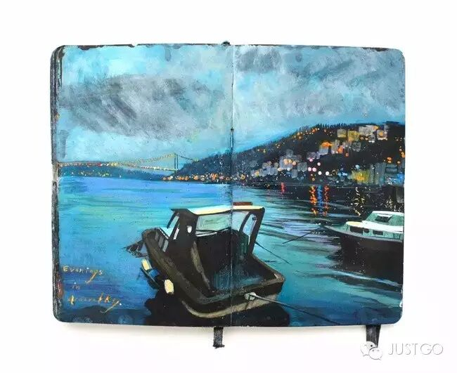

**4. 自己的已有资产**

自家的房屋出租，我们大约每月能补进一点点钱。

**自己得有公司**。我自己则每月靠国内的一些广告业务，锵锵有个1000块钱进账，聊胜于无。因为自己根本不管事儿了，所以也不指望它有多少成长。

我那去巴基斯坦的哥们，旅行10个月能多攒3w元。因为他有自己的公司。路上会遇到各种极品，时不时的帮别人走个帐什么的，也能分到点钱。顺便卖点他自己公司的医疗器械，也能赚点钱。按他的话说，这会丧失旅行的乐趣。另外，他让我不要学，有的钱赚了，迟早要进去的～

我认识一些早期的旅行者，后来资金链进入正循环，是tmd赶上了中国社会变迁的性高潮。比如某人2000年在上海购置了房产，然后2011年卖了，就玩high了。有人当年在大明山原始森林徒步9天，开辟了徒步路线，后来出来做青年旅舍什么的，做的早，赚大发了，后来时不时的去千岛湖买个岛，去哪里买个山什么的。钱根本就不是问题了。

**5. 代购**

我没做代购。我有流量资源，我也可以去弄货源，现在很方便。但很烦人，我不想做客服，不想每天跑出去进货，不想搞网店。我老婆也不想。

**赚这个钱，你就别想有随遇而安的旅行体验。**

真做代购的，就是某段时间网店关门，自己纯游，然后购买一堆东西，回国后，再狂做一段时间的网店。这事儿就是这么将人吊着的～

而且每次购置这些东西，也都是要成本的，所以，这种前置投资，成本不知啥时候收回的买卖，不适合屌丝～适合不差这点钱的人～

每天要面对一堆小白问题，很心烦的。

这个东西的利润迟早被摊薄到没有利润可赚，最后都从义乌进货为止。**绝对不是长久之计，不想在这种没长性的事情上浪费生命。**

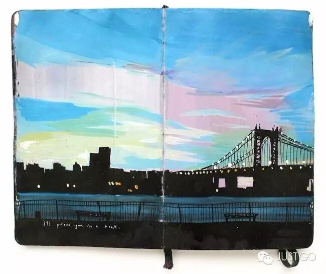

**6. 做设计？接外包？**

**请死心。没有固定的时间和网络环境，你就别想搞这个。**洽谈项目不知道啥时候才能跑通，前期就先把房租、网费、生活费垫进去了，对于随走随停的旅行者来说，不靠谱的紧～

我自己因为业务关系，早就认识了新西兰的设计公司、新西兰最大的华人媒体、社会化媒体公司的CEO。聊了聊，有不少合作的可能性。但最后由于我居无定所，大部分不了了之了。

这种和国内没分别的工作，我跑到外面来做干嘛？如果仅仅是为了赚钱，我宁可做最苦逼的体力劳动，而不想把国内的生存模式搬出来。

**做没做过的事情，才是重要的体验，做自己习惯的事情，则没啥意义。旅行本身就是为了寻找个人的突破，而不是出去了，发现自己乐于安逸，换个方式再把自己缩进自己最习惯的方式，缩进壳里。**

要突破，就要勇敢，要勇敢，就要做好最坏的打算，做好了最坏的打算，就准备放下面子、尊严，吃最苦的苦，把最简单的事情重复无数遍，直到做的比原先好一些。

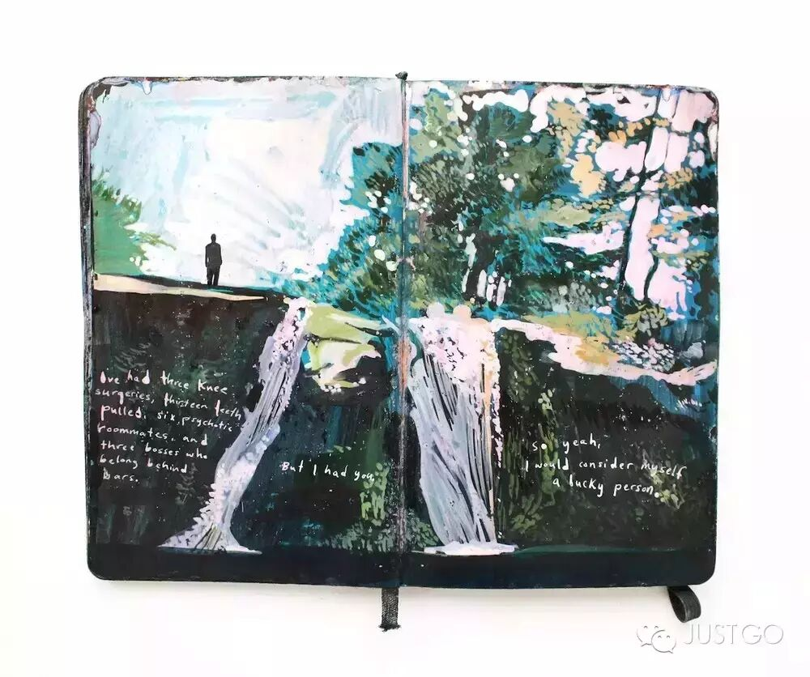

**7. 图片库摄影师**

这个还是**相对靠谱的，**但是你器材要好，要熟悉图片库相片的要求。在旅行中对拍摄好照片要有耐心，路过能遇见愿意提供影棚的朋友更加。

我出发之前买了本《把你的照片变成钱》，不过自己没有花时间去实施这件事。一是各种注册帐号麻烦，而是提成的回笼时间很慢很慢。三是买不起好相机，只有500d配A小6这种极初级装备。

**8. 拉赞助**

首先你要会录DV（这个大概是人都会），然后你要会剪辑。你要能剪辑出好作品之后，才可以去和电视台聊合作。然后剩下的要运气好。

导演设定镜头，然后，后期剪辑都要一个人来做，这个很花时间，搭档要上镜，会配合镜头做戏，这个又是很多人做不了的了。

虽然自己会剪辑，老婆也能上镜，但是自己重来没尝试过这一招。

综上所述，凡事趁早：开旅舍、写书、打工旅行、代购，这些都是被人玩腻了的事情，无利可图，也不会改变你什么。真还想通过旅行，就去没有攻略写过、没人做过的事情上努力一把，那边还有逃避你凡俗生活的一丝可能性。不敢做无把握的事儿，凡事启动前，先上提问题，或先问前辈的，我奉劝一下，其实不光不要琢磨稳妥旅行的事儿了，其实连创业都不适合你。安分一点，做个常人，过一辈子，好好的。理想主义会害死你～

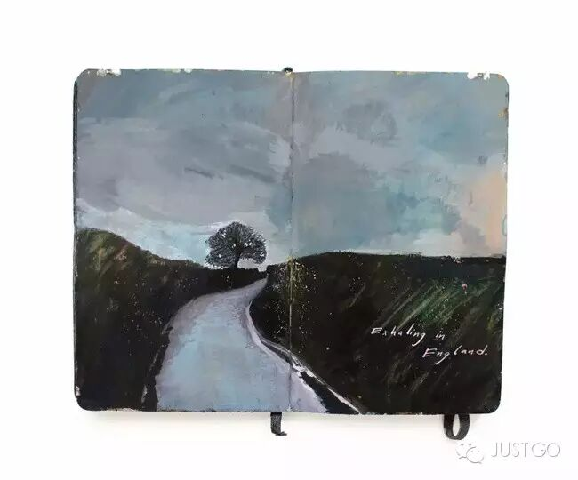

**有人问，说的那么惨兮兮的为啥还要出去旅行？我又没说过我是为了享受去旅行的。**

一直的目标是三年不开张，开张吃三年。打工一阵旅行一阵，也是这个目标下的一种尝试。而在出行前，我一直都在做各种这类尝试。

说实话，间隔年对于我来说，就是一个超长假期。而打工旅行，不过是度过这个假期的一个借口。毕竟这还算是比较正常的花费一年时间的方式。要是我和别人说，我想实验一年不开张，用一年的时间赚2年的口粮，做一年休一年。和亲朋好友解释的成本太高，以及想掐死我的人就大大增加了。

此外，很多认识我的人都知道，我是不会接受平凡的生活的；但是更多和我一起旅行过的朋友知道，我不是那种疯狂的主，我的旅行的状态，只能算是不上不下，按部就班而已。癫狂深度算不上，小资享乐算不上，精神修行算不上，只算一种半吊子，说自己参差，不过说的好听而已。

---

## 还有这样的答案

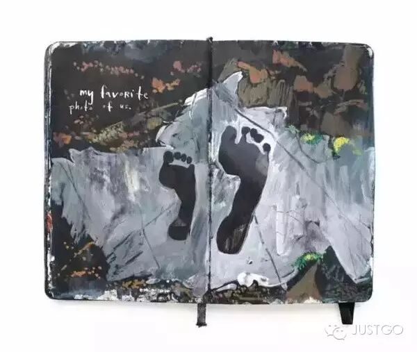

**@kaka2008：**不敢下太大的结论，就说说我了解的两个例子。

1、已经挣了足够的钱，利息再加上投资就足以支撑整年去旅游了。比如在新浪微博上某大V有83万粉丝，大师本人是一名软件商人，自己也承认经济实力比较高。从微博上看，其经常去全世界各地旅游，去年就去过非洲、南极。从其前一段置顶的微博看，去南非的花费一个人在十几万左右。

2、靠给报社写在旅行中各种各样的游记、报道为生。比如「美国人何伟」曾经在中国生活过多年，先是在涪陵支教两年，后来，在北京定居，在北京的那段日子，他的身份是华尔街日报驻中国记者，他经常开着车跑遍中国各地。在旅游的过程中，给好多家美国报纸写文章，靠稿费来支撑他的旅游。后来，还把旅游中的生活写成了两本书——《寻路中国》和《甲骨文》。

**至于大多数人，我想应该都有一个谋生手段。**网上看的那些，辞了工作，跑去旅游的，应该只是少数。毕竟，**如果你连吃饭问题都没法解决，是没有办法继续旅游的。**

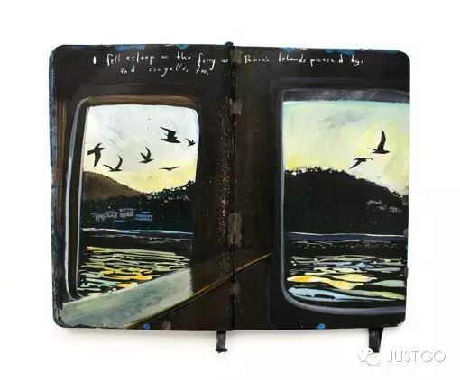

**@Jarod Zhang：**个人认为，实现可持续旅行的最佳解决方案就是**成为一名数字游民**，关于数字游民生活方式我之前写过一篇文章，现在挪到这里希望能对大家有所启发：数字游民这个词翻译自英文单词Digital Nomad（也有译作：数字游牧民，数码游民等）。这个概念由谁首次提出目前无从考证，但是随着互联网技术的发展，它已经从从前一个冷门小众的概念，逐渐开始走入主流媒体的视野，并开始演变成为一种日渐流行的生活方式。

那么到底什么是数字游民生活方式呢，这里我尝试给它用中文下个通俗易懂的概念：**所谓数字游民生活方式，简单地说就是利用基于互联网上的自由职业，或者创业产生的收入来支持自己不受地点约束的生活和旅行。更通俗简单地说，就是边玩儿边工作，旅行赚钱两不误。**

数字游民生活方式与朝九晚五的传统工作是死对头，它拒绝办公室格挡，拒绝通勤，拒绝加班，更拒绝一年10天（或者更少的）鸡肋带薪假期。数字游民创业也有别于传统创业，他不需要你有很多的原始资本积累，或者拿着PPT去忽悠风投的能力，它更需要的是你在时间和激情上的投入。数字游民生活方式强调去你想去的地方做你想做的事儿！

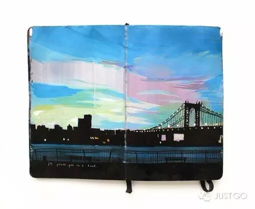

**@aloha：**在quora上发现一种的旅行方式，通过**World Wide Opportunities on Organic Farms**去所在国有机农场里打工以获取免费食宿，感兴趣可以去wwoof.org/看下。

**@minyuan：**先说说我的个人经历，去年大学毕业后一个人旅行了半年，去了云南、西藏、尼泊尔、印度、斯里兰卡、马来西亚、柬埔寨、泰国。在路上遇到了不少长途旅行的人，基本都是靠之前的积蓄出来旅行的（其中辞职出来的占多数），也有家里支持（极个别）。

旅行的人经济来源无非就两种：**1. 靠之前的积蓄。**这个就不说了，大部分人都是这样。

**2. 在旅行中赚钱**——从他们从事的行业又可以细分下：跟旅行有关的，跟旅行无关的。跟旅行有关的：文字工作者（给报社杂志写稿，出书的），摄影师（一般也是文字工作者），职业旅行者（一般都具备上面提到的两个身份之一），旅行玩家（摆地摊，街头卖艺，代购等）。跟旅行无关的：你可以是个软件开发者，反正在哪都能写代码。**你可以是任意职业，只要你足够的自由，能赚足够多的钱。**

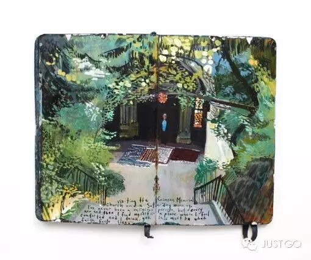

**@陈宇欣：**我所认识的满世界跑的人，都是在现实生活中有一份踏实的工作，努力攒钱，努力攒假，赡养父母，照顾孩子，同样在和有钱没时间和有时间没钱做艰苦的斗争。他们也许给人的感觉是在路上玩得很爽，但一定也是在背后做了很多很多的准备。**如果想要效仿，建议多关注他们做了哪些牺牲和准备，冷静分析其中的运气成分有多大，而不是关注他们的收益。**

内容摘选自：知乎（已联系各位作者授权）

插画：@Missy H. Dunaway

这位姑娘通过绘画的方式记录了自己2年的环球之旅，把旅行中的风景一边走一边画了下来。

愿梦醒了，世界还是你喜欢的模样。

