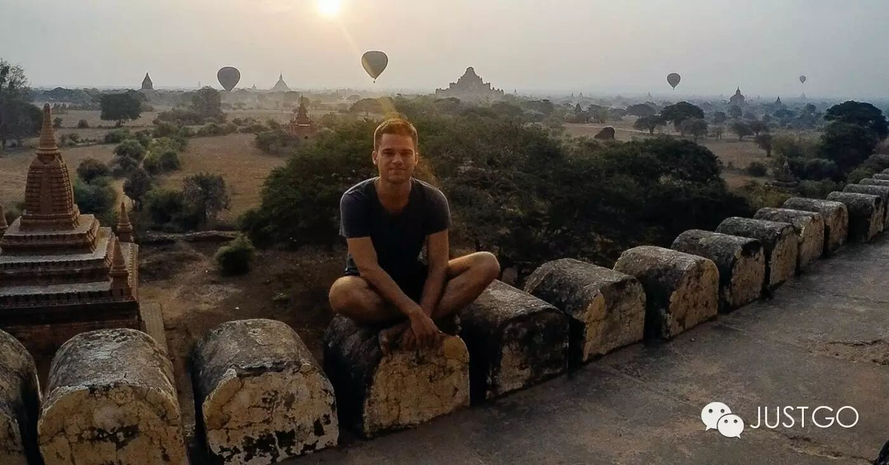
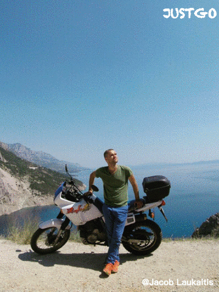
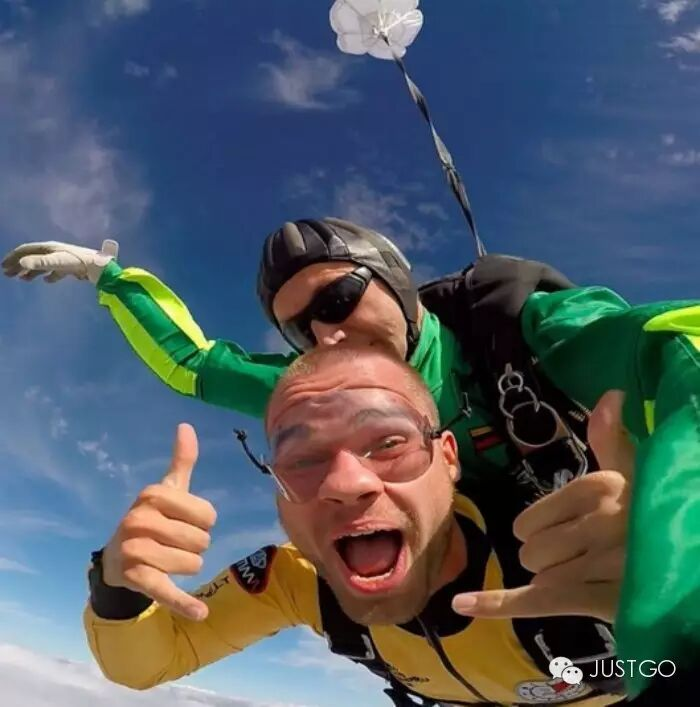
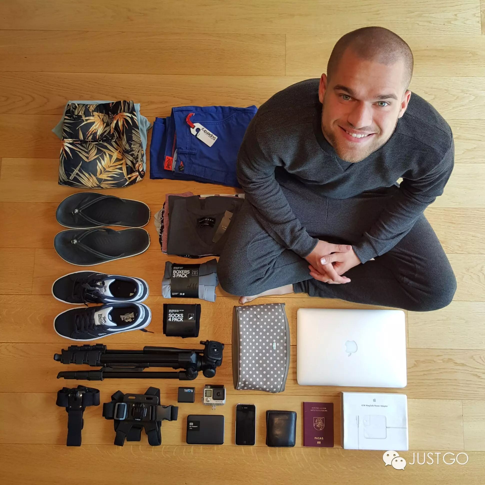
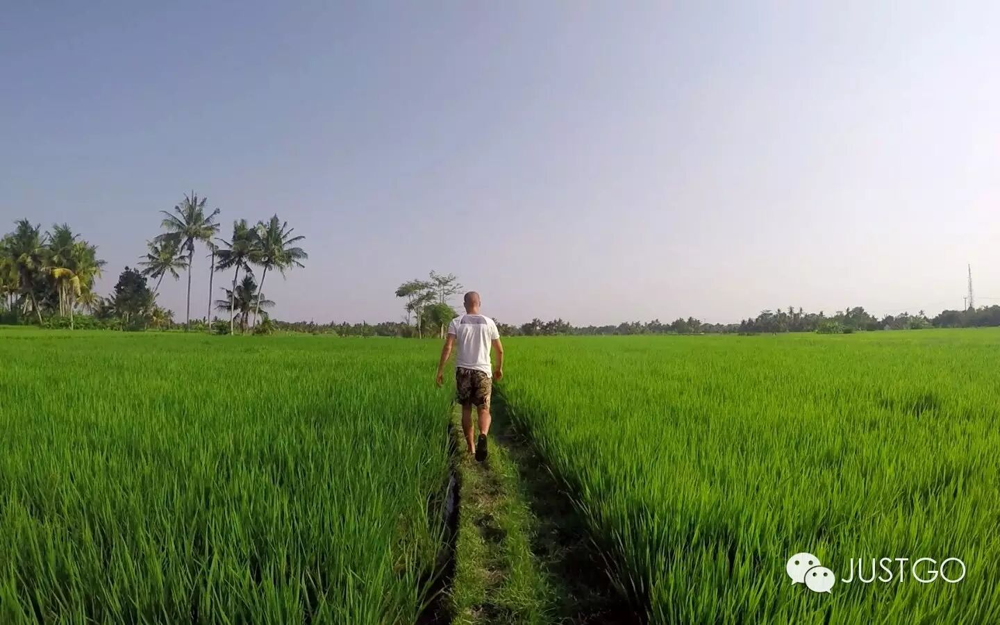

# 数字游民 · 如何实现一边工作，一边环游世界？

*Geng Yue · Travel Guides*

今天讲一个"数字游民"的故事。

**"只要有笔记本和网络，我就可以在全世界任何地方工作"。**

在你，你，就是你每天朝九晚五，累的下班回家不想说话时，没念完高中的他竟然来了这么一句。

他叫Jacob Laukaitis，在过去两年里，他背着笔记本、上着网，一共在30个国家生活、工作过，在每处呆的时间不超过1个月，一旦厌倦，就买张机票，飞往下一个目的地。

他不是个文艺青年，不是个背包客，更不是富二代。他也不啃老。他是一个"数字游民"，一个创业者，**"浪迹天涯"就是他的工作和生活方式。**

他出生在东欧立陶宛，15岁创办第一家公司，16岁把公司卖掉。17岁高中毕业的他，去看世界，开始一边旅行，一边工作。他花了一个月的时间在日本，接着，在吉利村拿到了深海潜水的执照，在菲律宾和鲸鲨游泳，在巴厘岛的火山攀爬，在缅甸和柬埔寨探访了数百间的寺庙，在四周内骑摩托车行驶8000公里，穿行了巴尔干半岛，穿越了无数岛屿、村落和城市。

在此期间，他参与了数起创业项目，他于2014年5月创立的一家互联网公司，为想省钱的美国人找购物优惠券，目前已经有20个全职工作人员，并进入稳定盈利的状态。

对于Jacob来说，"数字游民"这种生活给他最大的回报，是可以迅速地学习不同国家、不同文化的精髓。他花了很多时间去研究各个洲的历史，不同的文化，和在线的一些商机。他说自己以前所未有的速度在成长，并且认识到不同地方有趣的人。虽然总是一个人在路上，但他并不感到孤独。他总是会结识当地的朋友，迅速融入他们的生活。

他是如何做到的？

**▼"我的父辈们，对'成功'有一种非常简单的看法——找到一份工作，然后做一辈子。"**

在他看来，这是种"踏实地呆在自己的舒适区里"，过一种"不复杂、可以预测"的生活：9点出现在办公室，确保自己看起来会忙一整天，在下午五点离开。

而做为一个"数字游民"来说，**你可以"设计"你的生活。**

自由的画风是这样的：如果你喜欢冲浪，你可以搬去加州，如果你喜欢骑自行车，你可以花两个月去台湾环岛，如果你喜欢摩托骑行，你可以花六周去越南来一趟长途旅行。如果你喜欢打麻将，那么，成都欢迎你。如果你想去喜马拉雅爬山、去夏威夷度个假、去吃烧烤，去吧。如果你今天需要参加母亲的生日派对，或者朋友的毕业典礼，那就去吧。你可以做任何你喜欢的事情。只要你能把工作做好，拿出很棒的结果，我才不管你在哪儿上班呢。

**当你从物理位置和时间上同时被解放出来，是怎样的一种体验？**

首先，你会觉得很爽，你可以自己选择你生活的地方和你的工作方式。

Jacob的真实工作安排，是他每天工作3-5小时，第一年去了12个国家。"我不会给自己制定固定的计划，但是我知道我要去哪里，要做什么。下个月的1号开始，我会在泰国呆一周来休息，接下来的一个月，在巴厘岛和我的同事们有非常棒的交流，再花一个月周游印度尼西亚，学他们本地的语言，花两个月去印度旅行（其中有两周会居住在孟买的贫民窟）。花三个月在台湾，学习普通话，和当地的创业公司、群体连接。花三个月在中国来一次长途旅行，去一些潜在的目的地。"

无限的自由的另一面，是无限的责任。你会感受到前所未有的压力。因为你必须要设计你自己的工作方式，找到一种适合自己、高效的工作方式。你是你自己事业的总设计师，船长，机长，列车长。

对于那些热爱四处飞行，随时启动玩乐模式的员工，并不会是最"糟糕、失控"的员工。作为老板的Jacob这样认为，在自己喜欢的事情和感觉舒服的环境里，心情最High时，效率才最高。因为他们会愿意为了让自己富有激情的事情，去花时间，越喜爱自己的工作，就会越主动，会对用户更用心，从而可以为公司产生更多的盈利和销售业绩。

▼

**追求**

"在办公室里要表现得忙碌是很容易的，开开会，回回邮件，喝喝咖啡……我们都过过这样的日子，不是吗？但是只有当你在远程工作时，每一分钟时间都是自己的，都由自己支配的时候，你才会一遍遍地问自己，我要怎么样才能高效地出准确的结果？此外，如果我们仅仅限制在旧金山地区招人，我们就会错过全世界其他地方的人才。现在，我们可以雇佣任何地方的人才，还能省房租。"

Jacob并不羡慕对于许多同龄人对物质财富和舒适生活的追求。他认为现在的社会过度执着于物质，痴迷于"占有"。正如Dave Ramsay所说，"人们用他们没有的钱，去买他们不需要的东西，去巴结他们并不喜欢的人。"

Jacob认为对于**物质财富**过度在乎的另一点牵绊是：**你需要去打理它们，它们会把你牢牢地绑在一个地方，让你动弹不得。**至少对于他来说，第一天晚上把所有的家当塞进背包，第二天早上买张飞机票，他就已经在路上了。

▼

**没有"最好的时间"**

乔布斯的一些话，让他更坚定了自己内心的声音。"你有时候会思考你将会失去某些东西, '记住你即将死去'是我知道的避免这些想法的最好办法。**你已经赤身裸体了，你没有理由不去跟随自己内心的声音。**"

Jacob说，如果你想要去探索这个世界，那么目前就应该去做。它并不需要牺牲你的事业，有数以千计的"我们"在准备帮助你，大量的办法可以去谋生，还有无限的事情去体验，远方等你去看。

在这个世界上，有无数种活法。

这算是我羡慕的其中一种，

想起《寻路中国》作者何伟（Peter Hessler），给年轻写作者的最后一条建议：

"离开家。离开你的家庭，离开你熟悉的日常，离开你舒适的社交圈。花时间跟与你不同的人在一起。"

祝你早日过上你最想过的那种生活。

