# Six Meals a Day in Xiamen's Snack Alleys · City List

*Geng Yue · Travel Guides*

**Down-to-earth, delicious, affordable, authentic**

These are the keywords for this City List on Xiamen street food.

These are recommendations my good friend Kiki, who lives in Xiamen, and I **tasted ourselves, one shop at a time.**

We bypassed the noisy "tourist" snacks in the scenic areas,

and carefully selected **small food shops loved by locals**, **time-honored establishments**, great-value **seafood stalls**, and **little stands** tucked away in alleys...

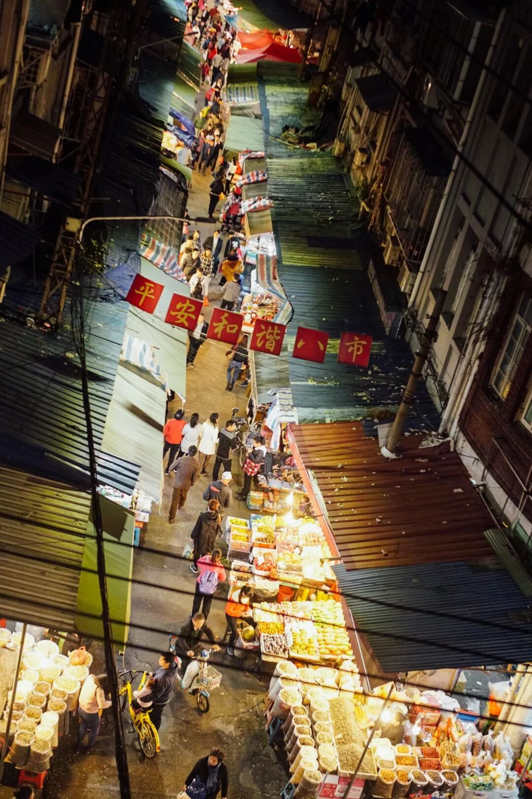

1

**Hongyi Dessert Shop — Traditional handmade sweets, healed in a single bite.**

We visited Hongyi Dessert on a morning. It's not the easiest to find — a somewhat hidden little shop.

When you walk in, the doorbell rings with a ding-dong, like a lucky cat's bell.

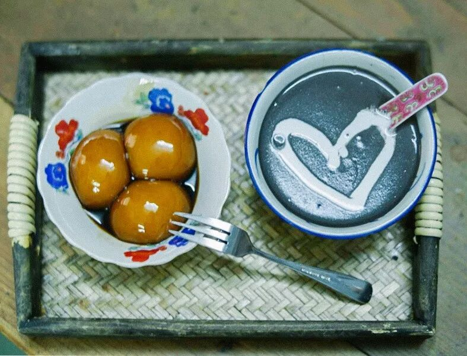

We ordered **brown sugar traditional tangyuan**, **curry fish balls**, and **black sesame paste** — the dark sesame paste had a milk-drawn heart on top. One bite, and we were healed — even a bit amazed.

The tangyuan were chewy and bouncy, dipped in brown sugar, not too sweet, but we ate them with a warm feeling inside.

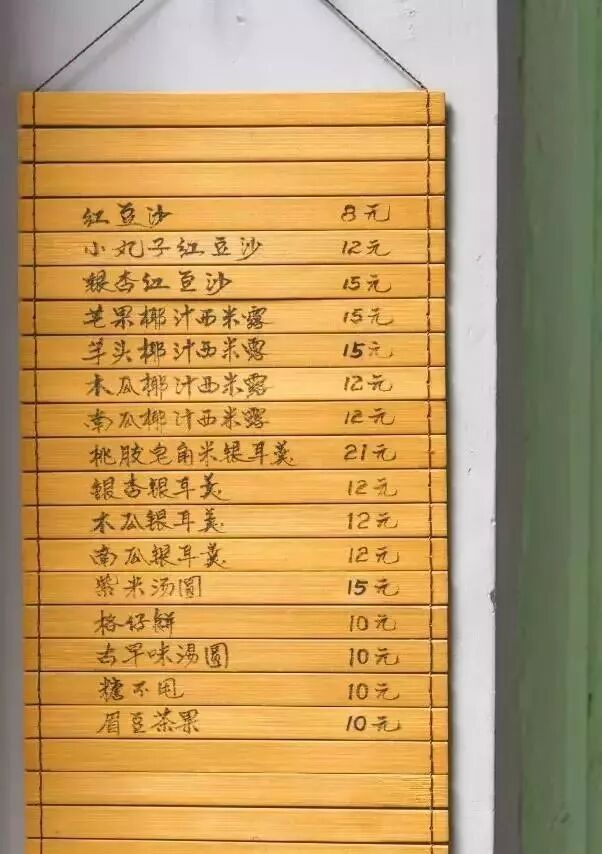

The prices are very reasonable too — about ten yuan a bowl of dessert buys you a wonderful morning.

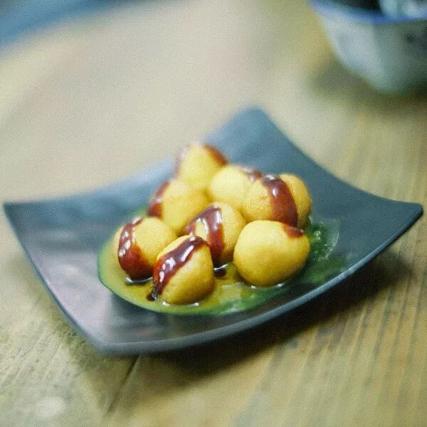

We also wanted to order mango pomelo sago and mango taro ball red bean soup, but our stomachs were already full.

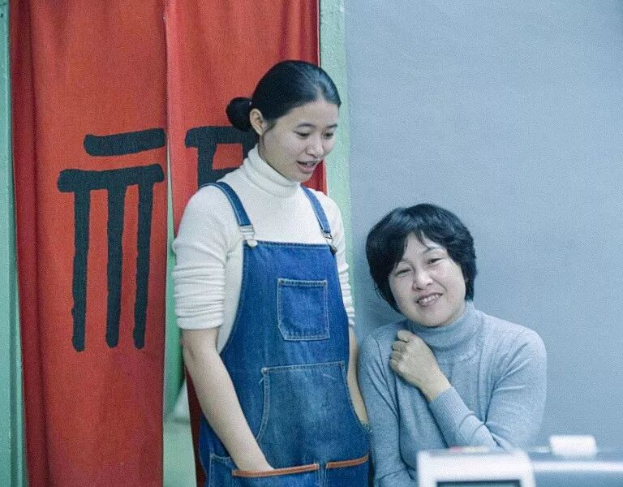

The shop is in the owner's own old house, so the atmosphere feels very much like home — simple, rustic, quiet decor, with just 2-3 chairs inside.

Later we learned that "Auntie Hong" had lived in Hong Kong for over 20 years and was deeply skilled in dessert-making. Everything in the shop is handmade from scratch.

18-102 Gucheng West Road, Xiamen (Zhongshan Road branch)

2

**Maque — Good food is like this: simple, clean, and makes your heart leap.**

I went to Maque twice, just to eat the Chinese-style braised pork and pig's trotter rice. It's a very small shop, but it won my unreserved affection.

Good food should be exactly like this: simple and clean.

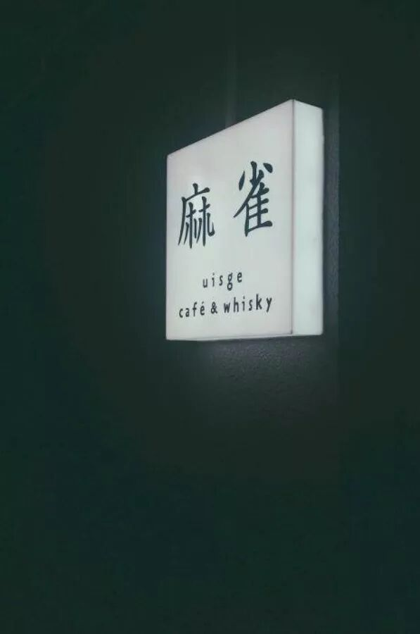

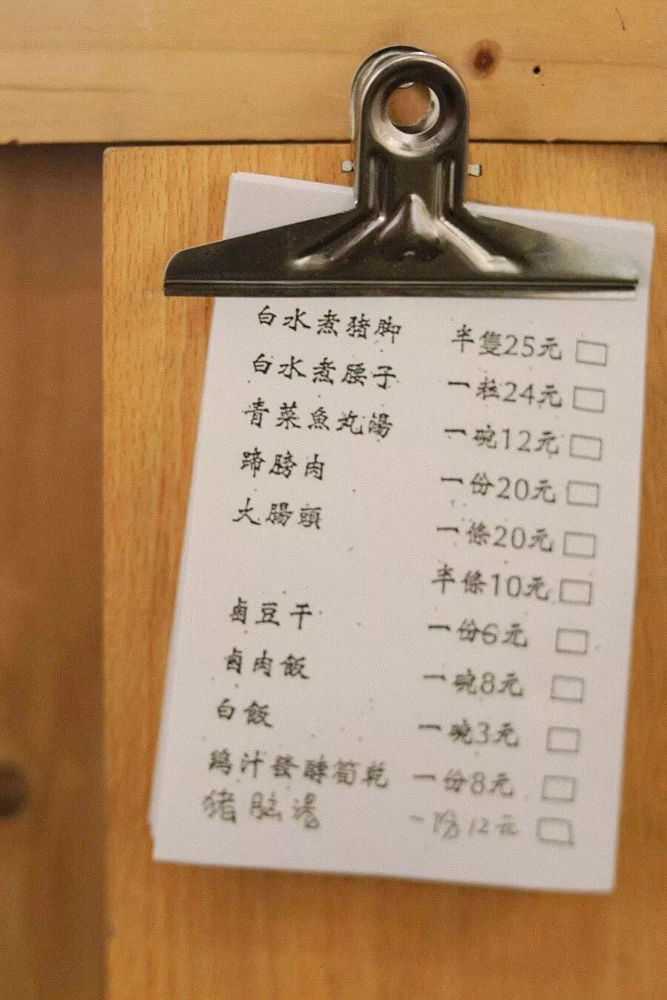

If my local friend Kiki hadn't brought me here, I would never have found this place.

The owner is from Taiwan and has been in Xiamen for over twenty years, very particular about authentic flavors. The braised pork rice is deeply flavorful, and the minced pork doesn't have heavy spices like cinnamon.

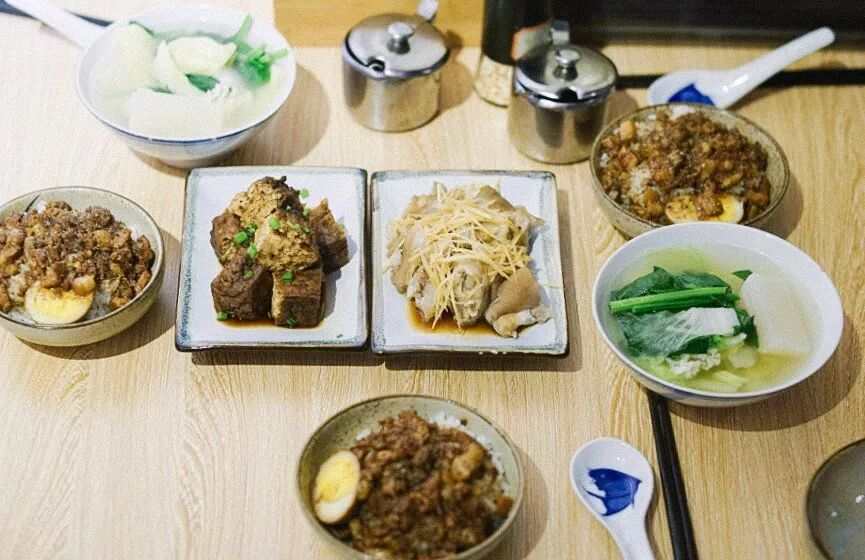

The fish ball vegetable soup is light — the fish balls are house-made, two of them, paired with greens and radish. Very comforting to eat.

The tofu is savory and fragrant, soaked in broth — one plate wasn't enough, so we ordered another.

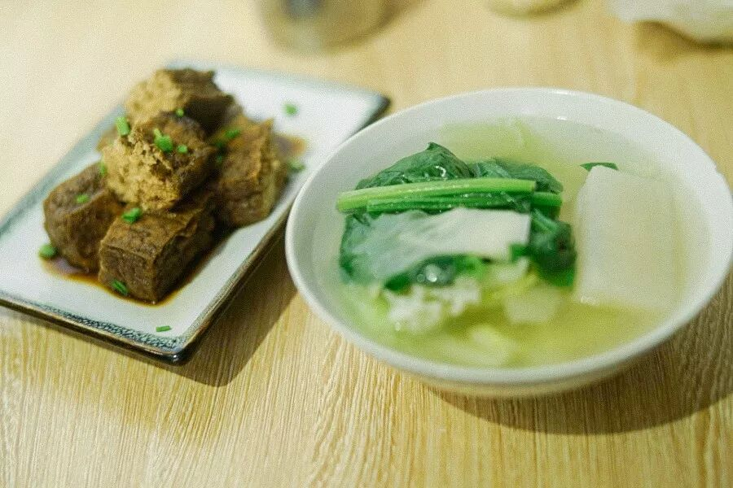

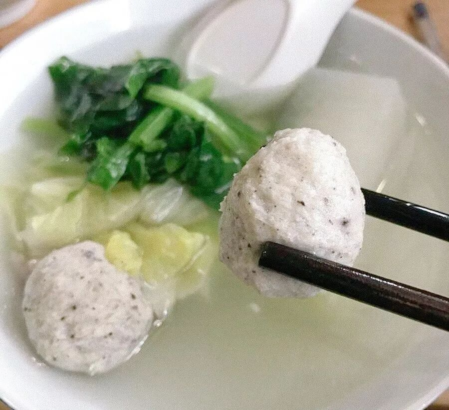

I love the signature braised pork rice — the sauce is on the lighter side, the rice grains are distinct, and there's a generous amount of black pepper.

The blanched pig's trotter has a traditional flavor — the meat is tender, melting in your mouth.

I bought a bottle of the shop's homemade chili sauce to bring back to Beijing. The owner makes it himself, and the flavor is rich and deep.

Many late nights, tasting that spoonful of sauce, I'd think of rainy Xiamen evenings.

Thinking of what Qingmao said to me, "You won't be able to eat this anymore." Kiki said, "She'll come back."

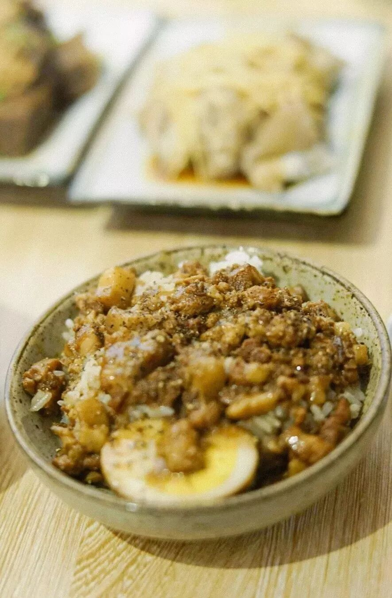

3

**Mingyue Shrimp Noodles — Truly delicious folk food is found among the people, on ordinary streets, unassuming.**

Following the crowds at the Eighth Market, we arrived at this roadside stall with a small table. The two of us ordered a signature shrimp noodle bowl to share.

It's said to be **the most authentic shrimp noodles in Xiamen**, 20 yuan a bowl, **generously portioned** — shrimp, lean meat, fish balls, bean sprouts, pork intestine, and a broth that's incredibly savory, made from simmered shrimp heads and shells.

Beside it, a large pot of shrimp broth was bubbling away.

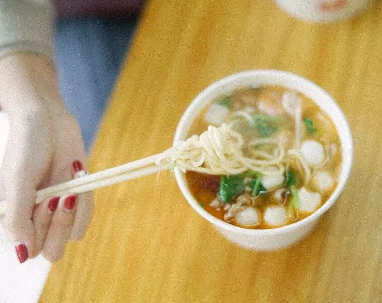

While eating noodles, we watched the shrimp and char siu fried rice being stir-fried nearby — it looked incredibly fragrant.

Next time I plan to order a bowl of fried rice with shrimp broth.

I have to mention the owner — he looks like he time-traveled from a Taiwanese film, with a bit of an Elvis vibe, wearing chunky necklaces and rings, permed hair, and bell-bottom pants.

180 Xiahe Road (near Datong Primary School)

4

**Liangshan Seafood Stall — Wok-fried seafood so fresh, perfectly seasoned.**

Liangshan left a deep impression — **great value**, very down-to-earth. The three of us shared a round table with three local Xiamen couples.

This shop is located in Xiamen's oldest market, the Eighth Market. It's said to be very famous — by 5 PM every afternoon, there's already a line, business booming.

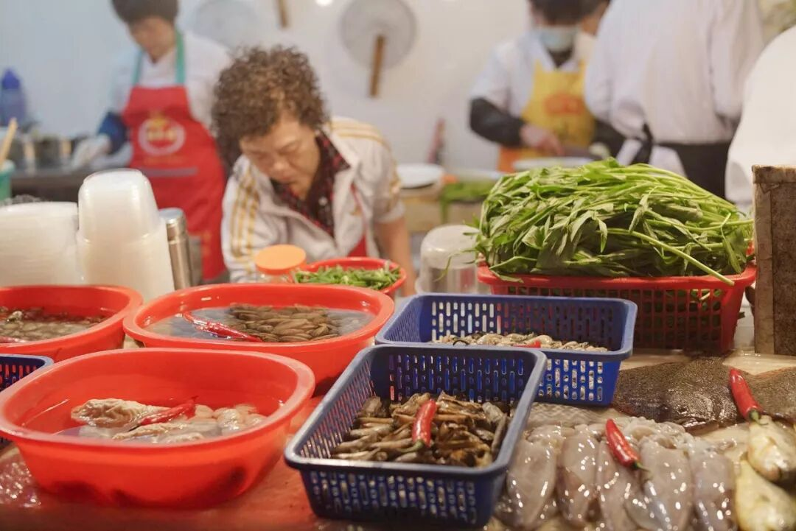

Outside the entrance are many large tanks of live seafood — crabs, lobsters, clams, and fresh fish stacked together, full of market atmosphere. There's no menu — you order directly outside, and the prices are very fair.

Inside, the environment is quite basic, very "dai pai dong." My friend said it used to be even more basic, but we had a wonderful and memorable meal.

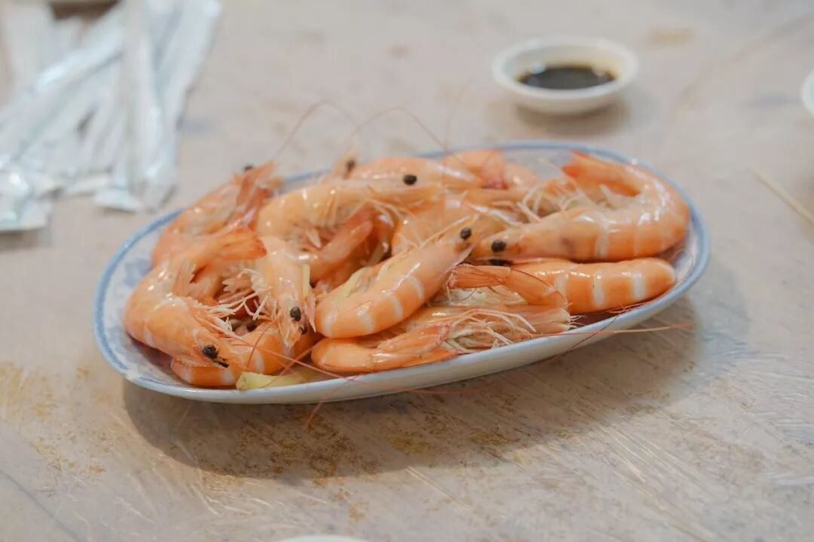

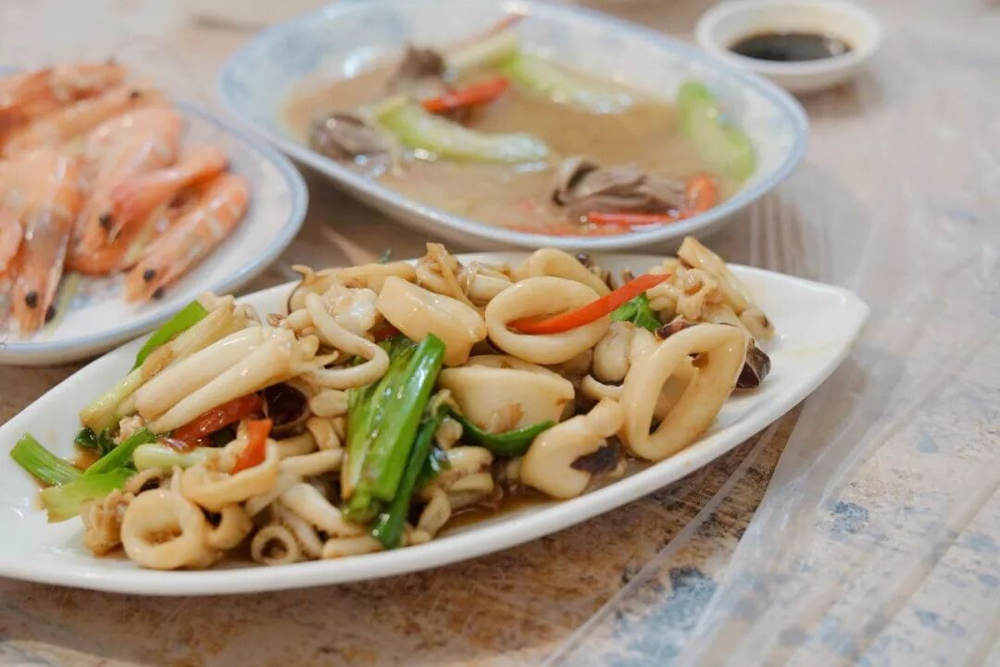

That evening, everything we ordered was a must-try:

✔️ **Blanched shrimp**, with the freshness of coastal seafood.

✔️ The must-order **signature pork kidney**, said to be the one you "can't miss" in Xiamen — arrive too late and it's gone. Cleanly prepared with no gamey smell. Expert knife work, paired with celery, tender and delicious.

✔️ **Vinegar pork**, a uniquely textured dish — tangy, not greasy, somewhat like sweet-and-sour pork but different.

✔️ **Stir-fried squid**, I love squid and this was deeply flavorful with a great sauce. I ate an entire plate of squid rings myself.

✔️ **Seafood soup**

There's also **stir-fried dried tofu**, **oyster fritters**, **lychee pork**... all worth trying. The chef has over 20 years of experience, controlling heat perfectly — never overcooking the seafood, and expertly combining ingredients to bring out the freshest flavors.

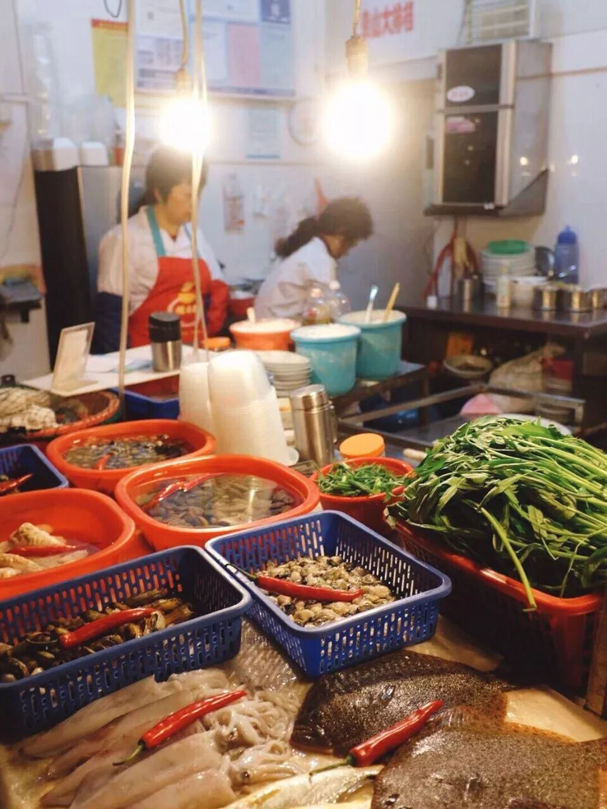

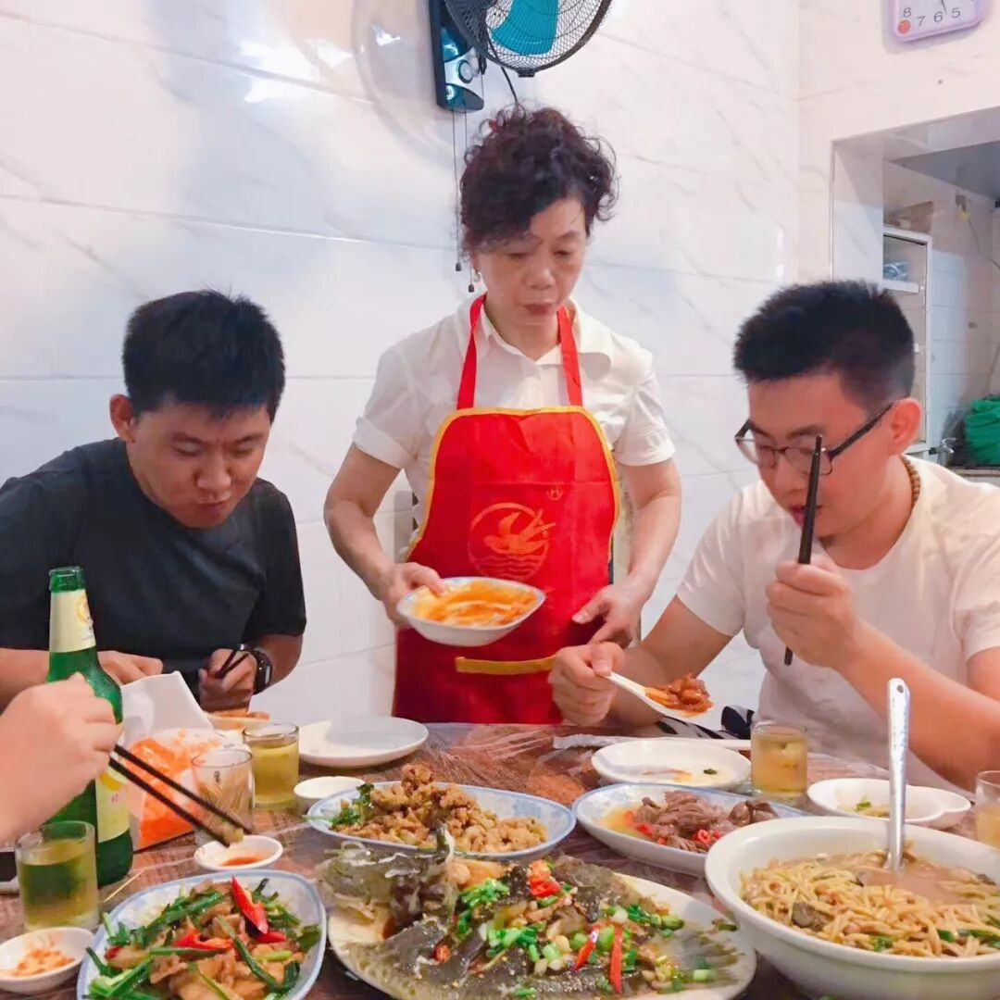

When we first sat down, my friend pointed out the owner while taking photos, saying she'd been there for years. She looks a bit fierce, with an imposing presence.

When the vinegar pork arrived, the auntie came over to remind every diner to put down their phones, save the chatting for later, and pick up chopsticks to eat while it's hot~

When the turbot fish was served, the auntie noticed the last two bites of vinegar pork remaining. She picked up the two gentlemen's spoons, scooped the broth, and placed it on their plates, telling them that the last bite is the best — **you must finish it!**

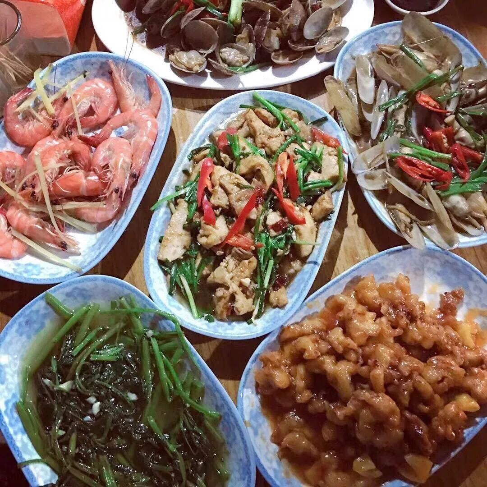

My friend who brought me said they come almost every week, and everyone they bring loves it. One traveler booked Liangshan for all three nights of their Xiamen stay. I laughed and said I would too.

**Back to basics — enjoy a proper Xiamen seafood meal.**

250 Kaiyuan Road

Hours: 17:00–22:30

5

**A Ling Misua — Misua is the most common Minnan snack.**

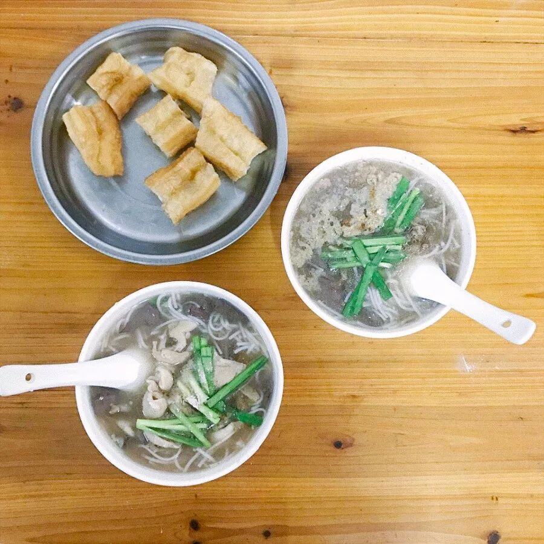

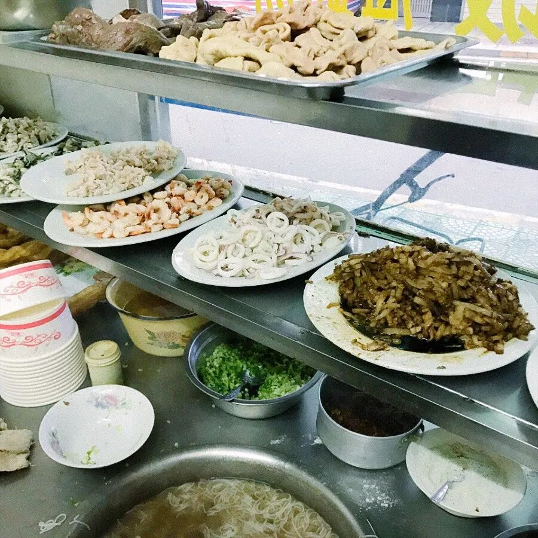

An authentic local misua shop — as the name suggests, the owner must be A Ling. She's also the chef and the cashier.

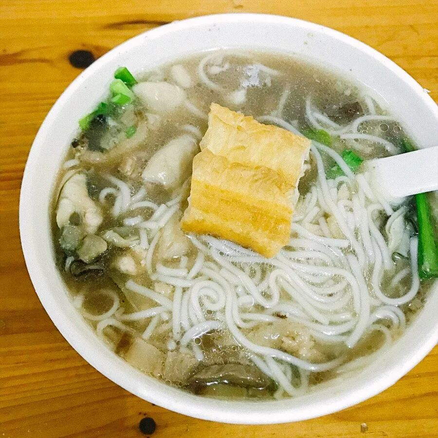

A Ling is a typical Minnan woman — hardworking, warm, and shrewd. Sitting in the shop eating, I couldn't help but quietly observe her multitasking — hands skillfully preparing food, turning to direct the helpers, warmly greeting regular customers, and finding time to handle the register.

Most impressive of all, with so many customers, she remembers every table's bill perfectly. I love the calm confidence she exudes, as if everything is under control.

63-1 Xi'an Road

6

**Ximen Tusundong — Ximen is the granddaddy of Xiamen tusundong.**

My local friend said she's been eating at this shop since elementary school,

from 0.5 yuan a piece to 2 yuan now. From a tiny space that could barely be called a shop to a spacious storefront now,

what hasn't changed is how delicious it remains — even the sauce tastes the same as in her childhood.

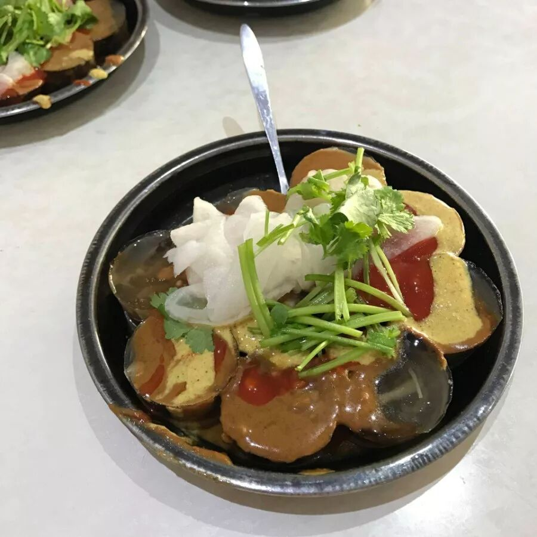

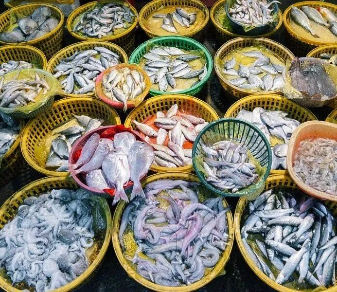

Tusundong is made from a marine worm called "tu sun" (sipunculid worm) found in tidal flats. It contains high levels of collagen, so after being boiled and poured into small bowls to cool naturally, it sets into a jelly-like form.

Ximen tusundong comes in three sizes — small, medium, and large. The small ones are made from baby worms, so the texture is more tender. The large ones have more chew.

Tusundong itself is bland — you eat it for the texture. By default, the shop adds **three sauces**: sweet chili sauce, peanut sauce, and yellow mustard. I like all three. **Cold tusundong with pungent mustard — an indescribably wonderful taste.**

I must also highly recommend the pickled radish (cai tou suan) that comes with it — sweet, sour, and crisp, it cuts through the richness of the peanut sauce. I always ask for extra.

Many people are scared off by the appearance of tusundong, but it's not only **highly nutritious** with a great texture — **you can only find it in the Minnan region**, so it would be a shame to miss.

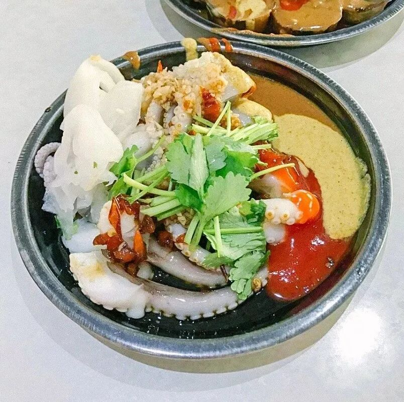

Another strong recommendation is the **blanched octopus**. Because it's so fresh, the texture is wonderful — the best octopus I've ever had, sweet and savory with a satisfying crunch.

33 Douxi Road (near West Gate of Zhongshan Park)

7

**Haodelai Ginger Duck**

**We literally followed the aroma.**

Haodelai Ginger Duck is hidden in an old neighborhood called Baijiacun. Outside is the bustling city, but turn into Zhongxing Road and the whole world goes quiet.

It feels like the people, shops, and streetscapes here haven't changed in decades, like a parallel universe.

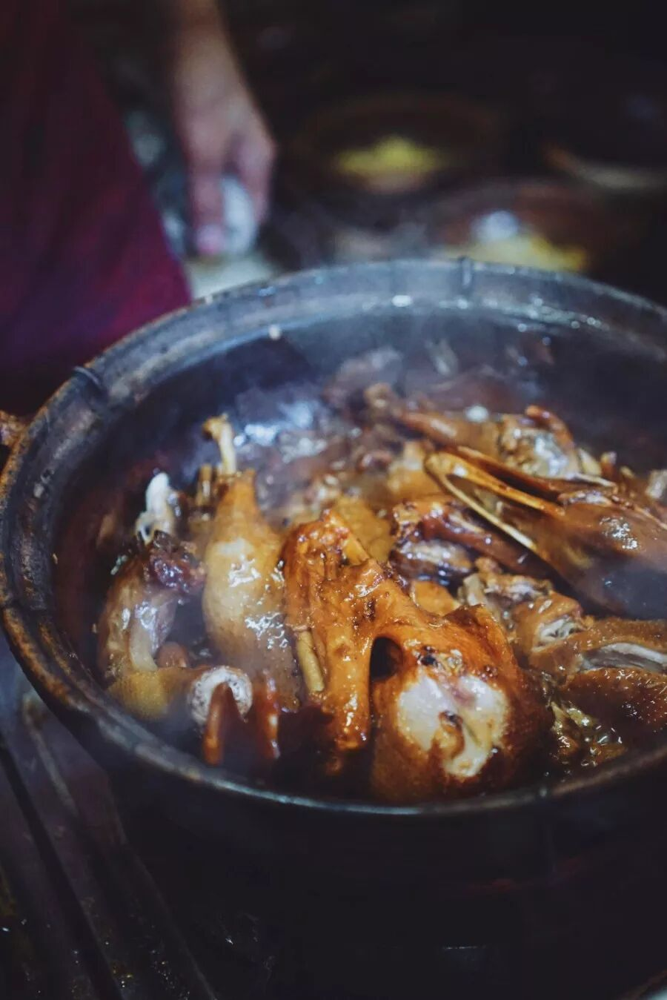

We asked an old grandmother on the roadside for directions, and she said, "Just walk down this way and you'll smell it."

We really did follow the aroma.

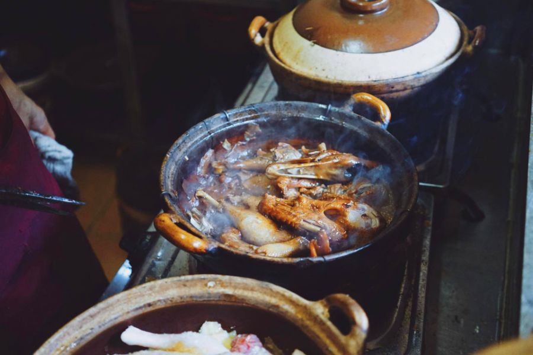

A row of stoves, a dozen clay pots lined up, the owner skillfully turning the glistening ducks in the pots.

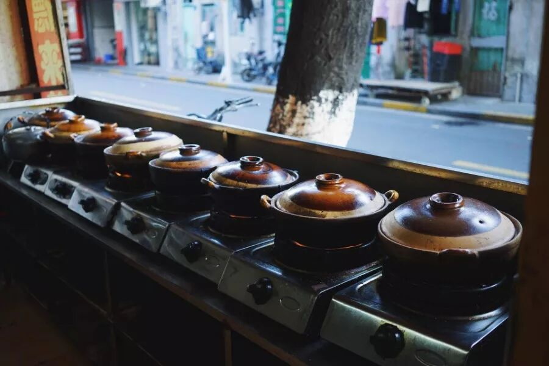

The ducks are first braised with ginger and cooking wine for two hours, then the heat is turned off.

When a customer places an order, seasonings are added and the pot is reheated.

The finished ginger duck arrives still sizzling in its clay pot.

With its tempting color, you can't wait to take a bite. It was the first time I tasted **such tender duck meat** — **the sauce, ginger aroma, and duck meat fused perfectly**. Three girls actually finished a whole duck, even the ginger at the bottom.

I couldn't resist asking the owner, **why is his ginger duck so delicious? Any secret?** The owner smiled honestly and said, if you choose good ducks and good ginger, it naturally tastes good.

Ah, such a simple and straightforward principle — it's just that many businesses nowadays have forgotten this most **honest "secret."**

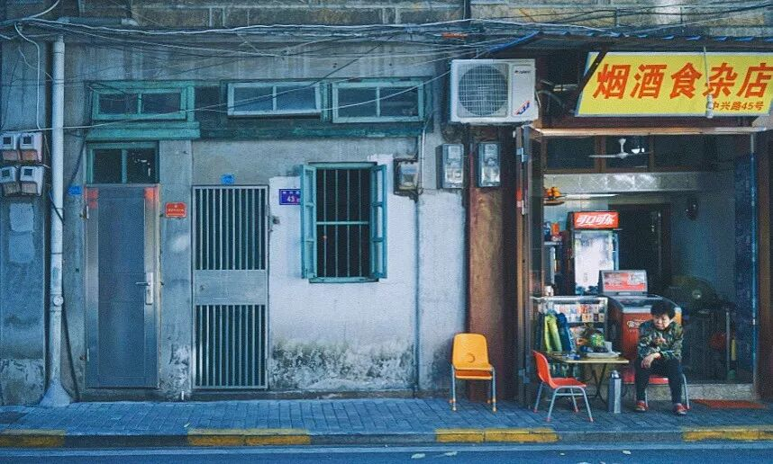

40 Zhongxing Road, Zhongshan Road / Lundu area

8

**Fuyu Datong Duck Porridge**

Fuyu Datong Duck Porridge has over 40 years of history,

a snack shop with an outstanding reputation among Xiamen locals. Rarely, it's open 24 hours — a late-night canteen for young people after a night of fun, and a tasty breakfast for early-rising grandparents.

**Coming for porridge on a cold night, walking in to see a large pot of steaming porridge instantly brings warmth.**

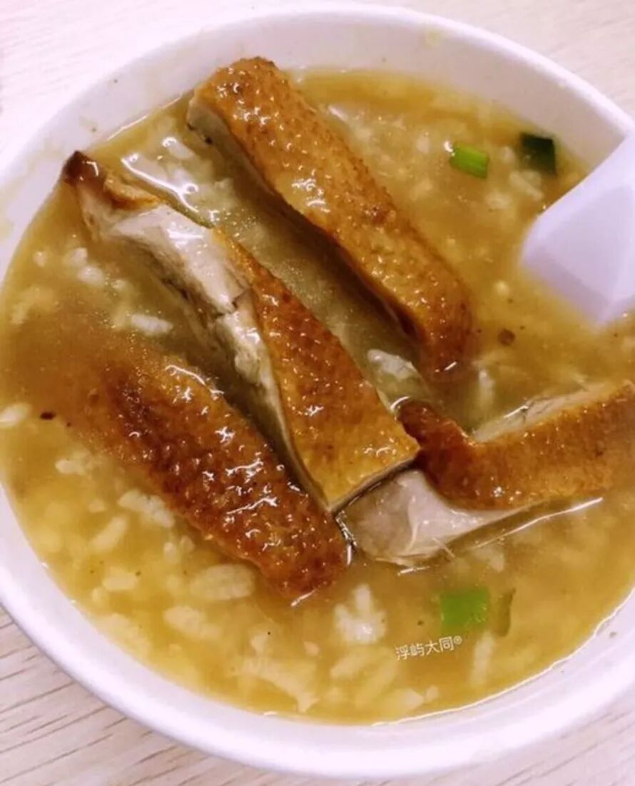

The porridge base is slowly simmered with duck broth, letting every grain of rice absorb the duck flavor. The right heat makes the porridge look thick but not murky — simple porridge, yet what you taste is fragrant, glutinous, and mellow.

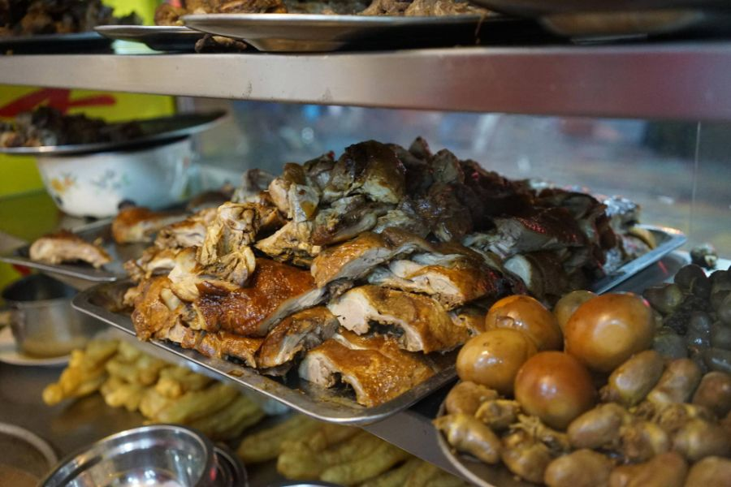

There are also various braised duck parts to add to your porridge — duck meat is tender and flavorful, duck legs are meaty and plump, duck intestines are crisp, duck tendons are savory and chewy, and the rice blood cake made from duck blood is soft — you wish you could add a bit of everything to be satisfied.

31-18-1 Xiaoxue Road, Zhongshan Road / Lundu area

9

**Jukou Mixed Noodles**

Jukou Mixed Noodles is **hidden** in a small alley near Zhongshan Road (the alleys around Zhongshan Road are full of hidden gems, by the way). It was recommended by a local friend and is said to have been operating for over 30 years.

The shop has only a small indoor dining area, with the kitchen and most seating outdoors. Seats are arranged along the wall with low tables and stools — very down-to-earth, that **street-side snack style.**

There's no menu. The main offerings are mixed noodles, fresh-boiled soup made with various seafood and offal, and cold dishes.

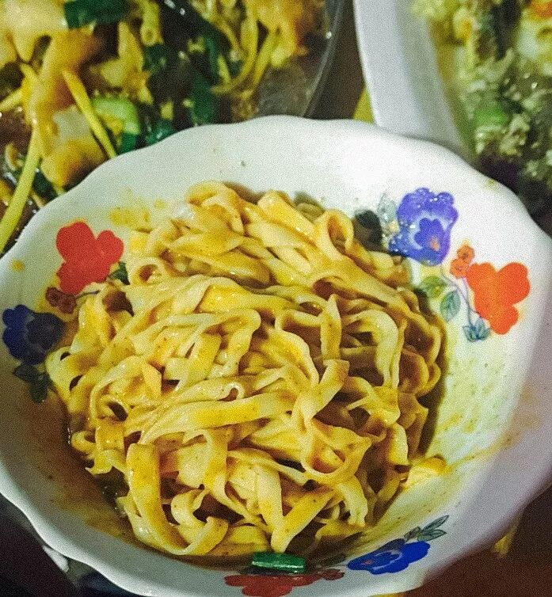

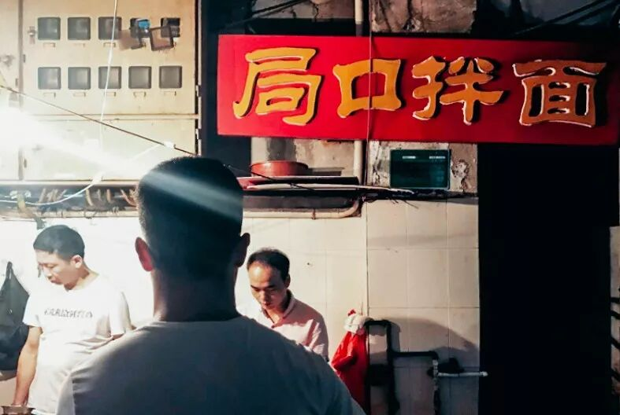

The fresh-boiled ingredients are displayed on the counter — a dazzling array: **pork liver, pork kidney, large intestine, wontons, razor clams, oysters, squid**, and more. You choose according to your preference.

The cook blanches your selected ingredients over high heat, ladles on the rich bone broth, and finishes with ginger shreds to remove any fishiness and white pepper for extra flavor.

The soup looks plain, but one sip reveals a savory depth far exceeding visual expectations — **just one mouthful of broth and I'd already given it a high score in my heart.**

When the mixed noodles arrive, all you see is plain white noodles, looking unremarkable. The **surprise is hidden underneath — peanut butter and Minnan-style sweet chili sauce are at the bottom of the bowl.** Once mixed, every strand is coated in sauce, combining the richness of peanut butter with the sweet heat of chili sauce — a flavor that any girl would love.

Hours are 4 PM to 2 AM. Go off-peak to avoid the line.

Jukou Street, an alley off Siming South Road, Zhongshan Road / Lundu area

**Delicious snacks hidden in ordinary alleys make you linger and never want to leave this city.**

