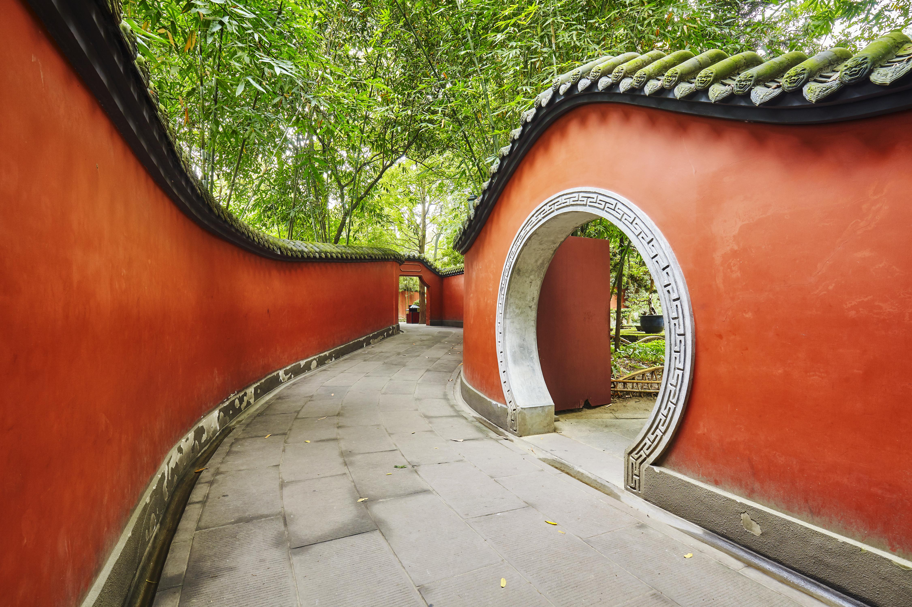
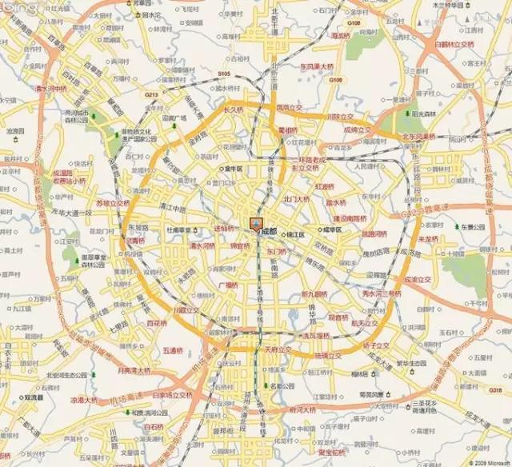
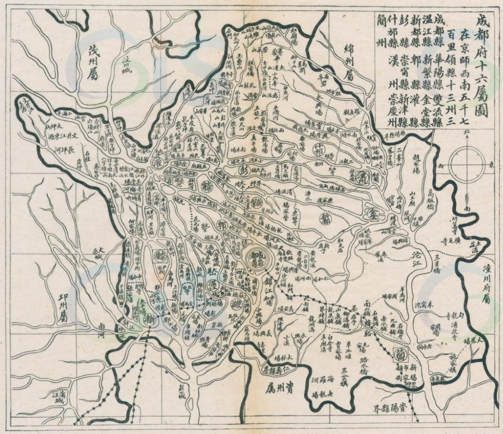
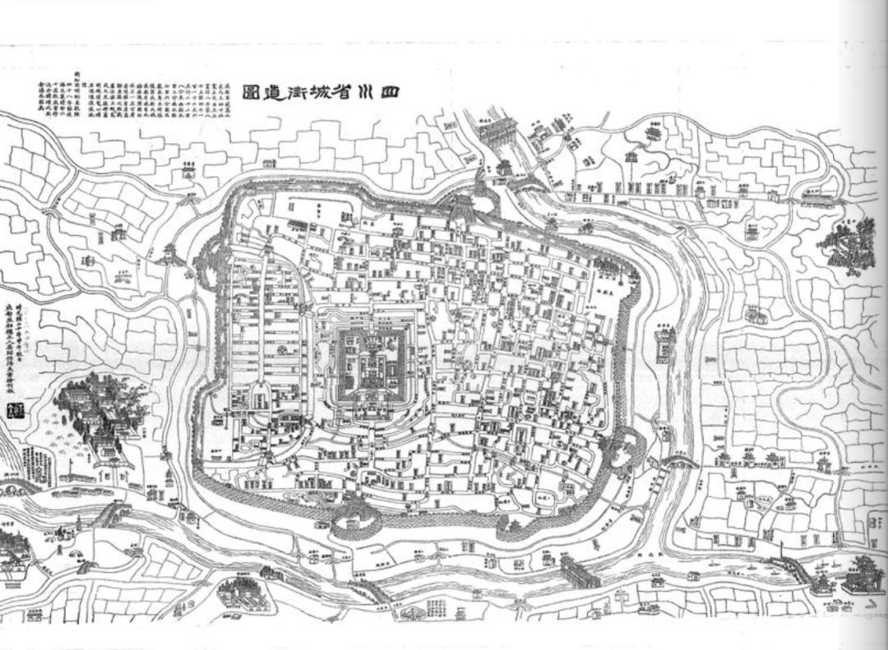
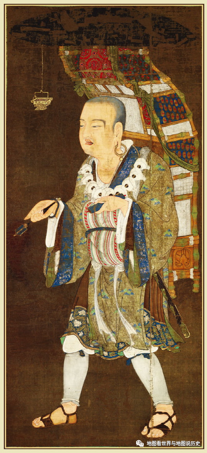
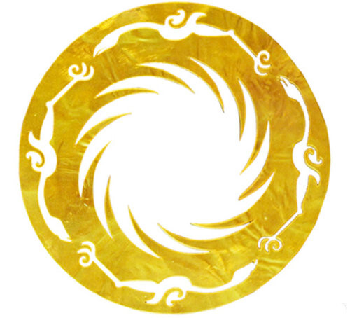
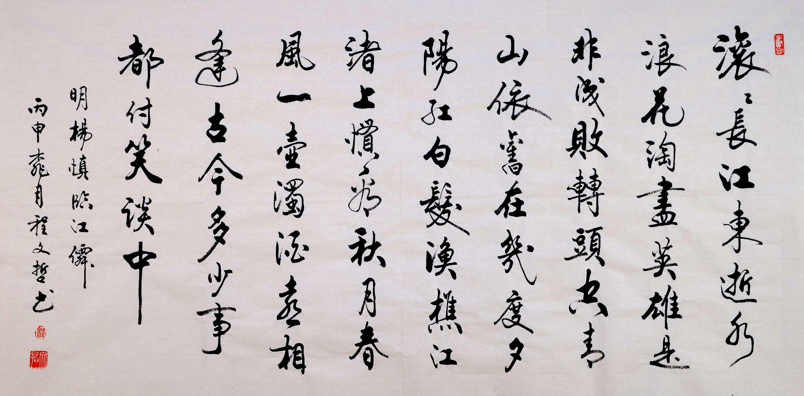
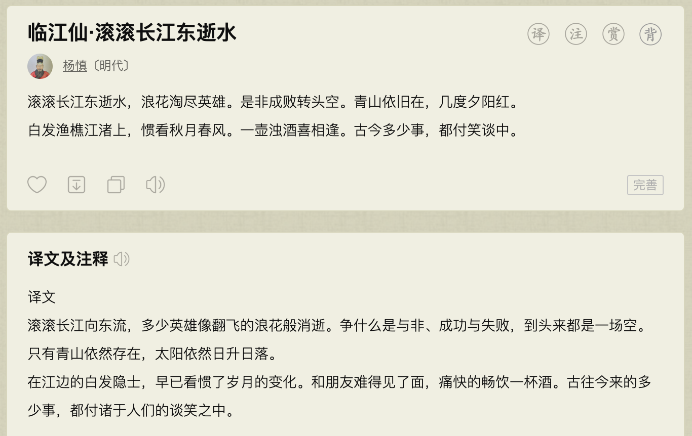

# 关于成都，只有本地人才知道的冷知识

*耿悦 · Travel-Guides · 2023-06-09*

---

没想到，这座屹立在西南最大平原上的城市，曾是水城，有水乡的美誉。

> 长似江南好风景，画船往来碧波中

河流横贯，沟渠众多，桥和水构成了老成都的一大景观。有不少小码头小渡口，

成都市内最后一个渡口——望江楼渡口，于70年代末龙舟路修好公路桥后撤销。

成都拥有世界上最早的锦缎丝织品 蜀锦（春秋战国）

武侯祠是中国历史上唯一一座君臣同祀的祠堂。

永陵是全国第一座被科学发掘的皇帝陵，也是唯一一座地上皇陵。

百花潭公园是成都以前的动物园，叫百花潭动物园。

成都诞生了世界上最早的纸币

交子（北宋）

但是发明“交子”的张咏并非成都人，而是山东人，时任益州知州，在成都为官。

> 北宋天圣二年（1023年），朝廷在成都设益州交子务，至北宋大观三年（1109年）改为“钱引”，交子总共运行了86年。

---

人民公园的鹤鸣茶馆，过去相当于是教师人才市场，老师们在这里等待各地的校长(多是县份上的)来考察下聘。

华兴正街上的悦来茶园，到今天也是川剧的圣地，选在这里是因为挨着祖师爷唐明皇的庙子。

毛泽东1958年曾来成都开会，是他此生唯一一次来到成都。会议地方就在金牛宾馆，当时准备了两个合作社让他巡视，一个就是红光，一个是在新都。

蒋介石是从成都凤凰山机场逃亡台湾的。成都是他在大陆的最后一站。

琼瑶是在庆云街上的成都仁济医院（今天的成都第二人民医院）出生的。

散打评书不是传统的四川曲艺，而是成都艺术家李伯清自己创作的。

成都是全球人口超过1kw的特大城市里距离雪山最近的。

成都有世界上修建最早的大熊猫博物馆——成都大熊猫繁育研究基地。

…

---

经常听人说到“锦江”，到底在哪里？

其实，在成都人之间很少说到“锦江”，多数情况下会说“府南河”，

它是府河与南河的合称，而按照现在比较正式的说法，它们在合江亭下汇流之后统称为锦江。

---

成都是中国唯一一座2300多年城名未改、城址未迁的省会城市。

> 它大约在公元前5世纪中叶构筑城池，西汉时已成为中国六大都市之一。
> 
> 2001年出土的金沙遗址将成都建城史从公元前311年提前到了公元前611年，

成为中国城址未变历史最为久远的城市。在历次改朝换代中都是省会十大城市之一。

---

成都是个棋盘式城市，但街道并不是正南正北，而是顺时针偏斜了28.5度。

其原因在于从金沙时代起，其格局就是朝向冬至日的日出方位，金沙遗址的祭台便是偏斜了28.5度。

清朝成都老地图

成都著名的宽窄巷子以前是清朝八旗子弟住的地方，就是富人区。

成为青黛砖瓦的仿古四合院落，这里也是成都遗留下来的较成规模的清朝古街道。

少城是专给满蒙八旗居住的，所以命名全都按北人习俗，内部除主街长顺街外都叫胡同。

《成都通览》统计清朝末年成都城内有名字的桥总共192座，

其中青羊宫一带的桥多带“仙”字，成了系列，如望仙桥，迎仙桥，会仙桥，送仙桥。

---

唐玄奘在成都受戒出家；武德五年（622年），年满20岁的唐玄奘正式受戒；

成都大慈寺是唐玄奘出家受戒的地方，是他传奇一生的起点。

唐玄奘受戒的寺庙可能是圣寿寺，已不存，也有人说唐玄宗在大慈寺受戒，但没有充分的证据；

> 《玄奘法师略传》记载“大业末年，兵饥慌乱，和兄经陕西入四川，武德五年在成都受具足戒，七年离蜀，到荆州天皇寺。”

成都金沙遗址出土的太阳神鸟金箔，凝聚着古蜀文明的神秘和美妙，

生动地再现远古人类「金乌负日」的神话传说。

---

成都人吃辣才200年，吃麻3000年。

花椒和辣椒几乎贯穿了成都所有的菜，

辣椒在清朝中期传入四川，在成都又名“海椒”，成都有条街名叫“海椒市街”。

---

除了就此问题，

学习了一下网络上收集到的成都冷知识，

还被一个人的故事所吸引到：

**杨慎**

杨慎是四川新都（今成都市新都区）人，他是明代第一大才子、明朝蜀中唯一的状元。

《临江仙》写得荡气回肠，却喜欢涂粉插花穿女装。

> 《皇明世说新语》卷六记载：“胡粉傅面，作双丫髻，插花。门生舁之，诸妓捧觞。游行城市，了不为忤。”

他极博学。《明史》本传记载：“明世记诵之博，著作之富，推（杨）慎第一。

他擅长的研究领域覆盖了经学、史学、哲学、语言学、音韵学、金石学、书法绘画、戏曲音乐和民俗文艺等，据说平生著作有400余种，存诗约2300首。

关键是，这些著述往往有独到主见，或可补史阙，或提供线索，有相当大的学术价值。

明朝的文化人曾经想过一个脑洞题：如果本朝出一个文化人和其他朝代相比，要能不逊色，至少不被比下去，应该选谁呢？很多人的答案，正是杨慎。

著名的心学大师李贽，把杨慎当作自己的精神偶像之一。

他不仅极力称赞杨慎的人品、学问，还说

> “岷江不出人则已，一出人则为李谪仙、苏坡仙、杨戍仙，为唐宋并我朝特出，可怪也哉”。

白话是，李白、苏轼和杨慎分别是唐、宋、明三朝文化界的扛把子，而这三人恰好都是四川人。四川要么不出人才，一出就出大牛人，此地真奇怪！

**《临江仙·滚滚长江东逝水》**

> 滚滚长江东逝水，
> 浪花淘尽英雄。
> 是非成败转头空。
> 青山依旧在，
> 几度夕阳红。
> 
> 白发渔樵江渚上，
> 惯看秋月春风。
> 一壶浊酒喜相逢。
> 古今多少事，
> 都付笑谈中。

拓展阅读 + 参考资料（这问题在知乎有不少优秀回答，附在参考答案中推荐阅读）

耿悦

旅行优秀回答者47777 次赞同去咨询

## 参考

> ^城市冷知识10：成都市冷知识50条——第十大古都，李冰治水、文翁化蜀，第一条铁路、第一支股票、最早的农家乐 https://new.qq.com/rain/a/20210914A01J2000
> ^1621年成都府地图，大开眼界 https://www.thepaper.cn/newsDetail_forward_15492324
> ^金沙遗址金箔神鸟图是古蜀国修道通神的标志 https://ishare.ifeng.com/c/s/7vfF0OXzu4t
> ^关于成都你不知道的21个冷知识  https://www.sohu.com/a/247468515_786771
> ^杨慎:悲剧人生也要活出尊严 https://zhuanlan.zhihu.com/p/113229759
> ^成都冷知识1️⃣0️⃣0️⃣条 https://zhuanlan.zhihu.com/p/151218126
> ^有什么关于成都的冷知识？ https://www.zhihu.com/question/52631857