# 一半海水，一半沙漠：那些交汇的旅行地

*耿悦 · Travel-Guides · 2023-06-19*

---

## 骷髅海岸：非洲的地狱之门

位于非洲南部的纳米比亚，西部海岸线上有一段被称为「骷髅海岸」的区域。

一片无尽的沙漠与湛蓝的大西洋在此交汇，

来讲讲这个「鬼魅海滩」的故事。

这里是葡萄牙水手们的灵魂最后的安息地，是险恶环境中的生物之家，

也是探险家们的最后挑战。

在这片迷人又恐怖的土地上，你会发现人类与大自然的较量，

死亡与生存的矛盾，以及对未知的恐惧与好奇。

## Skeleton Coast

这里是一片巨大的沙漠地带，直接毗邻大西洋。

被誉为世界上最荒凉和最令人畏惧的地方之一，

骷髅海岸公园北起昆仑湖，南至翁戈帕河，长约500公里。

名字源于散落在海岸线上的动物骷髅和沉船残骸。

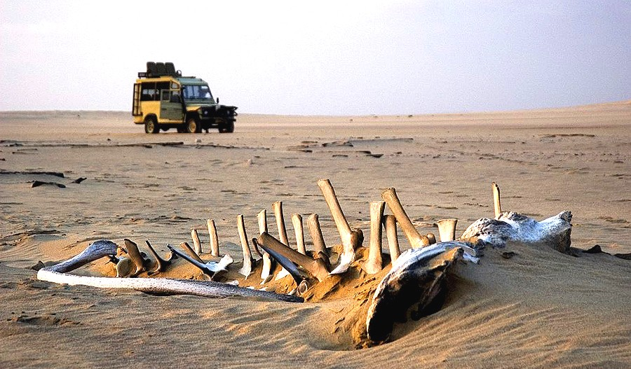

沙漠、沼泽和河流仿佛将它与外界隔离。

这就是为什么抵达那里的旅程异常艰难。

公园内有海狮、黑犀牛、大象、豹等多种野生动物。

由于地理环境的特殊性，这里的动植物种类比较单一，但生态环境保存完整。

尽管骷髅海岸被称为非洲最危险的地区，但仍然吸引着大量的游客和探险家前来。

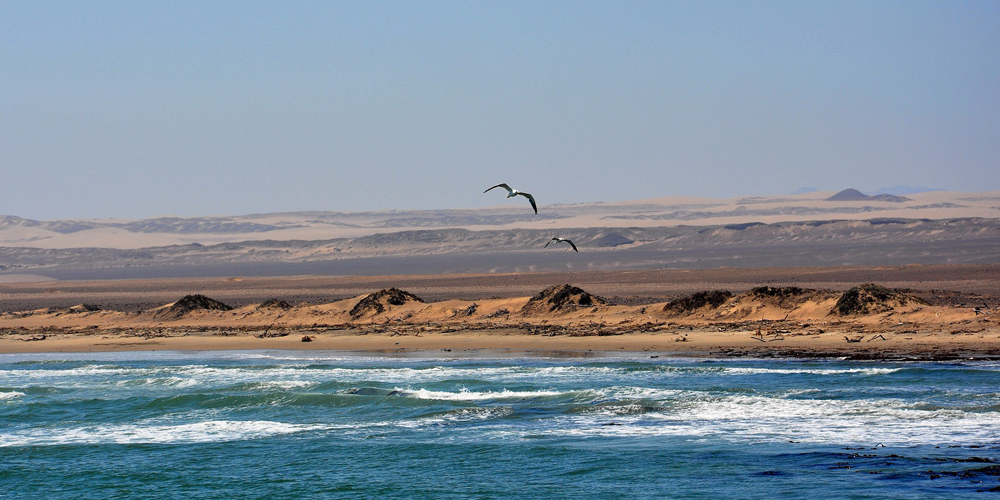

## History

布须曼人是纳米比亚的原住民，15世纪，他们选择离开在骷髅海岸附近的定居点。

那里不仅交通困难，而且地区贫瘠干燥，取水困难，降雨稀少。

布须曼人将其称为"上帝发怒时创造的土地"，

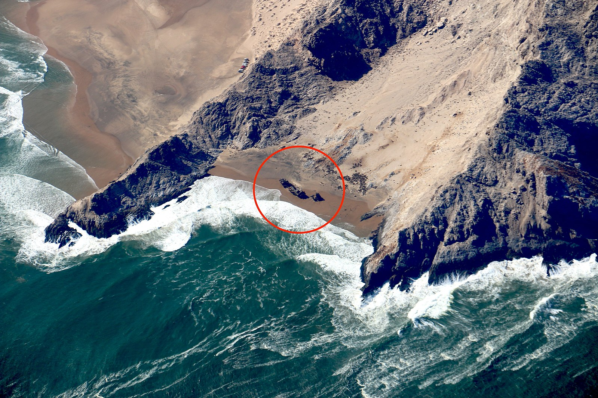

从17世纪开始，停靠在那里的葡萄牙水手们，给这片地方起了不同的绰号。

他们乘船到达海岸附近的海域，捕鲸和猎取海豹。

然而，他们的到来往往成为一场灾难。

那里的海滩有大石头和砂岩，海风难以预料，海浪巨大，因此，许多船只最终搁浅在海岸沿岸。

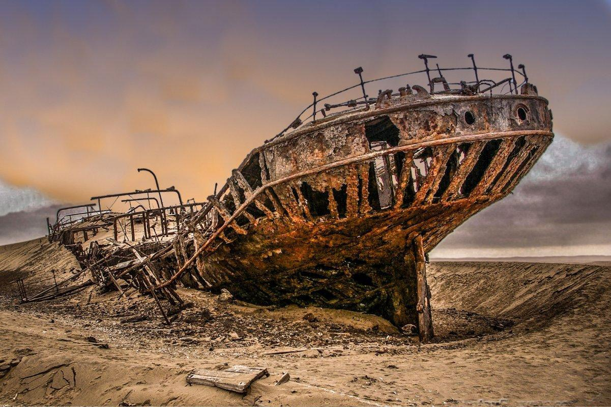

“骷髅海岸”这一名字，源自于约翰·亨利·马什 (John Henry Marsh) 的命名，

他编写了一本关于英国沉船事故的书，

其中包括在骷髅海岸沉没的达尼丁星号。

至今，这艘船的残骸仍然躺在海边，如同一个悼念的纪念碑。

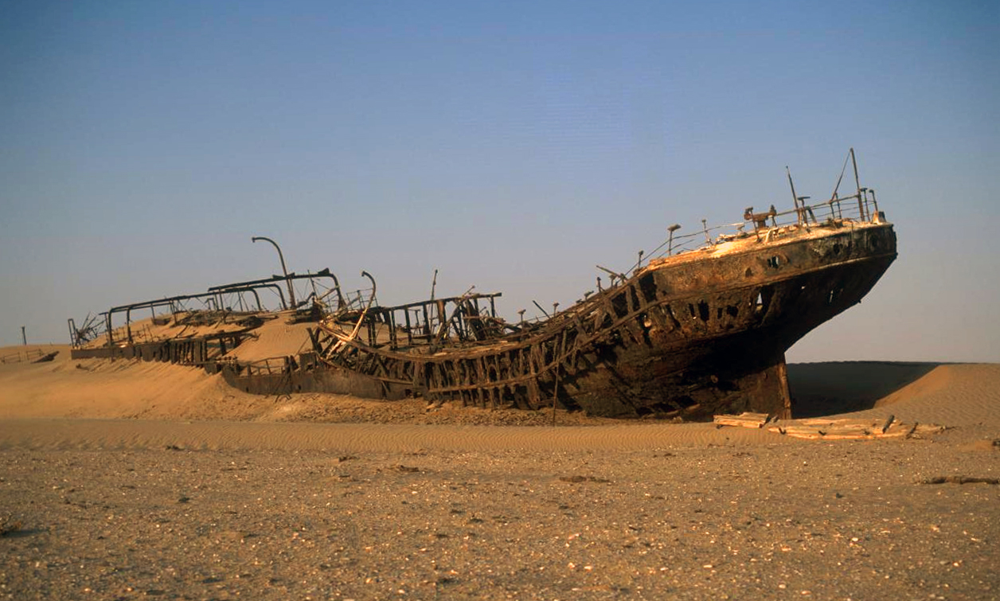

他将这片海岸地区称为骷髅海岸，

因为从早前的船员们的记录中，他们声称在海岸上发现了许多头骨，

这些可怜的生物无一例外都是饿死，或被其他动物猎杀而死的。

在某个时期，人们发现的人类头骨，被认为是来到这里并死去的布须曼人或水手。

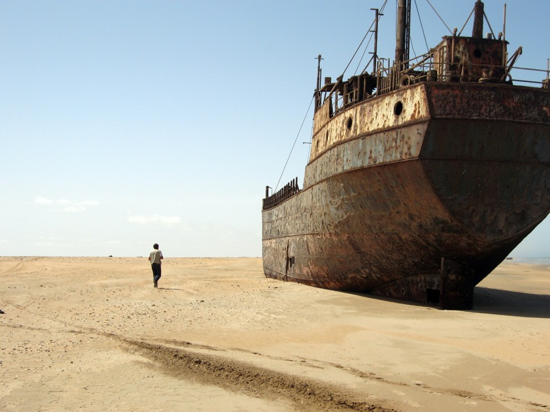

每一艘沉船都似乎在讲述着一段历史故事。

在海岸边，你可能会找到古老的捕鲸工具，或者是由于年代久远而生锈的锚。

这些物品都见证了过去人们在这里的劳作和生活。

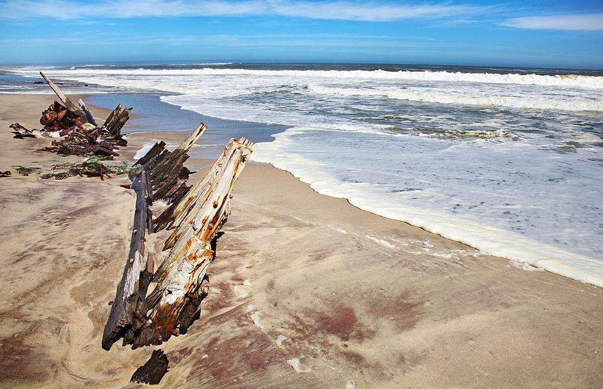

在这个看似恶劣的环境中，生命以独特的方式繁衍延续。

在沙漠中，你会看到矮胖的沃尔维奇亚树，它们是世界上最古老的生命形式之一，

部分树龄甚至超过了两千年。

在海洋中，你会看到海鸥飞翔，大群的海狮，在浪涛之中欢快地嬉戏。

这些景象展示着生命的顽强和不屈。

骷髅海岸充满了令人惊叹的自然奇观。

从空中俯瞰，你会看到一片巨大的白色沙漠，与深蓝色的大西洋海水形成鲜明对比。

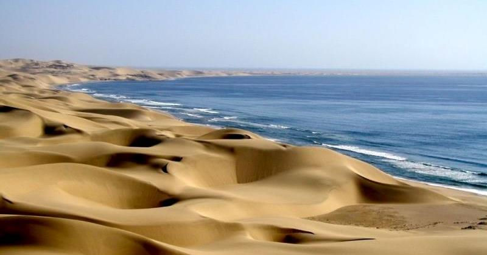

沙漠中夹杂着巨大的岩石，这是大自然在这片土地上留下的独特印记。

而在沙漠的深处，你会看到一座座迷人的沙丘，它们的形状随着风的吹拂而不断改变。

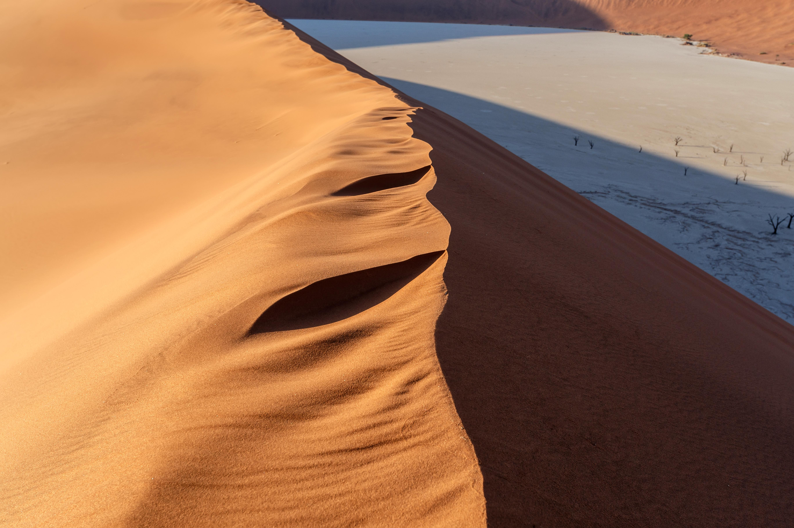

海洋和沙漠的交汇处有许多看似平稳的地方，

实则是危险的流沙区域。

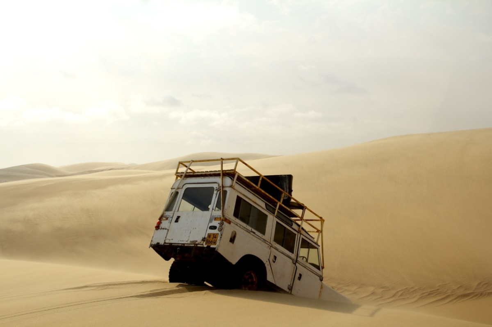

更深入内陆的河床是狒狒、长颈鹿、狮子、黑犀牛、斑鬣狗、棕鬣狗和跳羚的家园。

动物从狒狒或大象挖的水井中获取大部分水。

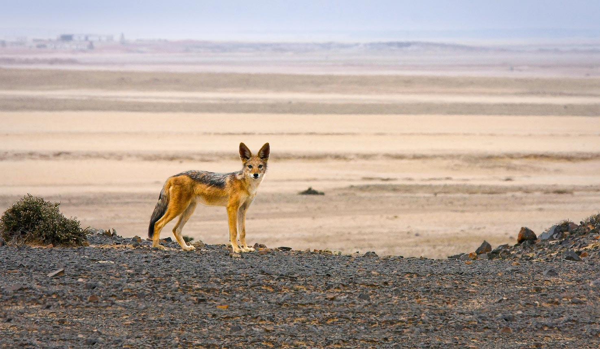

由于其独特的环境和丰富的野生动物种群，

骷髅海岸成为许多自然纪录片的拍摄地。

比如1965年的国家地理纪录片《骷髅海岸的幸存者》，

就讲述了动植物如何适应极度干燥的环境。

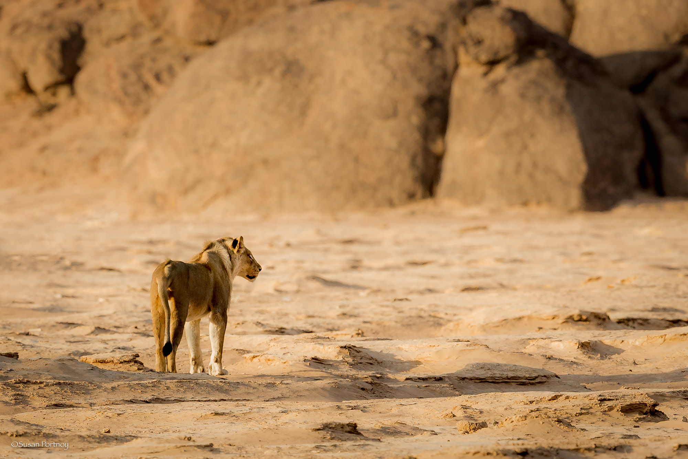

作为探险者，你将面临无数挑战。

你需要穿越热风烘烤的沙漠，面对干燥和饥渴，体验人类生存的极限。

你也需要面对大西洋的巨浪，感受海洋的无情和变幻莫测。

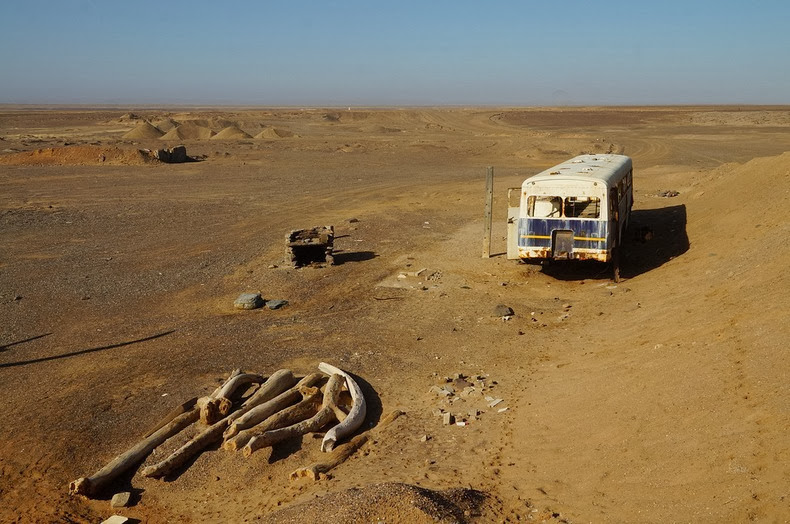

在骷髅海岸，你也将见证人类历史的痕迹。

那些遗留在海滩上的沉船残骸，

那些依稀可见的遗址，都曾见证过人类的冒险和挫折。

感受到人类的脆弱与勇敢。

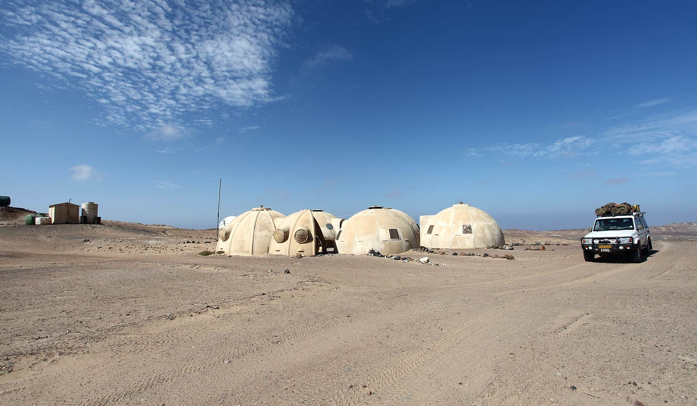

据说现在的行程也可以坐直升飞机并直接降落在沙漠上。

准备好探索海边徒步旅行和沙漠沙滩。

但是如果你打算探索骷髅海岸，一定要做好充分的准备，最好有当地的向导带路。

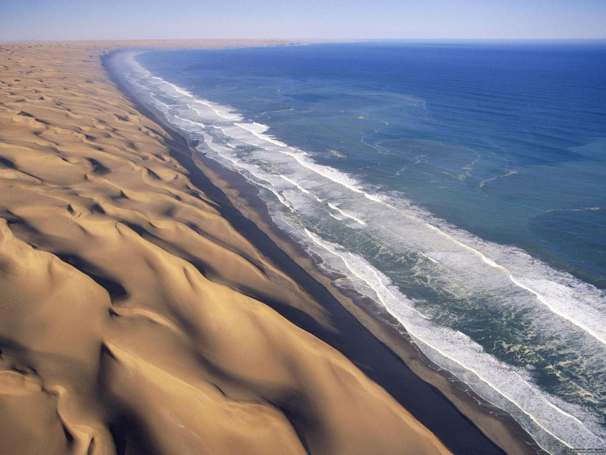

骷髅海岸是一个神秘迷人和挑战的地方，它集合了大自然的奇妙元素和人类历史的痕迹。

无论你是热爱冒险的探险家，还是一个喜欢安静观察的旅行者，

都找到属于自己的旅行体验。

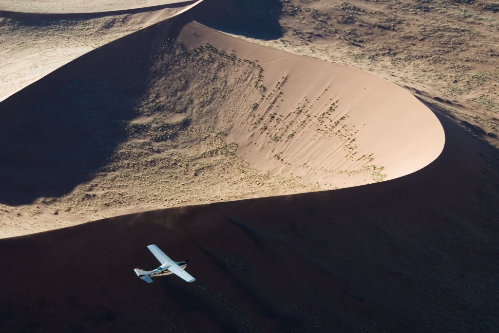

只要你勇于接受挑战，骷髅海岸就能为你展现出一个不同于任何地方的世界，

你将有机会感受到大自然的神奇，

体验到生命的奇迹，理解到生与死的真谛。

这个世界既充满了未知，也充满了美丽。

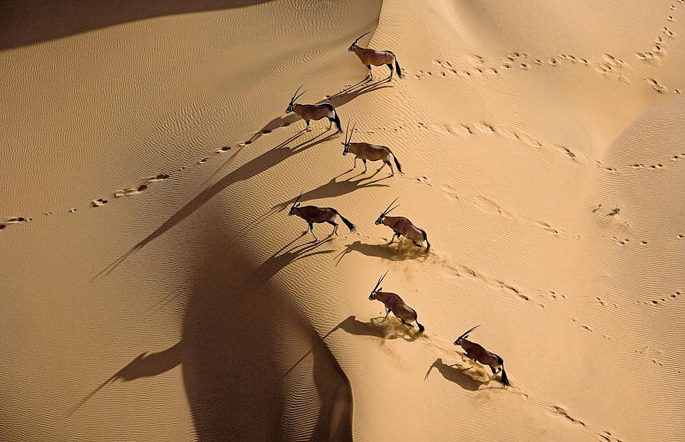

在这片看似无生命的沙漠和无尽的海洋中，

探险家们可以发现人类对自然的敬畏、对未知的探索，以及生与死的深刻理解。

在骷髅海岸，生与死的界限变得模糊，

**非洲的地狱之门！**

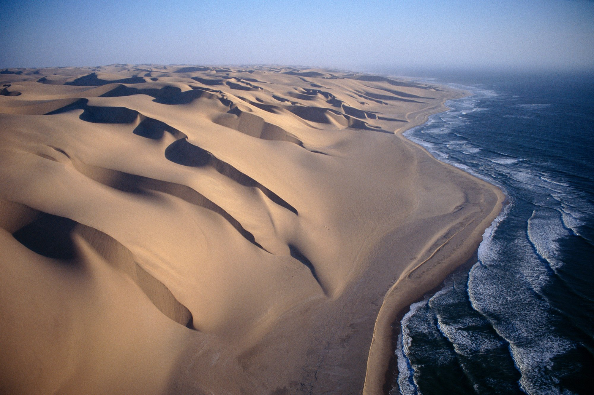

---

拓展阅读：卡塔尔（补充）

之前写过卡塔尔是一个位于波斯湾的半岛国家，因此海洋和沙漠都是其主要的地理特征。

首都多哈就坐落在海岸线上，你可以在此欣赏到湛蓝的海水和现代化的城市风景。

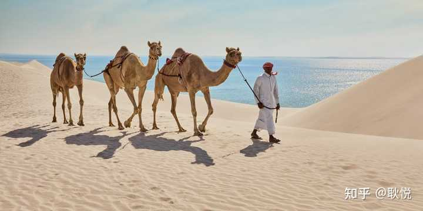

此外，卡塔尔的内陆部分则是广阔的沙漠。

在这里，你可以参加沙漠探险，驾驶四驱车在沙丘上穿梭，甚至可以在星空下露营，体验沙漠之夜的神秘和寂静。

## 参考

> https://en.wikipedia.org/wiki/Skeleton_Coast
> https://www.breakingthecycle.education/expeditions/the-skeleton-coast-namibia/
> https://traveldigg.com/skeleton-coast/