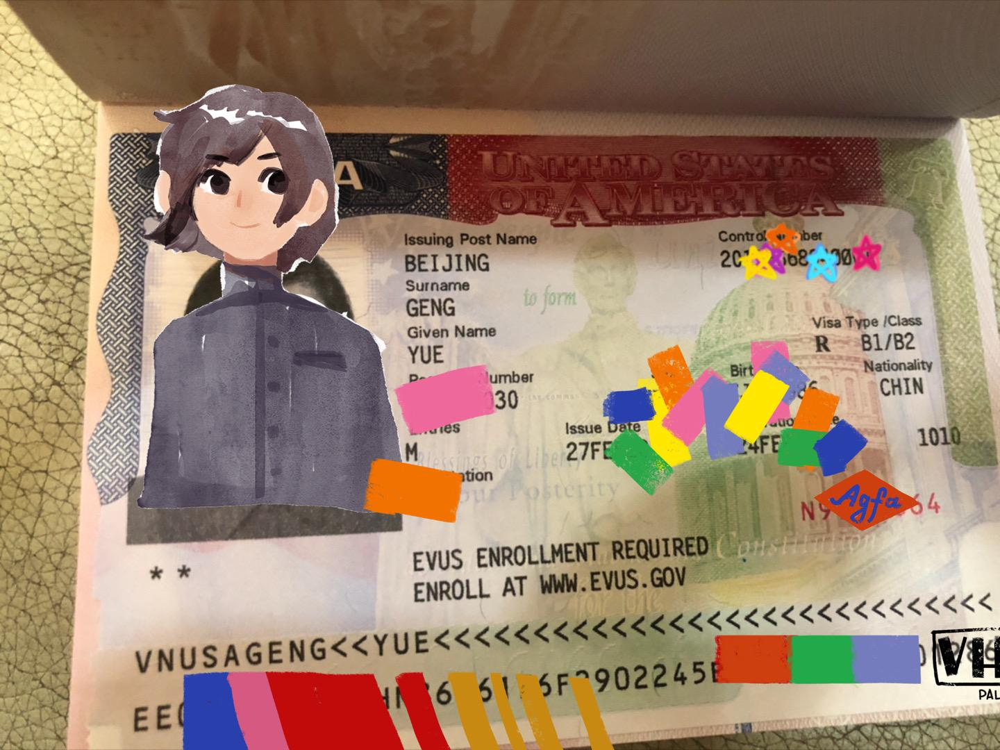
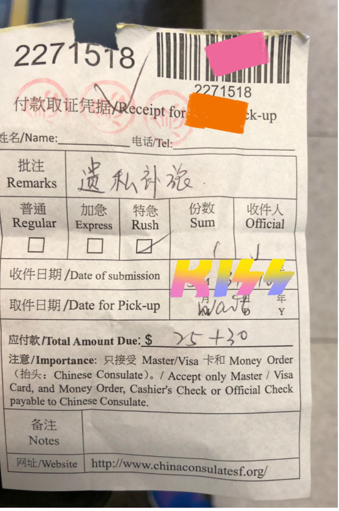
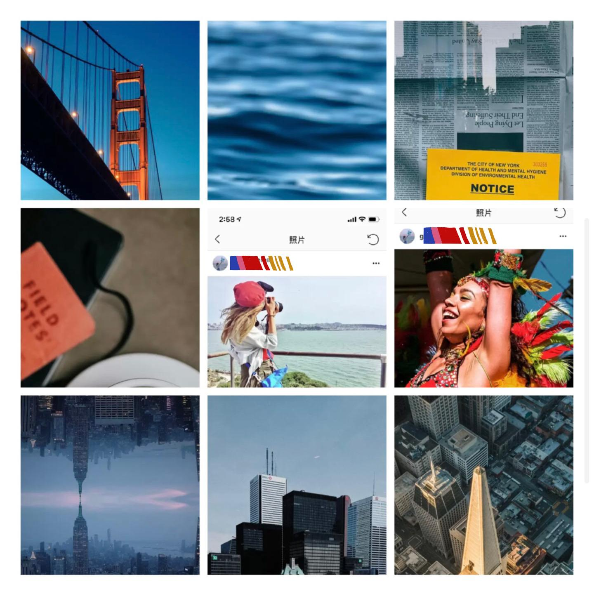

# 美国 10 年旅游签：两次都通过的实战经验

*耿悦 · Travel-Guides · 2023-06-12*

---

办过两次美国10 年旅游签证，第二次是悲催被偷了护照。两次都通过了。

记得第一次办理时，很早了，当时有一种印象是美签是世界上最难办的签证，

这个可怕印象来自当时认识的一个姑娘，她天天都在办美签，去了好几个城市都没过。

所以我一直不敢办，最后是有一次旅行摄影出差，不得不办，但还是战战兢兢，听天由命，我就非常细致准备了资料。

大概一分钟就过了。

### 首次办理，克服白本

当时的经验，和首次办理解决方案：

如果你是白本，可以先去一些东南亚的几个国家旅行，护照上有一些记录之后，

再去签美国等国家的签证，就会相对容易很多。

所有的签证官，要看的信息，**都是**

**“你会不会移民滞留在他们国家”，**

**要银行流水、工作证明、和其他的资料，都是为了证明这一点。**

在中国有稳定的工作，生活，你过去旅行之后，还会回来。

所以最开始，**不必太有负担，把该准备的相应准备好，**

然后要很肯定的**给签证官释放这个信息**，

**我只是去你们国家旅行的，旅行完我就回来啦。**

我当年是白本，前面有一个通过的英国签证，紧接着就去美国签证，

记得那天排队前面拒签掉了一排人，**到我问了一分钟就过了。之后办签证都无比顺利。**

美签有个说法是旅游签证里的天花板，

就基本你护照里有个美签打底子，办其他国家的签证都基本不会拒签。

---

### 护照丢失，签证失效

但我为什么第二次又办理了一次呢，唉，

倒霉悲催的，因为我大概过了好几年后吧，

还是在美国有次旅行，护照被偷了，然后去大使馆挂失，滞留了大概一周多，

唉，那个护照上还有办好的各个国家的几年签证整体作废，花的钱和时间都瞬间失去了，

### 二次办理，充实准备

第二次是回到北京之后再补办，

依然得认真准备，重头再来，

而且面试有时候很随机。

看到有一些经验里写的，可能你东西非常全的，但面试官就是有可能不通过，

可以准备的相对充分点：

如果已经有很多出国旅行的经历了，可以打印出来，

就除了常规需要的资料，认真填写好自己的Ds160表之外，

我把过去在一些一线杂志上发表的专栏旅行故事，明显带有我名字和头像照片作品，都裁剪出来放入了一个文件夹子。

去补办时，听说那段时间美签更加严格了，

第二次我们那队被拒签的人也不少，我排到的窗口的签证官感觉也有点严格，

他问我问题还挺多的， 不像上一次一分钟秒过，但就是真诚回答吧。

然后就给他看了一点发表过的旅行故事，翻开就能确定，我目的就是单纯旅行，非常清晰。

然后那面试官对故事很感兴趣，看到时一下眼睛亮了，说哇塞这是我梦想职业！好酷哈哈哈哈最后气氛蛮友好的，笑嘻嘻地跑了出来。

### 办美签高通过率 tips：

所以共同点就是：

- 签证上最好有一些去过泰国、新加坡、欧洲、澳、英等国家，会很大程度上提高你美签的通过率，至少有一个也行。
- 认真、真实填写 DS-160 表的内容。
- 材料翔实：银行流水、工作证明、存款证明、邀请函（如果有的话附个英文版），证明你是一个稳定的公民，没有任何跑过去偷渡想滞留的风险。老娘是去旅游的！
- 出行的行程单安排可以有一份，附上出发和回来的机票、期间的旅行计划、居住的酒店/民宿等，清晰详尽（这个基本出行都可以提前做）。
- 和面试官沟通的时候，真诚诚实放松，释放有效信息。
- 也可以提前搜索一些经验贴，有一个心理准备。