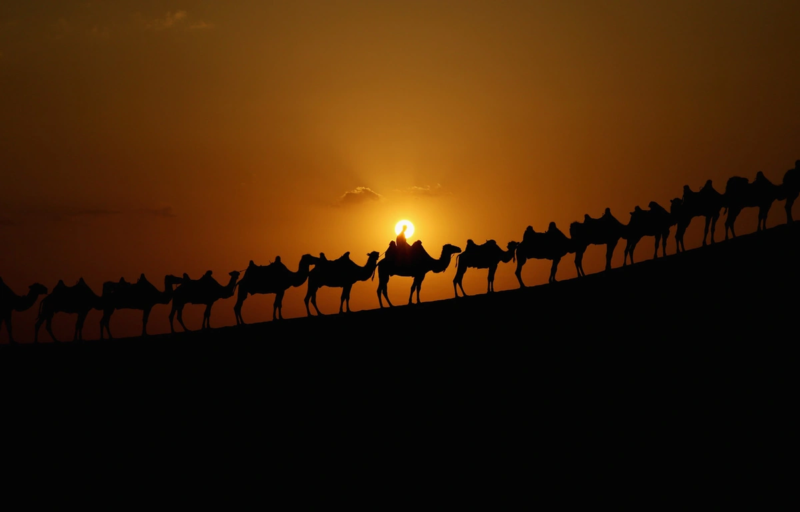
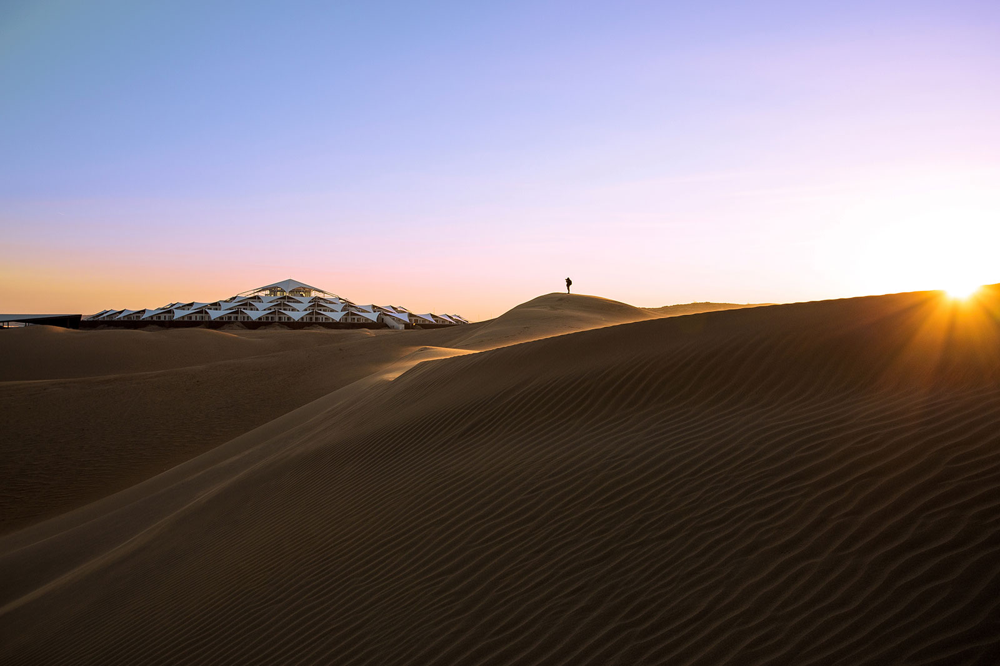
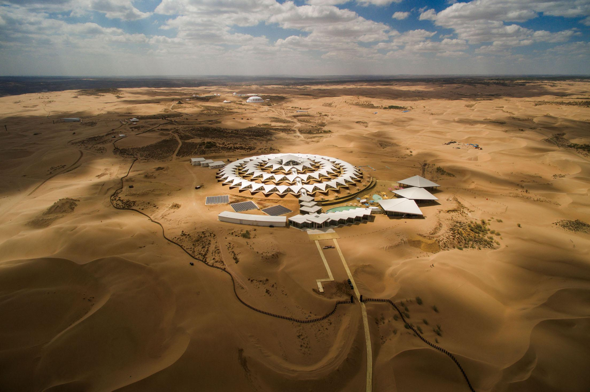
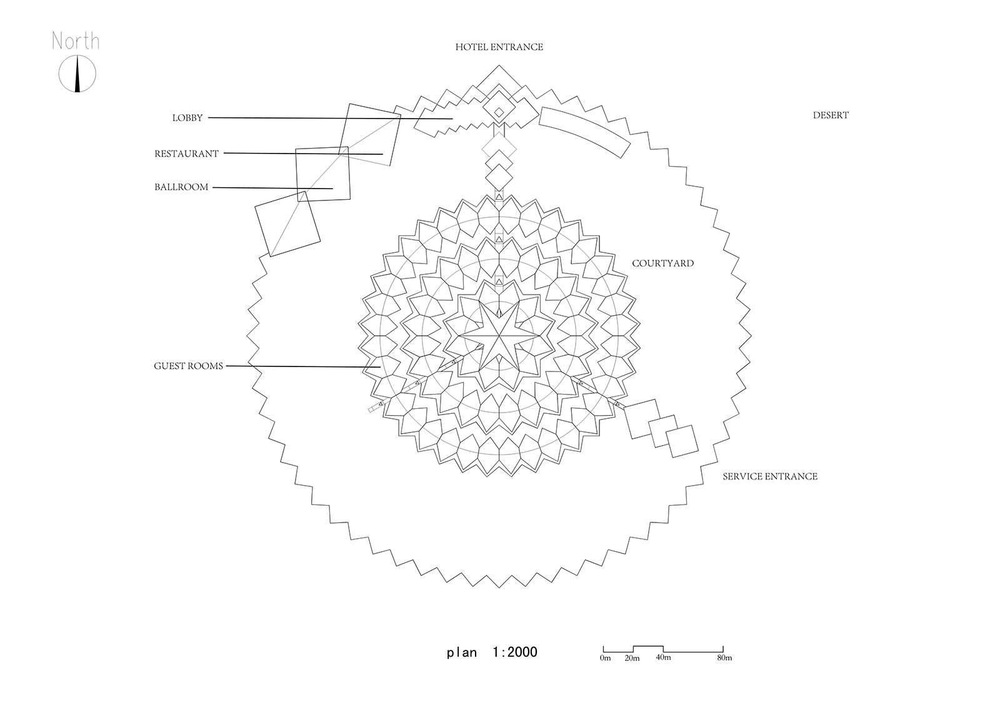
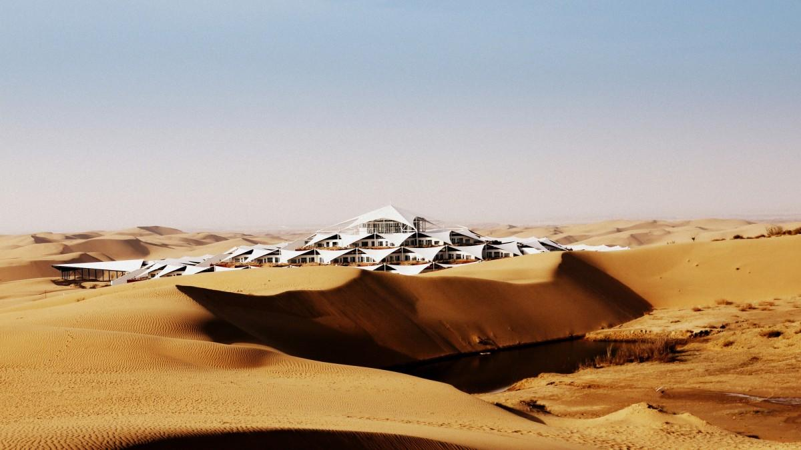
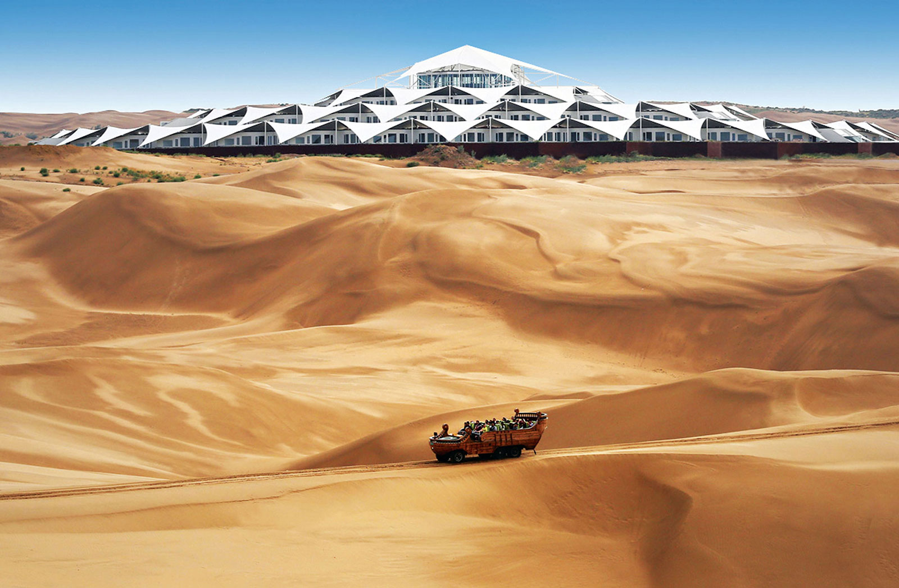
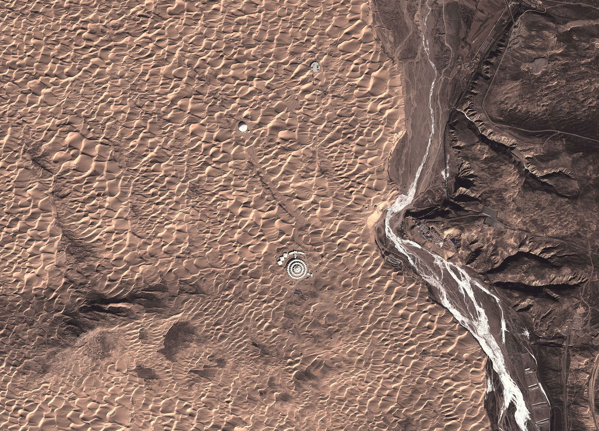

# 响沙湾沙漠旅行攻略

*耿悦 · Travel-Guides · 2023-06-21*

---

曾经读过《大西洋月刊》的一个图集，写了一些沙漠，说说这个沙漠。

因**「这里的沙子会唱歌」而得名的响沙湾**。

位于内蒙古自治区鄂尔多斯市，一个著名沙漠旅游景点，也算**是距离北京比较近的沙漠。**

响沙湾沙高110米，坡度45度，呈弯月状形成一个很大的沙山回音壁。

当人们从沙顶向下滑动，便会听到犹如飞机掠空而过的轰鸣声；

当你对着两手猛力向中间捧沙时，便会听到哇哇的蛙鸣声。

因此得名响沙漠。

**项目信息**

| 项目 | 详细信息 |
|------|----------|
| 星级 | AAAAA |
| 开放时间 | 8:00-19:00 |
| 门票信息 | 景区门票120元（包含往来索道） |
| 游玩时长 | 建议4-5小时 |
| 游玩贴士 | 在进入沙漠之前需要做好防晒措施，带好充足的水以防缺水 |

> “库布其”是蒙古语，其汉语意思为“弓弦”，该沙漠为南北走向，蜿蜒八百多里，总面积为1.61万平方公里。响沙，蒙古语为布日芒哈，意为“带喇嘛的沙丘”。

在这个沙世界里，

隐现着似超现实/设计感沙漠酒店：

莲沙度假岛/福沙度假岛/悦沙休闲岛/仙沙休闲岛/一粒沙度假村等

其中视觉感最突出的，这个莲沙度假岛上的莲花酒店挺吸引眼球：

其设计独特，形状如莲花般规模宏大，是景区的标志。

这是一座绿色环保的生态度假型酒店，

没有使用砖、瓦、沙、石、水泥、钢筋等传统建材，

而是采用了更加环保的建筑材料，仿佛一片绽放在心灵深处的净土，

背后的建筑故事也不错。

**活动：**

沙漠冲沙、骑骆驼、探险越野车、滑沙等。感受沙漠的神秘和壮丽。

可以参观蒙古族的毡房，品尝蒙古族的传统美食，如手抓肉、羊肉烤全羊、奶茶等。

你也可以参与到蒙古族的传统活动中，如马术、摔跤、射箭等，更深入地理解和体验蒙古族文化。

沙漠日出和日落的景色也非常壮观。

沙漠的夜晚是另一种奇妙的体验。

当太阳落山后，整个沙漠变得安静而神秘。

你可以在明亮的篝火旁，品尝美味的烧烤，

听着蒙古族的传统歌曲，观赏星空，享受一场难忘的沙漠夜宴。

**北京到达各目的城市的交通情况：**

| 起始城市 | 目的城市 | 飞机 | 火车 | 自驾车 |
|----------|----------|------|------|--------|
| 北京 | 鄂尔多斯市 | 1小时 | 11小时 | 6-7小时 |
| 北京 | 包头市 | 1小时 | 8小时 | 5-6小时 |
| 北京 | 呼和浩特市 | 45分钟 | 7小时 | 4-5小时 |

**从响沙湾出发的自驾车情况：**

| 起始地点 | 目的地点 | 自驾车距离 | 是否全程高速 |
|----------|----------|------------|--------------|
| 响沙湾 | G65包茂高速 | 3公里 | — |
| 响沙湾 | 包头市 | 45公里 | 是 |
| 响沙湾 | 鄂尔多斯市 | 50公里 | 是 |
| 响沙湾 | 呼和浩特市 | 180公里 | 是 |
| 响沙湾 | 北京 | 600多公里 | 是 |
| 响沙湾 | 太原 | 400公里 | 是 |
| 响沙湾 | 银川 | 380公里 | 是 |
| 响沙湾 | 西安 | 680公里 | 是 |

**一些具体交通**

**鄂尔多斯：** 自驾全程50公里，驾车从市区出发到第一个公路收费站行驶290米后，直行进入G65国道，沿G65国道行驶31.3公里，右转（沿途设置收费站）行驶2公里，即到达响沙湾景区。

**包头：** 自驾全程约58.4公里，驾驶时长约1小时20分钟。驾车从市区出发，沿建设路行驶5公里，过右侧加油站约1.8公里，稍向右转上匝道；沿匝道行驶1.5公里，右前方转弯进入G210辅道；沿G210辅道行驶200米，直行进入G210国道；在G210国道行驶11.8公里，向右转即进入响沙湾景区。

**包头乘车：** 在包头机场或包头东火车站选择乘坐出租车，约50分钟的行程即可到达景区。或者在包头长途汽车站东站（包头东火车站向北500米）乘坐包头至东胜的长途大巴，在响沙湾立交桥下车，前进3公里即到景区。

**鄂尔多斯乘车：** 在鄂尔多斯机场或鄂尔多斯市东胜区火车站可选择乘出租车，约50分钟到达景区。或者在东胜区长途汽车站乘坐东胜至包头的长途大巴，在响沙湾立交桥下车，前进3公里即到景区。

**呼和浩特乘车：** 在呼和浩特机场或呼和浩特火车站，可选择乘出租车约3小时到达景区。或者在呼和浩特长途汽车站乘坐呼和浩特至包东胜的长途大巴，在响沙湾立交桥下车。

图片源自网络，侵删，标注来源。

## 参考

- A Lotus in the Desert: China's Xiangshawan Resort - The Atlantic：https://www.theatlantic.com/photo/2013/08/a-lotus-in-the-desert-chinas-xiangshawan-resort/100575/
- 在旱地中盛放的白莲花，内蒙古响沙湾沙漠莲花酒店：http://www.archcollege.com/archcollege/2018/5/40249.html
- 作为中国首个沙漠星级酒店建筑，从设计到建成因各种原因整整耗费10年时间。
